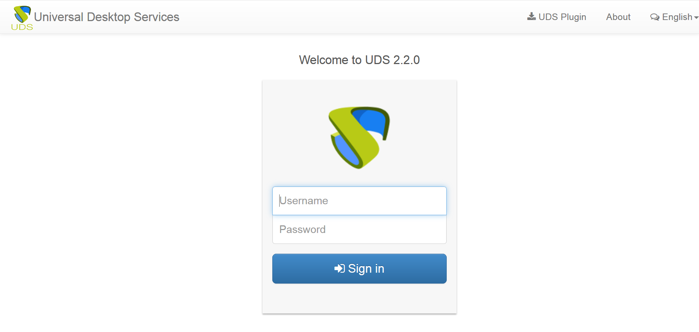

# Руководство администратора VDI Appliance

## Глоссарий

| Понятие | Определение |
| :------: | :------: |
| Аутентификатор (Authenticator) | Ресурс, обеспечивающий управление правами доступа пользователей к виртуальным ресурсам |
| Базовый образ (Base Machine) | Базовый шаблон виртуальной машины | 
| Менеджеры операционной системы (OS Managers) | Управляющий компонент для операционной системы виртуального рабочего места |
| Сервис (Service) | Ресурс, обеспечивающий выделение виртуальных рабочих мест |	
| Тонкий клон (Linked Clone) | Клонированный образ виртуальной машины минимального размера|	
| Транспорты (Transports) | Приложения для подключения к виртуальным рабочим местам по требуемым протоколам |

## Общие данные

Настоящий документ представляет собой руководство администратора программного комплекса виртуализации серверов, приложений и рабочих столов (далее – программный комплекс). 
Руководство описывает действия администратора при настройке основных компонентов программного комплекса и содержит список и описание наиболее часто встречающихся команд.

## Администрирование UDS

Для первоначальной настройки и администрирования программного комплекса необходимо ввести IP-адрес или имя сервера UDS брокера через http или https доступ.
При первом входе в панель администрирования UDS необходимо ввести имя и пароль администратора, как показано на Рис. 1. После входа в панели администрирования можно изменить пароль, создать или выбрать новых пользователей, которым будет разрешен доступ в панель администрирования.
![Картинка][uds-1]

**Рис. 1**

Если уже существует настроенная учетная запись пользователя с правами администратора для платформы UDS, необходимо ввести имя и пароль этого пользователя и выбрать тип аутентификации, который будет использоваться для входа.

Если настроено несколько аутентификаторов, и необходимо получить доступ к панели администрирования с помощью локальной учетной записи администратора, выбранный аутентификатор не будет использоваться, так как этот пользователь не будет сопоставлен с аутентификатором.
 

[uds-2]: ./images/uds-2.png
[uds-3]: ./images/uds-3.png
[uds-4]: ./images/uds-4.png
[uds-5]: ./images/uds-5.png
[uds-6]: ./images/uds-6.png
[uds-7]: ./images/uds-7.png
[uds-8]: ./images/uds-8.png
[uds-9]: ./images/uds-9.png
[uds-10]: ./images/uds-10.png
[uds-11]: ./images/uds-11.png
[uds-12]: ./images/uds-12.png