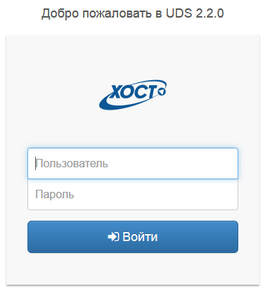
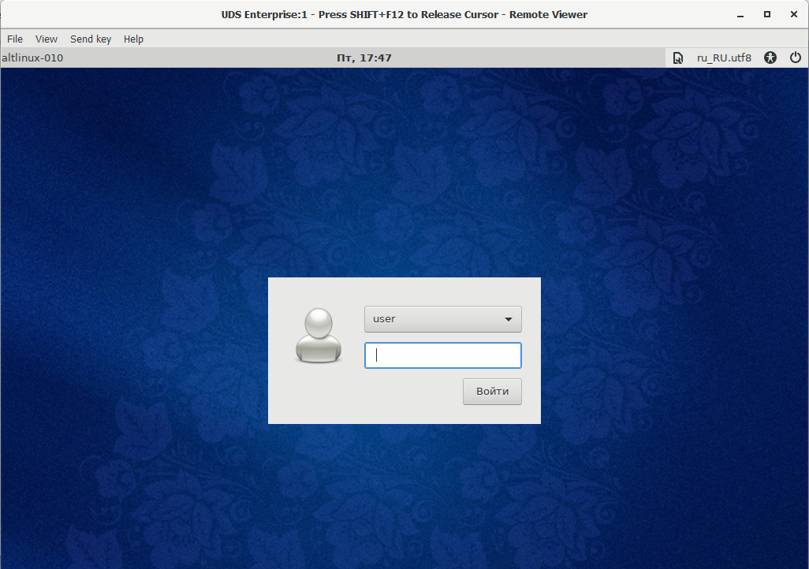
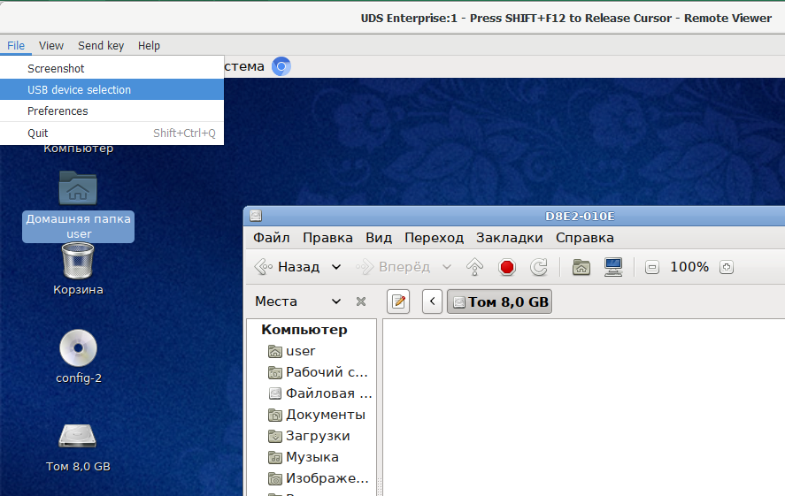
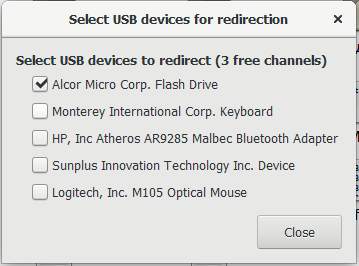

## Общие данные

Компонент платформы виртуализции HOTSVM VDI предназначен для виртуализации рабочего стола пользователя. 

С помощью специализированного ПО на рабочем месте пользователь может удаленно подключиться в систему, получая доступ ко всем программам, приложениям и данным.

## Инструкция по подключению

### Подготовка к работе

Скачайте дистрибутивы и установите следующее ПО:

**Virt-Viewer**

* [для 32-разрядной ОС](https://cloud.hostco.ru/s/xGm6XMcWB9iaPCo)

* [для 64-разрядной ОС](https://cloud.hostco.ru/s/ErRSswPLWMTzpWz)

**Usb-Dk**

* [для 32-разрядной ОС](https://cloud.hostco.ru/s/TtjLn7pB2xgZXmS)

* [для 64-разрядной ОС](https://cloud.hostco.ru/s/KHDLzewkKioYLYo)

**[UDS Plugin](https://cloud.hostco.ru/s/samC2QXdGaxgQFN)**

### Вход в систему

Для входа в систему выполните следующие шаги:
1. Откройте в браузере адрес VDI-портала;
2. В открывшуюся форму введите логин и пароль предоставленный в письме с приглашением на тестирование.

**Рис.1 Форма для авторизации**

3. Выберите нужную ОС и нажмите на иконку для открытия сессии.

**Рис.2 Перечень ОС**

Если после открытия сессии потребуется ввод логина и пароля для входа в операционную систему, используйте следующие данные:
* логин: user;
* пароль: vdiuser.

**Рис.3 Вход в систему**

Если необходимо подключить в сессию USB-устройство с локальной машины, выполните следующие шаги:
1. В окне с открытой сессией выберите пункт меню: Файл → USB Device Selection;

**Рис.4 Окно с открытой сессией**

2. Отметьте нужное устройство в появившемся списке;

**Рис.5 Выбор USB-устройства**

3. Закройте список и дождитесь подключения устройства в сессию.
