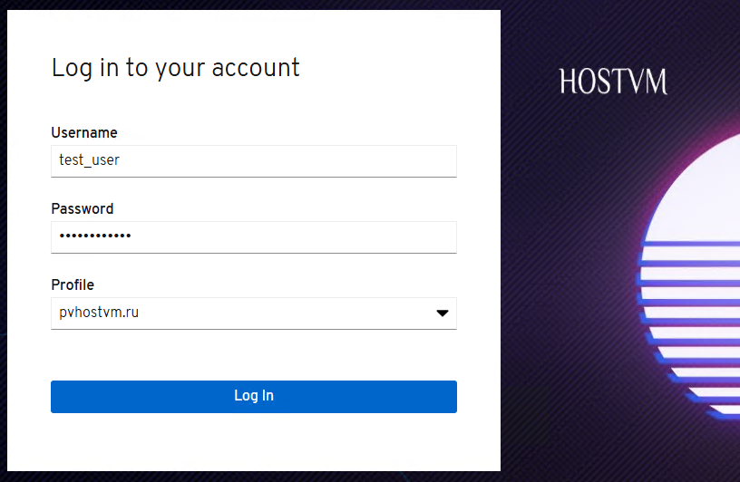

# Настройка подключения HOSTVM Manager к домену Active Directory

## Требования

* Настроенный лес Active Directory;
* Настроенный DNS на разрешение леса Active Directory;
* Для защищенного соединения между LDAP сервером и управляющей машиной должен быть подготовлен сертификат удостоверяющего центра в формате .pem;
* Если анонимный поиск по LDAP запрещен, то необходимо предоставить сервисному пользователю разрешения на просмотр всех пользователей и групп в Active Directory;
* Создана сервисная учетная запись для выполнения поисковых запросов и логина в Active Directory;
* Если Active Directory охватывает несколько доменов, необходимо обратить внимание на ограничения описанные в файле `/usr/share/ovirt-engine-extension-aaa-ldap/profiles/ad.properties`


Для корректной работы простого подключения (plain) между HOSTVM Manager и Active Directory используется протокол NTLM. Убедитесь, что на ваших контроллерах домена не заблокирована NTLM-аутентификация. Отсутствие доступа к NTLM приведет к невозможности интеграции HOSTVM Manager с доменом.


## Подключение Active Directory

1. Подключитесь к управляющей машине и установите необходимые зависимости:

```
dnf install ovirt-engine-extension-aaa-ldap-setup
```

2. Запустите утилиту для установки в интерактивном режиме:

```
ovirt-engine-extension-aaa-ldap-setup
```

3. Выберите тип LDAP. Для Active Directory пункт 3:

```
Available LDAP implementations:
1 - 389ds
2 - 389ds RFC-2307 Schema
3 - Active Directory
4 - IBM Security Directory Server
5 - IBM Security Directory Server RFC-2307 Schema
6 - IPA
7 - Novell eDirectory RFC-2307 Schema
8 - OpenLDAP RFC-2307 Schema
9 - OpenLDAP Standard Schema
10 - Oracle Unified Directory RFC-2307 Schema
11 - RFC-2307 Schema (Generic)
12 - RHDS
13 - RHDS RFC-2307 Schema
14 - iPlanet
Please select: 3
```

4. Введите имя леса Active Directory:

```
Please enter Active Directory Forest name: pvhostvm.ru
[ INFO  ] Resolving Global Catalog SRV record for pvhostvm.ru
```

5. Выберите протокол подключения:

```
Please select protocol to use (startTLS, ldaps, plain) [startTLS]: plain
```

6. Введите имя (DN) сервисного пользователя. Пользователь должен иметь разрешения для просмотра всех пользователей и групп на сервере каталогов. Если анонимный поиск разрешен, нажмите Enter без ввода:

```
Enter search user DN (empty for anonymous): cn=test_user,ou=Users,dc=test,dc=pvhostvm,dc=ru
Enter search user password:
```

7. Укажите использовать SSO для виртуальных машин или нет. Функция включена по умолчанию, но ее нельзя использовать, если используется SSO для входа на портал администрирования. Имя профиля должно совпадать с именем домена:

```
Are you going to use Single Sign-On for Virtual Machines (Yes, No) [Yes]: Yes
```

8. Укажите имя профиля. Имя профиля доступно пользователям на странице входа.

```
Please specify profile name that will be visible to users: pvhostvm.ru
```

<figure><figcaption></figcaption></figure>

9. Протестируйте возможность поиска по LDAP и вход в систему, чтобы убедиться, что домен Active Directory правильно подключен к Менеджеру. Для проверки возможности входа необходимо указать имя учетной записи и пароль. Для проверки возможности поиска по LDAP от имени пользователя необходимо выбрать Principal, при использовании групп выбрать Group. В пункте Resolve ввести Yes для получения информации о группе. Введите Done для завершения настройки. После окончания настройки будут созданы три файла конфигурации.

```
NOTE:
It is highly recommended to test drive the configuration before applying it into engine.
Login sequence is executed automatically, but it is recommended to also execute Search sequence manually after successful Login sequence.
Select test sequence to execute (Done, Abort, Login, Search) [Abort]: Login
Enter search user name: testuser1
Enter search user password:
[ INFO  ] Executing login sequence...
...
Select test sequence to execute (Done, Abort, Login, Search) [Abort]: Search
Select entity to search (Principal, Group) [Principal]:
Term to search, trailing '*' is allowed: test_user
Resolve Groups (Yes, No) [No]:
[ INFO  ] Executing login sequence...
...
Select test sequence to execute (Done, Abort, Login, Search)[Done]:
[ INFO  ] Stage: Transaction setup
[ INFO  ] Stage: Misc configuration (early)
[ INFO  ] Stage: Package installation
[ INFO  ] Stage: Misc configuration
[ INFO  ] Stage: Transaction commit
[ INFO  ] Stage: Closing up
          CONFIGURATION SUMMARY
          Profile name is: pvhostvm.ru
          The following files were created:
              /etc/ovirt-engine/aaa/pvhostvm.ru.properties
              /etc/ovirt-engine/extensions.d/pvhostvm.ru.properties
              /etc/ovirt-engine/extensions.d/pvhostvm.ru-authn.properties
[ INFO  ] Stage: Clean up
          Log file is available at
          /tmp/ovirt-engine-extension-aaa-ldap-setup-20260224131219-cvmw7p.log:
[ INFO  ] Stage: Pre-termination
[ INFO  ] Stage: Termination
```

10. После выполнения подключения Active Directory перезапустите службу ovirt-engine:

```
systemctl restart ovirt-engine
```

11. Созданный профиль теперь доступен на портале администрирования и на страницах входа. Чтобы предоставить учетным записям пользователей на сервере LDAP соответствующие разрешения, например, для входа в VM Portal, необходимо дополнительно присвоить права пользователю через портал администрирования.

