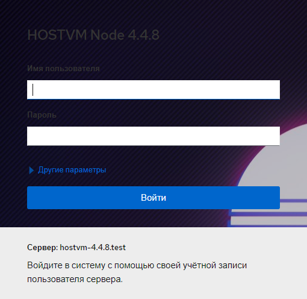

# Установка HOSTVM Manager на FC-диск

После установки ISO-дистрибутива на сервер обратитесь по адресу, указанному в процессе установки на порт 9090 через браузер и зайдите под пользователем root.

Пароль root по умолчанию для новой версии hostvm node: HostvmNode.

Логин HOSTVM Manager по умолчанию: admin\
Пароль HOSTVM Manager по умолчанию: engine

Пример адреса: [https://192.168.0.5:9090](https://192.168.0.5:9090)

Перейдите на вкладку _Apps->Virtualization->Hosted Engine._

Напротив Hosted-engine нажмите кнопку _Start._


Внимание! FC-диск для организации хранилища виртуальных машин должен отвечать следующим требованиям:

* объем диска – не менее 80 Gb;
* диск должен быть пустым и не содержать в себе какой-либо файловой системы;
* диск не может быть примонтирован к текущей файловой системе.


На DNS-сервере должны быть как минимум две записи типа A, содержащие в себе FQDN-имя сервера, а также имя виртуальной машины hosted-engine, которая будет установлена.\
\
Если на DNS-сервере отсутствуют записи, то их можно добавить вручную на ноде HOSTVM: [deistviya-pri-ustanovke-hostvm-pri-otsutstvii-zapisei-v-dns.md](../../deistviya-pri-ustanovke-hostvm-pri-otsutstvii-zapisei-v-dns.md "mention")

Заполните форму. Виртуальная машина создается со статическим файлом с использованием файла hosts.

Значения задаваемых параметров:

| Параметр               | Значение                                                                                            | Примечание                                                                                             |
| ---------------------- | --------------------------------------------------------------------------------------------------- | ------------------------------------------------------------------------------------------------------ |
| Engine VM FQDN         | Имя будущей виртуальной машины управления виртуализацией                                            | Имя должно разрешаться через файл _/etc/hosts_ или через DNS-сервер                                    |
| MAC Address            | MAC-адрес будущей виртуальной машины управления виртуализацией                                      | Можно оставить по умолчанию                                                                            |
| Network Configuration  | Способ получения IP-адреса                                                                          | Static или DHCP                                                                                        |
| VM IP Address          | Адрес виртуальной машины                                                                            |                                                                                                        |
| Gateway Address        | Адрес шлюза                                                                                         |                                                                                                        |
| DNS Servers            | DNS-серверы, прописываемые внутрь виртуальной машины                                                |                                                                                                        |
| Bridge Interface       | Каким физическим интерфейсом будет пользоваться виртуальная машина                                  | Можно оставить по умолчанию                                                                            |
| Root Password          | Пароль операционной системы виртуальной машины                                                      |                                                                                                        |
| Root SSH Access        | Может ли пользователь root авторизоваться через SSH-сервер                                          |                                                                                                        |
| Number of Virtual CPUs | Количество виртуальных ядер процессора, используемых виртуальной машиной                            | Рекомендуется не менее 4                                                                               |
| Memory Size (MiB)      | Память, используемая виртуальной машиной                                                            | Не менее 4096                                                                                          |
| Root SSH Public Key    | SSH-ключ безпарольного доступа внутрь виртуальной машины                                            |                                                                                                        |
| Bridge Name            | Имя виртуального сетевого интерфейса виртуальной машины                                             | Рекомендуется оставить по умолчанию                                                                    |
| Gateway Address        | Шлюз виртуальной машины                                                                             | Рекомендуется оставить по умолчанию                                                                    |
| Host FQDN              | Имя хоста виртуализации                                                                             | Рекомендуется оставить по умолчанию                                                                    |
| Edit Hosts File        | Создавать ли записи в hosts виртуальной машины                                                      | Рекомендуется включать опцию                                                                           |
| Pause Host             | Требуется ли приостанавливать установку для внесения своих изменений в настройки виртуальной машины | Не рекомендуется включать опцию                                                                        |
| Apply OpenSCAP profile | Профиль OpenSCP                                                                                     | Не рекомендуется включать опцию                                                                        |
| Network Test           | Проверка работоспособности виртуальной машины в процессе установки                                  | Рекомендуется выбрать _ping_ при использовании файла hosts. Можно оставить _DNS_ при использовании DNS |
| OVA Archive Path       | Путь до альтернативного образа виртуальной машины                                                   | Не рекомендуется использовать                                                                          |

Заполните следующую форму. Укажите пароль от веб-интерфейса будущей виртуальной машины. Заполните настройки отправки уведомлений e-mail при необходимости.

Создайте управляющую виртуальную машину (нажмите _Prepare VM_).

Подождите довольно продолжительное время, пока виртуальная машина не будет создана и настроена.

Выберете тип хранилища _Fibre Channel_ и укажите свободный LUN.

Подождите пока hosted-engine расположится в хранилище.

Поздравляем! Hosted-engine развернут.

Логин HOSTVM Manager по умолчанию: admin\
Пароль HOSTVM Manager по умолчанию: engine

## Если что-то пошло не так

1. Проверьте корректность вводимых данных в сценарии развёртывания. При обнаружении ошибок выполните команду `/usr/sbin/ovirt-hosted-engine-cleanup`, очистите хранилище и начните сначала.
2. Если после завершения установки не открывается страница в браузере с адресом `https://engine.mydomain.ru`, то

* проверьте, что Ip для управляющей машины, указанный в таблице в начале установки, отвечает на команду `ping`;
* проверьте, что имя engine.mydomain.ru разрешается вашим dns-сервером.

Если устранить проблему не удалось, обратитесь в [техническую поддержку](https://lk.pvhostvm.ru/) используя [инструкцию](https://lk.pvhostvm.ru/) К обращению приложите логи установки, которые находятся в директории `/var/log/ovirt-hosted-engine-setup`.
