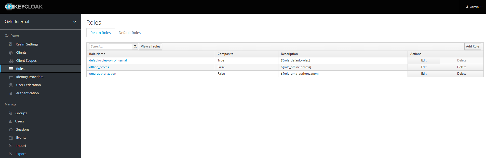
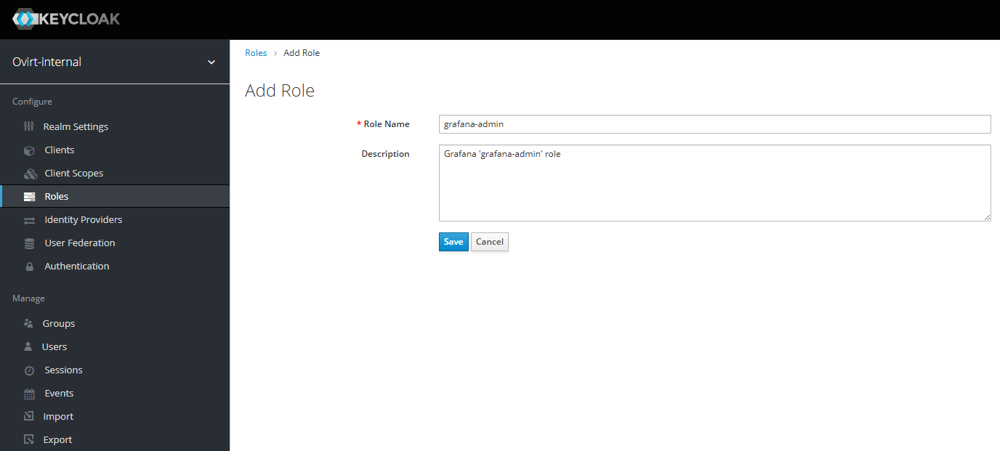
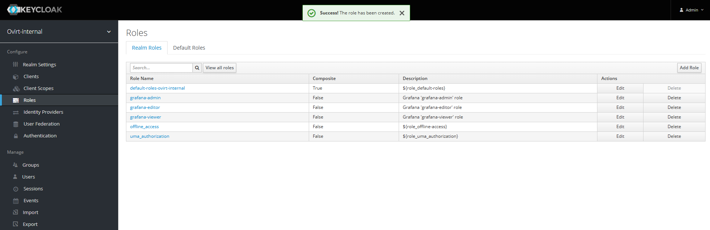
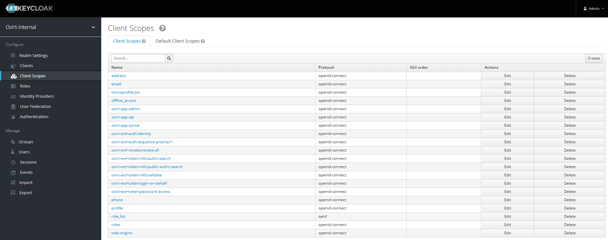
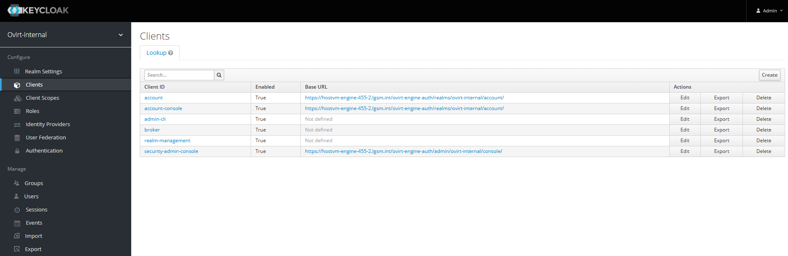
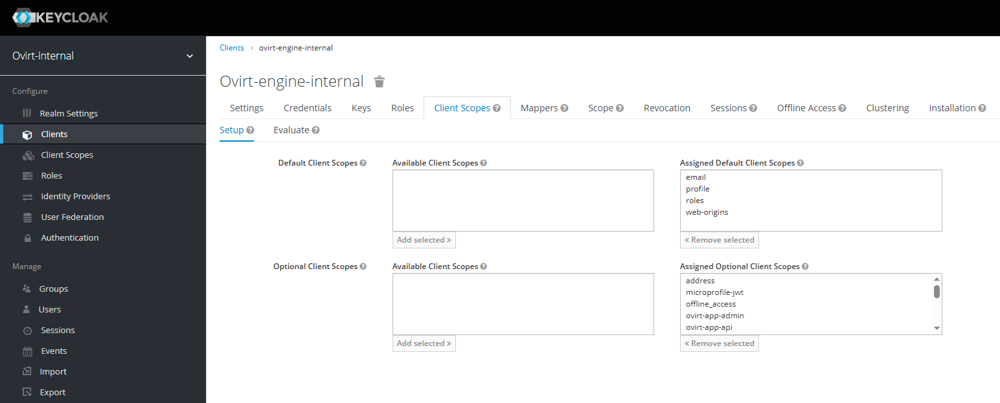

# Установка Keycloak


Первый шаг инструкции выполняется только в случае, если установка Keycloak производится на HOSTVM Manager, обновленный с версии 4.4 на 4.5, в остальных установка начинается с шага №2


1. В веб-интерфейсе управляющей машины заходим во вкладку Administration -> Providers, находим ovirt-provider-ovn, нажимаем Edit и переименуем его, например, на ovirt-provider-ovn\_old. В процессе установки он будет создан заново с другими параметрами.<br>
2. Перед установкой нужно перевести HOSTVM Manager в режим обслуживания, выполнив с ноды команду:<br>

```
hosted-engine --set-maintenance --mode=global
```

1. Далее подключиться к управляющей машине по ssh и запустить установку с выбором ответов:<br>

```
engine-setup --otopi-environment="OVESETUP_CONFIG/keycloakEnable=bool:True" --offline
```

&#x20;Либо запустить установку с ответами по умолчанию:

```
engine-setup --otopi-environment="OVESETUP_CONFIG/keycloakEnable=bool:True" --offline --accept-defaults
```

&#x20;После успешной установки зайти по адресу:\
[https://FQDN/ovirt-engine-auth/admin/](https://fqdn/ovirt-engine-auth/admin/)\
Логин: admin\
Пароль: указан при установке

1. Нужно создать realm, для этого в выпадающем списке нажать Add realm

<figure><figcaption></figcaption></figure>

6. Задать имя ovirt-internal для нового realm, дальнейшая настройка будет производиться в нем.

<figure><figcaption></figcaption></figure>

7.  Заходим в Groups, нажимаем New, задаем имя группы ovirt-administrator:

    <figure><figcaption></figcaption></figure>
8.  Заходим в Users, нажимаем Add user

    <figure><figcaption></figcaption></figure>
9.  Задаем имя пользователя admin@ovirt, Email: admin@localhost (важно для авторизации в Grafana), в выпадающем списке Groups выбираем ранее созданную группу ovirt-administrator<br>

    <figure><figcaption></figcaption></figure>
10. Проверяем, что пользователь успешно создан, нажав View all users, после чего нажимаем Edit:<br>

    <figure><figcaption></figcaption></figure>
11. Во вкладке Credentials задаем пользователю пароль, флаг Temporary говорит о том, что при первом входе будет необходимо изменить пароль<br>

    <figure><figcaption></figcaption></figure>
12. После ввода пароля нажимаем Set password:<br>

    <figure><figcaption></figcaption></figure>
13. Переходим во вкладку Roles и нажимаем Add Role:

    <figure><figcaption></figcaption></figure>
14. Задаем Role Name: grafana-admin, в Description можно написать: Grafana 'grafana-admin' role. Нажимаем Save:

    <figure><figcaption></figcaption></figure>
15. Повторяем шаги 13 и 14. Необходимо добавить роль grafana-editor с описанием Grafana 'grafana-editor' role и роль grafana-viewer с описанием Grafana 'grafana-viewer' role:

    <figure><figcaption></figcaption></figure>
16. Переходим во вкладку Client Scopes и нажимаем Create:<br>

    <figure><figcaption></figcaption></figure>
17. Задаем Name: ovirt-app-admin, остальные параметры оставить по умолчанию. Нажать Save:<br>

    <figure><figcaption></figcaption></figure>
18. Повторяем шаги 16 и 17 для создания Client Scope:

    ovirt-app-api

    ovirt-app-portal

    ovirt-ext=auth:identity

    ovirt-ext=auth:sequence-priority=\~

    ovirt-ext=revoke:revoke-all

    ovirt-ext=token-info:authz-search

    ovirt-ext=token-info:public-authz-search

    ovirt-ext=token-info:validate

    ovirt-ext=token:login-on-behalf

    ovirt-ext=token:password-access

    <figure><figcaption></figcaption></figure>
19. Переходим во вкладку Clients и нажимаем Create:

    <figure><figcaption></figcaption></figure>

    Задаем Client ID: ovirt-engine-internal, в качестве Root URL указываем https://FQDN управляющей машины. Нажимаем Save:

    <figure><figcaption></figcaption></figure>
20. Общие настройки клиента выглядят следующим образом:<br>

    <figure><figcaption></figcaption></figure>
21. Вносим изменения:

    Access type: confidential\
    Valid Redirect URLs: https://FQDN/\* меняем на https://FQDN\*\
    Base URL: https://FQDN\
    Backchannel Logout Session Required: OFF\
    Нажимаем Save.

    <figure><figcaption></figcaption></figure>
22. Переходим во вкладку Credential и сохраняем себе Secret, он понадобится вам при дальнейшей настройке.

    Secret: 5fb182da-34f0-411b-9f1b-78a332384219\
    <mark style="color:red;">**Обратите внимание! Ваш Secret будет отличаться от указанного в инструкции!**</mark>

    <figure><figcaption></figcaption></figure>
23. Переходим во вкладку Client Scopes:

    <figure><figcaption></figcaption></figure>
24. Перевести все доступные Optional Client Scopes из Available Client Scopes в Assigned Optional Client Scopes:

    <figure><figcaption></figcaption></figure>
25. Переходим во вкладку Mappers и нажимаем Create:<br>

    <figure><figcaption></figcaption></figure>
26. Создаем username со следующими параметрами, нажимаем Save:<br>

    <figure><figcaption></figcaption></figure>
27. Создаем groups со следующими параметрами, нажимаем Save:<br>

    <figure><figcaption></figcaption></figure>
28. Создаем realm role со следующими параметрами, нажимаем Save:<br>

    <figure><figcaption></figcaption></figure>
29. Настройка параметров Keycloak в административном веб-интерфейсе закончена. Дальнейшая настройка производится в терминале HOSTVM Manager. В консоли выполните команду:

```
grep OIDCClientSecret /etc/httpd/conf.d/internalsso-openidc.conf 
```

Пример вывода:<br>

```
OIDCClientSecret j8WIzSCM42BpCRuG8Vp8fg
```

30. Secret **j8WIzSCM42BpCRuG8Vp8fg** необходимо заменить на **5fb182da-34f0-411b-9f1b-78a332384219** из пункта 23. Изменить Secret необходимо в следующих файлах:

* /etc/httpd/conf.d/internalsso-openidc.con
* /etc/grafana/grafana.ini
* /etc/ovirt-engine/engine.conf.d/12-setup-keycloak.conf
* /etc/ovirt-engine-setup.conf.d/20-setup-ovirt-post.conf

Выполните следующие команды <mark style="color:red;">**(Подставляя свои значения!)**</mark>:\
\
&#x20;

```
cp /etc/httpd/conf.d/internalsso-openidc.conf /etc/httpd/conf.d/internalsso-openidc.conf.bak
```

```
sed -i 's/j8WIzSCM42BpCRuG8Vp8fg/5fb182da-34f0-411b-9f1b-78a332384219/g' /etc/httpd/conf.d/internalsso-openidc.conf
```

```
/cp /etc/grafana/grafana.ini /etc/grafana/grafana.ini.bak
```

```
sed -i 's/j8WIzSCM42BpCRuG8Vp8fg/5fb182da-34f0-411b-9f1b-78a332384219/g' /etc/grafana/grafana.ini
```

```
cp /etc/ovirt-engine/engine.conf.d/12-setup-keycloak.conf /etc/ovirt-engine/engine.conf.d/12-setup-keycloak.conf.bak
```

```
sed -i 's/j8WIzSCM42BpCRuG8Vp8fg/5fb182da-34f0-411b-9f1b-78a332384219/g' /etc/ovirt-engine/engine.conf.d/12-setup-keycloak.conf 
```

```
cp /etc/ovirt-engine-setup.conf.d/20-setup-ovirt-post.conf /etc/ovirt-engine-setup.conf.d/20-setup-ovirt-post.conf.bak
```

```
sed -i 's/j8WIzSCM42BpCRuG8Vp8fg/5fb182da-34f0-411b-9f1b-78a332384219/g' /etc/ovirt-engine-setup.conf.d/20-setup-ovirt-post.conf
```

31. После завершения настройки  перезагружаем сервисы на управляющей машине:

```
systemctl restart httpd
```

```
systemctl restart grafana-server
```

```
systemctl restart ovirt-engine
```

32. Выводим HOSTVM Manager из режима обслуживания из консоли гипервизора:

```
hosted-engine --set-maintenance --mode=none
```

Веб портал будет доступен по ссылке:\
[https://FQDN/ovirt-engine<br>](https://fqdn/ovirt-engine)Логин: admin@ovirt\
Пароль: указан при настройке Keycloak

<br>
