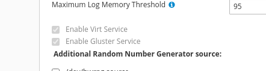
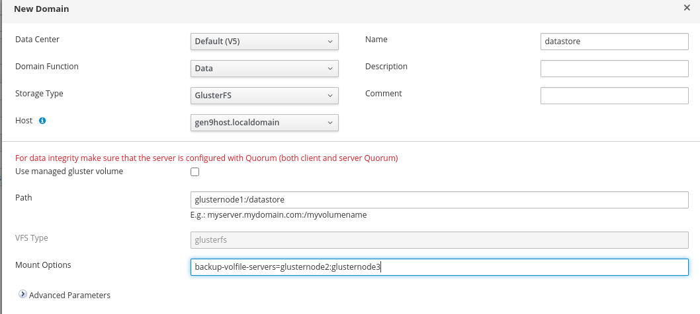

# Создание хранилища через CLI


Использование хранилища GlusterFS рекомендуется только для тестовых сред.


После развертывания HOSTVM используйте данное руководство для создания нового хранилища для виртуальных машин с использованием CLI.

Для обеспечения отказоустойчивости рекомендуется вариант настройки на трех, либо кратном трем количестве серверов (3, 6, 9, 12 и т.д.), приведенный в данном руководстве.

### Создание дополнительных записей имен серверов

На каждый из серверов кластера и на ВМ HOSTVM Manager добавить в файлы `/etc/hosts` записи следующего вида:

```
192.168.120.10    glusternode1    glusternode1.localdomain
192.168.120.11    glusternode2    glusternode2.localdomain
192.168.120.12    glusternode3    glusternode3.localdomain
```

* glusternode1-3 имя нод GlusterFS (второе имя для серверов и их IP-адреса на выделенных под Gluster интерфейсах).
* Опционально можно прописать все имена на DNS-сервере.

### Разметка дискового пространства

Допустим, что под новое хранилище виртуальных машин `datastore` мы хотим выделить 3ТБ.

Для размещения используем рейд-массив дисков, представленный в виде устройства `/dev/sdX`.

На каждом из серверов создадим logical volume под виртуальные машины:

```bash
pvcreate /dev/sdX
vgcreate datavg /dev/sdX
lvcreate -L 3072G -n datastore_lv datavg
mkfs.xfs -l size=512 /dev/mapper/datastore_lv
mkdir -p /data/gluster/datastore
```

* datavg – имя новой volume группы
* datastore\_lv – имя логического тома в составе группы datavg
* /data/gluster/datastore - точка монтирования

После того, как созданы том и файловая система, следующий шаг – создать запись в `/etc/fstab`:

```
/dev/mapper/datavg-datastore_lv    /data/gluster/datastore    xfs    defaults 0 0
```

И примонтировать том:

```bash
mount -a
```

На каждом из серверов создать директории под брики и запустить службу glusterd:

```bash
mkdir /data/gluster/datastore/brick
systemctl start glusterd && systemctl enable glusterd
```

Открываем требуемые порты на каждом сервере:

```bash
firewall-cmd --zone=public --add-port=24007-24008/tcp --permanent
firewall-cmd --zone=public --add-port=24009/tcp --permanent
firewall-cmd --zone=public --add-port=111/tcp --permanent
firewall-cmd --zone=public --add-port=139/tcp --permanent
firewall-cmd --zone=public --add-port=445/tcp --permanent
firewall-cmd --zone=public --add-port=965/tcp --permanent
firewall-cmd --zone=public --add-port=2049/tcp --permanent
firewall-cmd --zone=public --add-port=38465-38469/tcp --permanent
firewall-cmd --zone=public --add-port=631/tcp --permanent
firewall-cmd --zone=public --add-port=111/udp --permanent
firewall-cmd --zone=public --add-port=963/udp --permanent
firewall-cmd --zone=public --add-port=49152-49251/tcp --permanent
firewall-cmd --zone=public --add-service= nfs --permanent
firewall-cmd --zone=public --add-service=samba --permanent
firewall-cmd --zone=public --add-service=samba-client --permanent
firewall-cmd --reload
```

### Инициализация хранилища

Дальнейшая настройка осуществляется с одного из серверов будущего кластера т.е. _приведённые ниже команды нужно запускать только с одного из серверов_.

В примере команды выполняются с glusternode1.

Добавим ноды GlusterFS в зону видимости друг друга:

```
root@glusternode1:~# gluster peer probe glusternode2
root@glusternode1:~# gluster peer probe glusternode3
```

Инициализировать хранилище `datastore` командой :

```
root@glusternode1:~# gluster volume create datastore replica 3 glusternode1:/data/gluster/datastore/brick glusternode2:/data/gluster/datastore/brick glusternode3:/data/gluster/datastore/brick
```

Применить следующие настройки для хранилища `datastore`:

```
root@glusternode1:~# gluster volume set datastore cluster.quorum-type auto
root@glusternode1:~# gluster volume set datastore network.ping-timeout 10
root@glusternode1:~# gluster volume set datastore auth.allow \*
root@glusternode1:~# gluster volume set datastore group virt
root@glusternode1:~# gluster volume set datastore storage.owner-uid 36
root@glusternode1:~# gluster volume set datastore storage.owner-gid 36
root@glusternode1:~# gluster volume set datastore server.allow-insecure on
root@glusternode1:~# gluster volume set datastore features.shard on
root@glusternode1:~# gluster volume set datastore features.shard-block-size 512MB
root@glusternode1:~# gluster volume start datastore
```

### Добавление хранилища через web-интерфейс портала администрирования

Убедитесь, что в настройках кластера, на котором развернуто хранилище, включена опция:

Compute > Clusters > выбрать кластер > нажать кнопку Edit > вкладка General > Enable Gluster Service



После применения настроек создать новое хранилище на подготовленном ранее томе:

Compute > Storage > Storage Domains > нажать кнопку New Domain



* В качестве Storage type указать GlusterFS
* Указать имя хранилища
* В поле Path указать путь к созданному тому (имя сервера и имя тома GlusterFS): `glusternode1:/datastore`
* В поле Mount options указать остальные ноды : `backup-volfile-servers=glusternode2:glusternode3`
