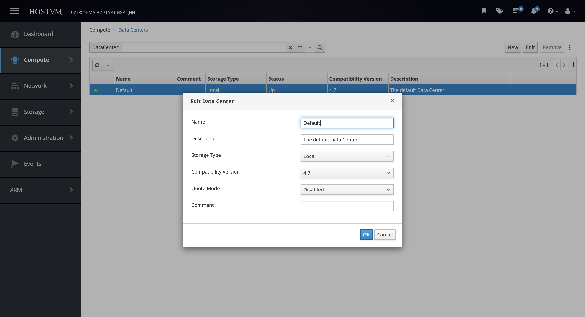
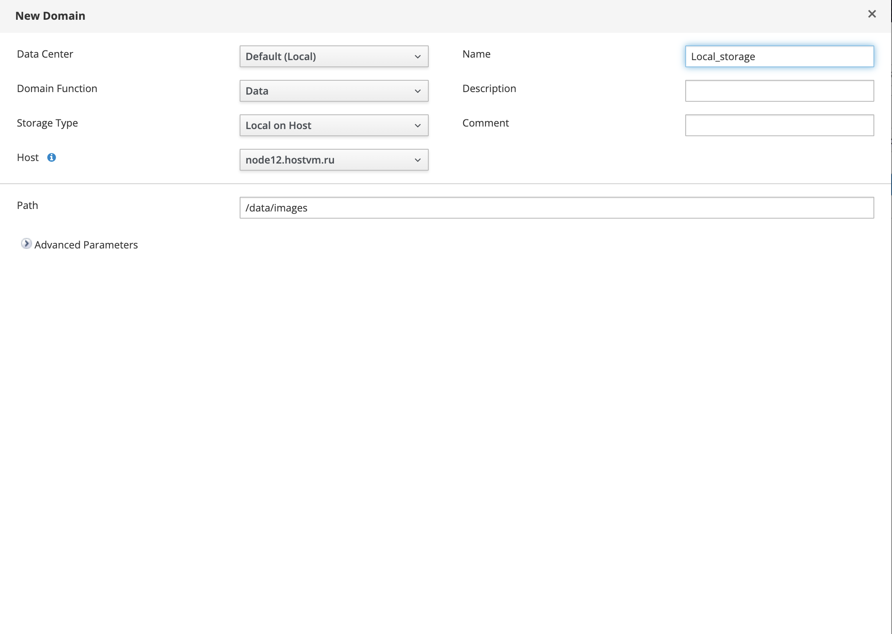
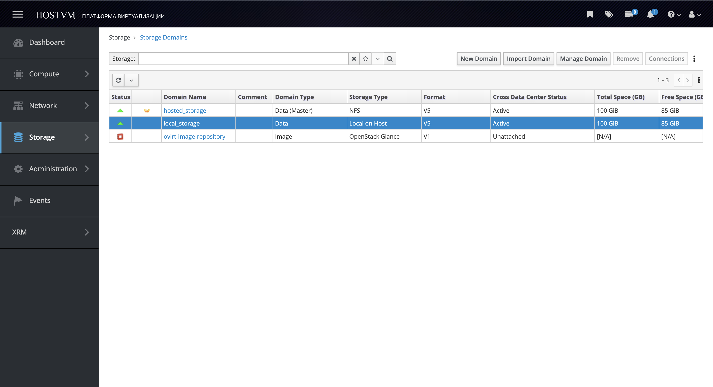

# Подключение локального хранилища

Добавление через портал администрирования:

1. Перейдите в раздел "Compute" -> "Data Centers";
2. Измените «Data Centers», если локальное хранилище находится на том же хосте, или создайте новое, если оно размещено на другом;
3. Задайте имя "Data Centers";
4. Выберите параметр "Storage Type" -> "Local";
5. Нажмите OK.

<figure><figcaption></figcaption></figure>

6. Перейдите в раздел "Storage" -> "Domains";
7. Нажмите «New», чтобы открыть окно диалога создания "Domains";
8. Задайте имя "Domain";
9. Выберите параметр "Storage Type" -> "Local on Host";
10. Укажите путь к каталогу локального хранилища в текстовом поле;
11. Нажмите OK.

<figure><figcaption></figcaption></figure>

12. Убедитесь, что local storage domain отображается со статусом "Active" и типом "Local on Host":

<figure><figcaption></figcaption></figure>

13\. Локальное хранилище готово.
