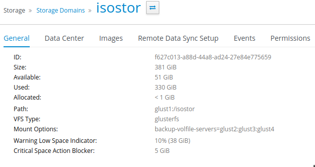

# Загрузка образов ISO

Для того, чтобы загрузить iso-образ в соответствующий домен хранения, необходимо скопировать его в директорию:

```
/путь к iso-домену/<domain-id>/images/11111111-1111-1111-1111-111111111111/
```

Получить можно через портал администрирования, на вкладке Details ISO домена, в поле ID:

<figure><figcaption></figcaption></figure>

Путь к iso-домену – это его месторасположение в файловой системе, например, /storage из примера по созданию NFS хранилища в п. «Подготовка NFS хранилища».

После загрузки файлов в указанную директорию необходимо изменить владельца файла командой chown 36:36 <ваш-образ>.iso. Обратите внимание, что владелец и группа файла изменилась с root:root на vdsm:kvm.

После завершения процедуры iso-образ будет доступен для использования через портал администрирования.

