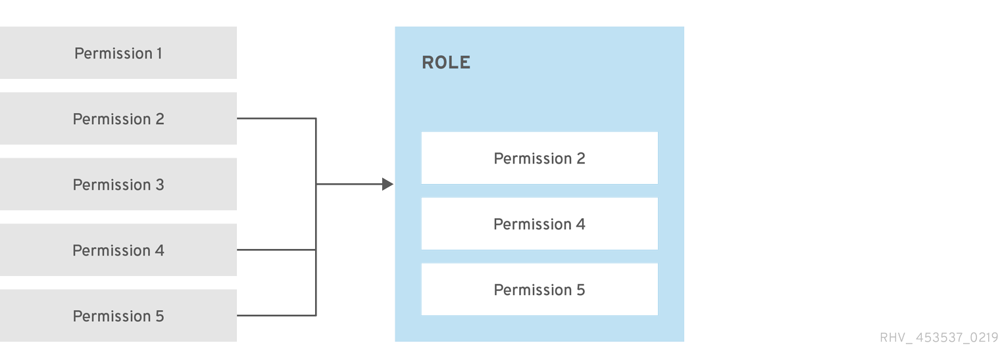
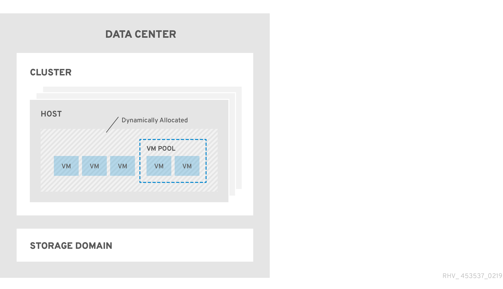

# Разрешения и роли

Новые пользователи обычно создаются в службе каталогов, подключенной к HOSTVM в качестве внешнего домена, с использованием встроенных механизмов службы. По умолчанию новые пользователи не имеют прав доступа к системе виртуализации HOSTVM. Для выполнения действий в системе им должны быть выданы соответствующие разрешения.

Модель авторизации HOSTVM основана на пользователях, действиях и объектах. Действия – это выполняемые задачи, например, запуск или остановка ВМ, создание шаблона, миграция ВМ на другой хост. Каждый тип действия имеет соответствующее разрешение. Пользователи имеют разрешения, которые позволяют им выполнять действия над объектами. Объекты – это сущности системы, такие как дата-центры, кластеры, хосты, сети или ВМ. Для упрощения обслуживания, несколько разрешений могут быть собраны в роль. Роль – это набор привилегий, дающих доступ к физическим и виртуальным ресурсам системы на разных уровнях. Система виртуализации имеет преднастроенные роли, такие как SuperUser или PowerUserRole. Они позволяют упростить выдачу конкретного уровня доступа пользователю.

<figure><figcaption></figcaption></figure>

Пользователям могут быть назначены роли, действующие на все объекты системы виртуализации HOSTVM, либо только на отдельные ее части (например, ВМ или дата-центр). Если пользователю назначена роль на объект, содержащий другие объекты, то пользователь будет иметь одну роль для всех объектов контейнера. Например, если пользователю назначена роль HostAdmin на кластер, он будет иметь эту роль на все хостах кластера.

Для выполнения некоторых действий пользователю могут потребоваться разрешения или роли на несколько объектов. Например, копирование шаблона между доменами хранения потребует соответствующих разрешений на оба домена.

Следующее изображение показывает иерархию объектов системы для наследования разрешений.

<figure><figcaption></figcaption></figure>
