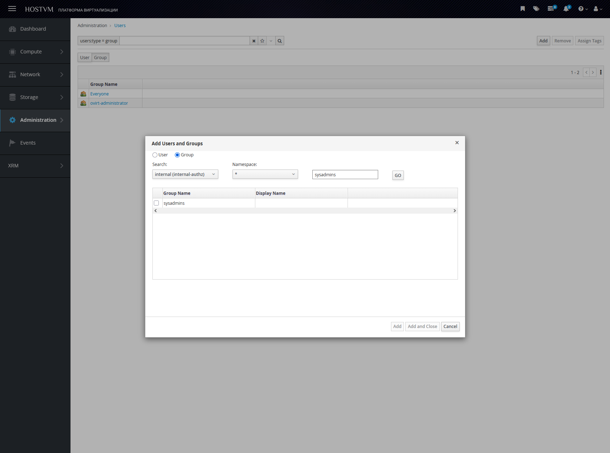

# Группы в системе управления

### Создание группы

Подключитесь по SSH к управляющей машине и выполните:

```
ovirt-aaa-jdbc-tool group add sysadmins
```

Проверка создания группы:

```
sudo ovirt-aaa-jdbc-tool query --what=group
```

Чтобы добавить новую группу в админ-панели, выполните следующие шаги:

1. В главном меню перейдите в раздел **Administration -> Users -> Group;**
2. На открывшейся странице списка групп нажмите кнопку **Add;**
3. В появившемся текстовом поле введите **Имя группы (Group Name);**
4. Нажмите кнопку **Go;**
5. В следующем окне подтвердите выбор, установив чекбокc напротив введенного имени группы;
6. Нажмите кнопку **Add** для добавления группы.

Для назначения пользователю необходимых ролей воспользуйтесь разделом: [Назначение ролей пользователям](razresheniya-i-roli/naznachenie-rolei-polzovatelyam.md)

<figure><figcaption></figcaption></figure>

## Добавление пользователя в группу

Для добавления пользователя в существующую группу выполните команду на управляющей машине:

```
sudo ovirt-aaa-jdbc-tool group-manage useradd sysadmins --user=admin2
```

Чтобы убедиться, что пользователь успешно добавлен в группу, выполните команду просмотра состава группы:

```
ovirt-aaa-jdbc-tool group-manage show sysadmins
```

В выводе команды будет отображен список всех пользователей, входящих в указанную группу.

### Удаление группы

Чтобы удалить группу через админ-панель, выполните следующие шаги:

1. В главном меню перейдите в раздел **Administration -> Users -> Group;**
2. В списке групп найдите и выберите нужную группу;
3. В контекстном меню или на панели действий нажмите кнопку **Remove;**
4. В диалоговом окне подтверждения нажмите **OK**.

**ВАЖНО!: при удалении группы через админ‑панель роли, назначенные этой группе, также удаляются.**&#x20;

Для полного удаления группы с управляющей машины выполните следующую команду:

```
ovirt-aaa-jdbc-tool group delete sysadmins
```
