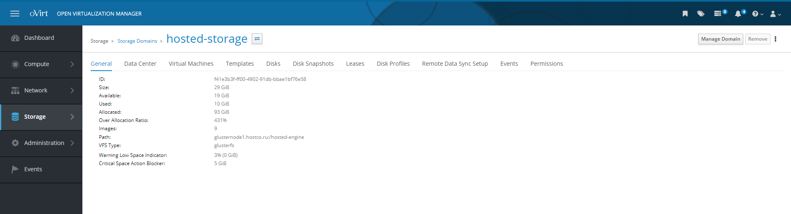

# Назначение ролей пользователям

Перед назначением пользователю прав или роли необходимо убедиться, что пользователь существует во внешнем или локальном домене. Обычно это проверяется с помощью административных инструментов, используемых службой каталогов вашего домена. После этого можно использовать портал администрирования для предоставления пользователю необходимых разрешений или ролей.

Чтобы назначить пользователю роль, применимую ко всем объектам в среде HOSTVM:

1. Выполните вход на портал администрирования с учетными данными пользователя с ролью SuperUser;
2. В левой панели щелкните Administration -> Configure, чтобы открыть диалоговое окно Configure;

<figure><figcaption></figcaption></figure>

3. Перейдите на вкладку System Permissions;
4. Нажмите Add чтобы открыть диалоговое окно Add System Permission to User;

<figure><figcaption></figcaption></figure>

5. Под полем Search выберите домен для поиска и нажмите кнопку GO для просмотра списка всех пользователей и групп;
6. Выберите нужного пользователя, используя чекбокс рядом с его именем;
7. Внизу диалогового окна выберите нужную для присвоения этому пользователю роль, нажав на выпадающий список с надписью Role to Assign;
8. Нажмите кнопку OK для подтверждения;

<figure><figcaption></figcaption></figure>

9. Чтобы убедиться в корректности присвоенных пользователю прав, войдите на соответствующий портал используя учетные данные данного пользователя.

Иногда пользователям необходимо назначить роль, которая применяется только к определенной части ресурсов в среде HOSTVM. В зависимости от назначенной роли пользователи могут получать доступ и использовать ресурсы, как описано ранее в этой главе. Ниже описана процедура назначения ролей пользователям на уровне ресурсов:

1. Перейдите на вкладку необходимого типа ресурсов и нажмите на ссылку в имени нужного ресурса, чтобы открыть его свойства;

<figure><figcaption></figcaption></figure>

2. Перейдите на вкладку Permissions, чтобы получить доступ к списку назначенных пользователей, ролей пользователей и наследуемых прав;

<figure><figcaption></figcaption></figure>

3. Нажмите кнопку Добавить, чтобы открыть диалоговое окно Add Permission to User;
4. Под полем Search выберите домен для поиска и нажмите кнопку GO, чтобы увидеть список всех пользователей и групп;
5. Выберите необходимого пользователя, установив флажок рядом с ним;
6. В нижней части диалогового окна выберите соответствующую роль для назначения этому пользователю, кликнув на выпадающий список под Role to Assign;
7. Чтобы подтвердить свой выбор нажмите ОК;
8. Чтобы убедиться в том, что пользователю присвоены корректные права, войдите на соответствующий портал с учетными данными этого пользователя и получите доступ к ресурсу.

