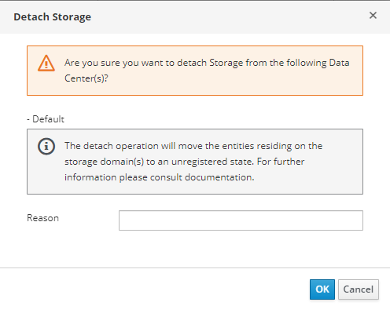
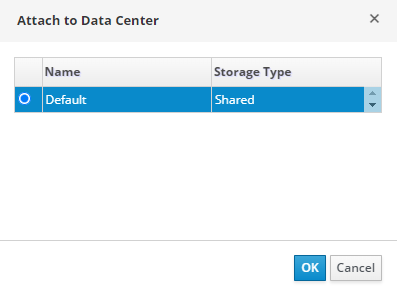
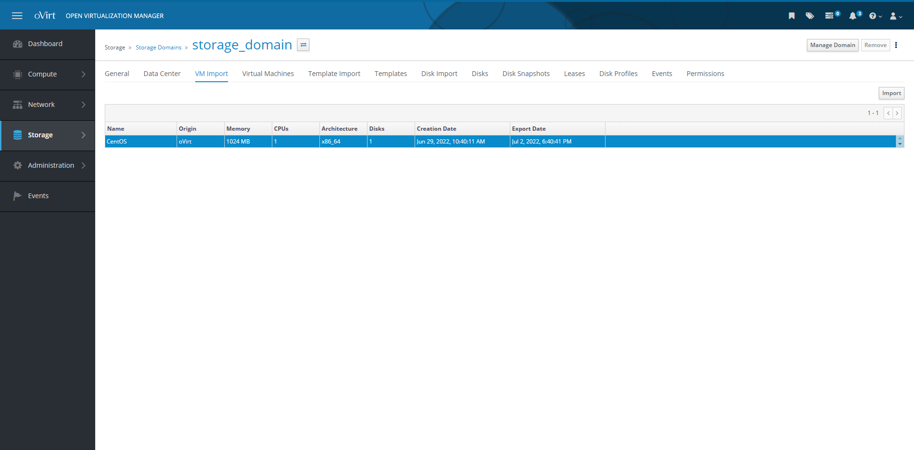
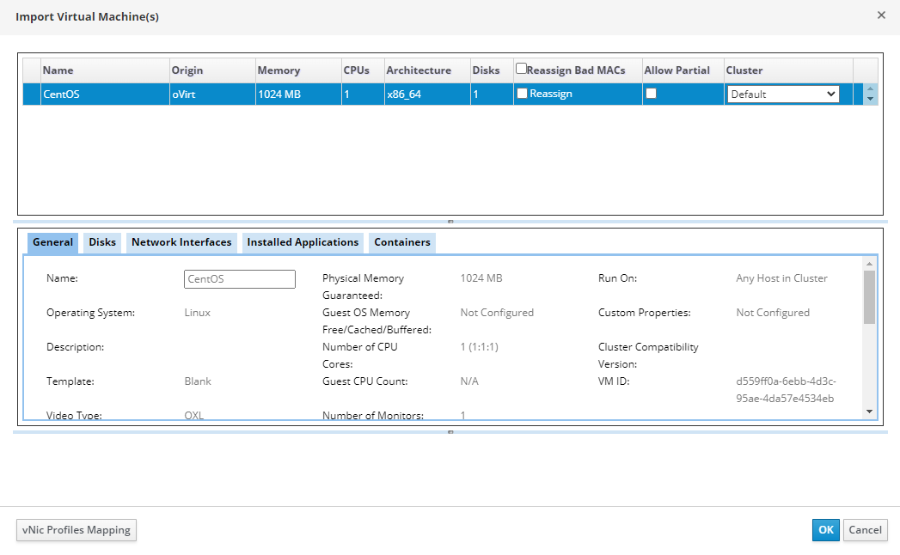

# Экспорт ВМ в другой дата-центр

HOSTVM Manager поддерживает перемещение образов ВМ между дата-центрами с использованием доменов данных. Домен данных необходим для хранения образов ВМ. Следующая процедура описывает, как экспортировать ВМ между дата-центрами с помощью домена данных на портале администрирования:

1. На вкладке Storage -> Domains выберите нужный домен данных. Отобразится новый раздел сведений о конфигурации домена данных. В этом новом разделе перейдите на вкладку Data Center и нажмите кнопку Maintenance, чтобы перевести домен данных в режим обслуживания в исходном дата-центре. Все ВМ должны быть выключены для перевода домена данных в режим обслуживания;
2. Отобразится окно Storage Domain maintenance c запросом подтверждения о переводе домена данных в режим обслуживания. Нажмите ОК;
3. Когда значение поля Domain status in Data Center для исходного центра данных изменится на Maintenance, нажмите Detach, чтобы отсоединить домен данных от исходного центра данных;

<figure><figcaption></figcaption></figure>

4. Откроется окно с заголовком Detach Storage. Нажмите OK, чтобы отсоединить домен данных от исходного дата-центра;
5. После отсоединения исходный дата-центр больше не будет отображен на вкладке Data Center в разделе сведений о конфигурации домена данных. На этой же вкладке нажмите кнопку Attach;
6. Откроется окно Attach to Data Center. Отметьте нужный дата-центр. Нажмите OK, чтобы присоединить домен данных к целевому дата-центру;

<figure><figcaption></figcaption></figure>

7. В разделе сведений о конфигурации домена данных перейдите на вкладку VM Import. Эта вкладка содержит список образов ВМ, хранящихся в домене данных. Выберите ВМ и нажмите Импорт;

<figure><figcaption></figcaption></figure>

8. Откроется окно Import Virtual Machine(s). Выберите кластер целевого дата-центра. Нажмите OK, чтобы импортировать ВМ;

<figure><figcaption></figcaption></figure>

9. Щелкните Compute навигационной панели слева и перейдите на вкладку Virtual Machines. Убедитесь, что импортированная ВМ отображается в списке, а ее статус Down.
