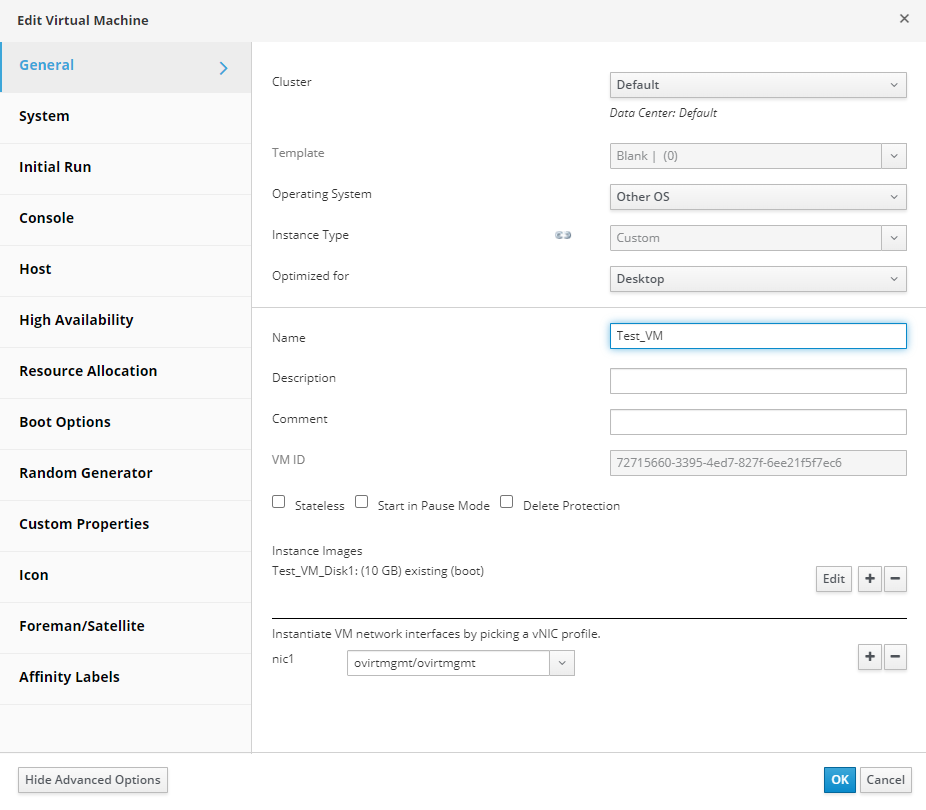

# Редактирование параметров ВМ

Чтобы навсегда изменить настройки ВМ, перейдите на вкладку Virtual Machines портала администрирования, выберите машину для изменения и нажмите кнопку Edit, либо щелкните по ВМ правой кнопкой мыши и выберите в меню пункт Edit. Откроется диалоговое окно Edit Virtual Machine.

<figure><figcaption></figcaption></figure>

Диалоговое окно Edit Virtual Machine практически идентично диалоговому окну New Virtual Machine, описанному в предыдущих разделах курса. Обратите внимание, что некоторые изменения требуют полного выключения ВМ и перезапуска.

Некоторые параметры (например, изменение Operating System) могут оказать серьезное влияние на ВМ. Перед внесением изменений убедитесь, что для изменяемой ВМ существует актуальная резервная копия.

Изменение данных параметров применяется немедленно, даже если ВМ запущена:

* Name (имя);
* Description (описание);
* Comment (комментарий);
* Optimized for (Desktop or Server) (оптимизировано для (десктоп или сервер);
* Delete Protection (защита от удаления);
* Network Interfaces (сетевые интерфейсы);
* Memory Size (объем памяти) – вы можете добавить память в «горячем» режиме даже если машина запущена;
* Virtual Sockets (виртуальные сокеты) – вы можете подключать vCPUs в «горячем» режиме, но ОС должна поддерживать данную возможность, вы также можете уменьшить (отключить) количество vCPUs, но только если они были подключены в «горячем» режиме, вы не можете уменьшить количество vCPUs ниже того значения, которое было присвоено ВМ при создании;
* Use custom migration downtime (задать время простоя при миграции);
* Highly Available (высокая доступность);
* Priority for Run/Migration queue (приоритет для очереди запуска/миграции);
* Disable strict user checking (отключить строгую проверку пользователей);
* Icon (иконка).

Все остальные настройки применяются только при выключении и последующем перезапуске ВМ. Ожидающие применения изменения отмечаются иконкой синей шестеренки в списке ВМ на портале администрирования. Краткое описание процедуры редактирования ВМ:

1. Найдите нужную машину в списке ВМ и выделите ее;
2. Нажмите кнопку Edit;
3. Измените необходимые параметры;
4. Нажмите кнопку OK, чтобы принять изменения;
5. Если появится диалоговое окно Next Start Configuration, нажмите кнопку OK.

