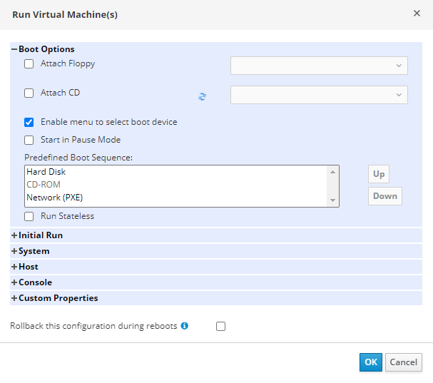

# Загрузка ВМ

Теперь, когда все оборудование для новой ВМ настроено, пришло время установить ОС. Если ВМ была запущена в штатном режиме, она может попытаться загрузиться с (пустого) жесткого диска, поэтому загрузите ее другим способом. Выберите новую ВМ в Virtual Machines, затем щелкните по стрелке на кнопке Run и выберите Run Once. Это вызовет окно Run Virtual Machine(s), в котором можно прикрепить установочный образ ОС, размещенный в домене ISO.

Установка ВМ с использованием PXE: ВМ в HOSTVM имеют функцию загрузки с помощью PXE (Pre-eXecution Environment, метод загрузки по сети).

Установка ВМ с помощью домена ISO: если установка с использованием PXE невозможна или необходимо выполнить установку с помощью ISO, можно использовать библиотеку ISO образов в домене ISO.

Для установки ВМ с помощью ISO-образа, выберите только что созданную ВМ, затем щелкните по стрелке на кнопке Run, выберите Run Once. Откроется окно Run Virtual Machine(s), в котором можно задать различные параметры загрузки ВМ. Чтобы загрузить ВМ из доступного ISO с помощью библиотеки ISO, нажмите кнопку + рядом с надписью Boot Options. Откроется новый раздел диалога, где вы можете указать способ загрузки этой ВМ. Поскольку вы использовали опцию Run Once, изменения, внесенные здесь, будут использоваться только для этой загрузки ВМ. Чтобы прикрепить установочный ISO к виртуальному приводу CD-ROM ВМ, установите флажок рядом с надписью Attach CD. Это активирует виртуальный привод CD-ROM для данной загрузки и позволит вам выбрать подходящий ISO-файл из списка всех доступных ISO в вашей библиотеке.

<figure><figcaption></figcaption></figure>

После того как вы выбрали нужный ISO-файл, задайте правильный порядок загрузки для ВМ. В этом примере выберите привод CD-ROM, щелкнув по его имени в списке Predefined Boot Sequence. Таким образом, будет выбран виртуальный CD-ROM привод и активированы две дополнительные кнопки Up (вверх) и Down (вниз). Так как вы хотите загрузиться с ISO-файла, примонтированном вашем виртуальном CD-ROM приводе, используйте кнопки Вниз и Вверх, чтобы переместить CD-ROM наверх списка Predefined Boot Sequence.

Важно: если запущенная через Run Once инсталляция была перезагружена без выключения ВМ, параметры BIOS сохранятся и ВМ снова загрузится с CD-ROM. Для сброса параметров Run Once необходимо выключить машину. Чтобы сбросить параметры Run Once автоматически, без необходимости вручную выключать машину, включите опцию Rollback this configuration during reboots.

Примените все параметры, щелкнув на кнопку OK.
