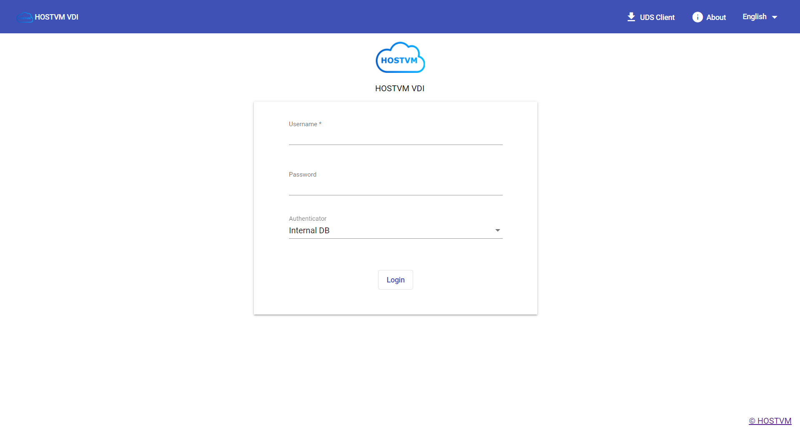

# Руководство администратора

## Глоссарий

|                    Понятие                   |                                       Определение                                      |
| :------------------------------------------: | :------------------------------------------------------------------------------------: |
|        Аутентификатор (Authenticator)        | Ресурс, обеспечивающий управление правами доступа пользователей к виртуальным ресурсам |
|         Базовый образ (Base Machine)         |                            Базовый шаблон виртуальной машины                           |
| Менеджеры операционной системы (OS Managers) |       Управляющий компонент для операционной системы виртуального рабочего места       |
|               Сервис (Service)               |                Ресурс, обеспечивающий выделение виртуальных рабочих мест               |
|          Тонкий клон (Linked Clone)          |               Клонированный образ виртуальной машины минимального размера              |
|            Транспорты (Transports)           |     Приложения для подключения к виртуальным рабочим местам по требуемым протоколам    |

## Общие данные

Руководство описывает действия администратора при настройке основных компонентов программного комплекса и содержит список и описание наиболее часто встречающихся команд.

## Администрирование HOSTVM VDI

Для первоначальной настройки и администрирования программного комплекса необходимо ввести IP-адрес или имя VDI брокера (развернутого из образа виртуальной машины) через http или https доступ.

При первом входе в панель администрирования VDI необходимо ввести имя и пароль администратора.

После входа, в панели администрирования можно изменить пароль, создать или выбрать новых пользователей, которым будет разрешен доступ.

Если уже существует настроенная учетная запись пользователя с правами администратора для платформы VDI, необходимо ввести имя и пароль этого пользователя и выбрать тип аутентификации, который будет использоваться для входа.

Если настроено несколько аутентификаторов, и необходимо получить доступ к панели администрирования с помощью локальной учетной записи администратора, выбранный аутентификатор не будет использоваться, так как этот пользователь не будет сопоставлен с аутентификатором.

Для перехода к порталу администрирования необходимо выбрать **«Dashboard» ("Панель управления")** в меню пользователя.

После открытия панели управления необходимо выполнить первоначальную конфигурацию компонентов, составляющих пул сервисов, для развертывания и подключения виртуальных рабочих столов и сервисов, поддерживаемых HOSTVM VDI.

Конфигурация каждого пула сервисов составляется из различных элементов:&#x20;

* подключение [сервис-провайдера](service-providers/);
* подготовка [базовых образов виртуальных машин](base-image-preparation/) (для виртуальных рабочих столов);
* настройка [методов аутентификации пользователей](authenticators/), групп доступа;
* настройка [менеджеров ОС](os-managers.md);
* настройка [протоколов подключения](transports/).&#x20;

После настройки компонентов пула, можно приступать к его [развертыванию](service-pools.md).

