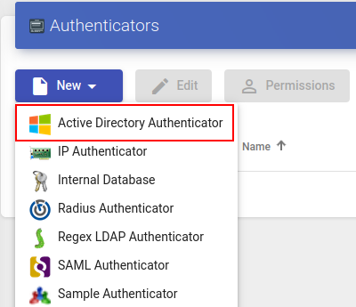

# Active Directory

Этот внешний аутентификатор обеспечивает доступ пользователям и группам пользователей, принадлежащим Active Directory, к виртуальным рабочим столам или приложениям.

### Версия 3.0 

Обязательные параметры для настройки аутентификатора Active Directory:

* Имя (Name) – имя аутентификатора;
* Приоритет (Priority) – приоритет аутентификатора. Чем ниже значение параметра, тем выше аутентификатор будет отображаться в списке аутентификаторов, доступных в окне доступа пользователя. Допускаются отрицательные значения;
* Метка (Label) – позволяет пользователям выполнять вход в систему используя этот аутентификатор, без необходимости выбора из перечня доступных. Доступ к форме входа в таком случае осуществляется по прямой ссылке вида HOSTVM-VDI-Server/uds/page/login/label, где label - значение данного поля. Например, если в поле задано значение AD, ссылка будет иметь вид https://HOSTVM-VDI-Server/uds/page/login/AD;
* Хост (Host) – IP-адрес или имя сервера AD;
* Порт (Port) – порт подключения к серверу AD (389, или 636 при использовании SSL);
* Использовать SSL (Use SSL) – если установлено значение «Да», используется SSL-соединение с сервером AD;
* Пользователь (Ldap user) – имя пользователя с правами чтения AD в формате: user@domain;
* Пароль (Password) – пароль пользователя;
* Тайм-аут (Timeout) – тайм-аут подключения к AD, в секундах;
* База (Base) – база поиска (для пользователей и групп) в AD (например dc=example,dc=com).

Нажав кнопку «Проверить» (Test), можно проверить, правильно ли настроено соединение с AD.

### Версия 3.5 

**Обязательные параметры** для настройки аутентификатора Active Directory:

_Основные (Main)_

* Имя (Name) – имя аутентификатора;
* Приоритет (Priority) – приоритет аутентификатора. Чем ниже значение параметра, тем выше аутентификатор будет отображаться в списке аутентификаторов, доступных в окне доступа пользователя. Допускаются отрицательные значения;
* Метка (Label) – позволяет пользователям выполнять вход в систему используя этот аутентификатор, без необходимости выбора из перечня доступных. Доступ к форме входа в таком случае осуществляется по прямой ссылке вида HOSTVM-VDI-Server/uds/page/login/label, где label - значение данного поля. Например, если в поле задано значение AD, ссылка будет иметь вид https://HOSTVM-VDI-Server/uds/page/login/AD;
* Хост (Host) – IP-адрес или имя сервера AD;
* Использовать SSL (Use SSL) – если установлено значение «Да», используется SSL-соединение с сервером AD;
* Тайм-аут (Timeout) – тайм-аут подключения к AD, в секундах;

_Учётные данные (Credentials)_

* Имя пользователя (Username) – имя пользователя с правами чтения AD в формате: user@domain;
* Пароль (Password) – пароль пользователя;

_Расширенные (Advanced)_

* База поиска (Search base) – база поиска (для пользователей и групп) в AD (например dc=example,dc=com).

**Дополнительные параметры** для настройки аутентификатора Active Directory:

_Расширенные (Advanced)_

* Переопределить базу поиска для групп (Override search base for groups) – если задано, переопределяет базу поиска AD для групп (например ou=groups,dc=example,dc=com);
* Домен по умолчанию (Default domain) – если задано, этот домен будет добавляться к имени пользователя для входа в систему, когда явно не используется UPN (user@domain). По умолчанию, если поле не заполнено, используется значение домена учетной записи со вкладки "Учетные данные". Указывается в формате `domain.dom`;
* Получить вложенные группы (Fetch Nested Groups) – если включено, поиск членства пользователя будет осуществляться во вложенных группах, в дополнение к тем, в которых он состоит напрямую.\
  \
  &#xNAN;_&#x41F;римечание:_ при большом количестве групп в домене и глубоком уровне их вложенности время ожидания ответа от контроллера домена может серьезно увеличиваться, и в некоторых случаях приводить к ошибке аутентификации пользователя. В таких случаях рекомендуется активировать эту настройку совместно с ограничением базы поиска групп (заданием параметра "Переопределить базу поиска для групп").

Нажав кнопку «Проверить» (Test), можно проверить, правильно ли настроено соединение с AD.

### Версия 3.6 

**Обязательные параметры** для настройки аутентификатора Active Directory:

_Основные (Main)_

* Имя (Name) – имя аутентификатора;
* Приоритет (Priority) – приоритет аутентификатора. Чем ниже значение параметра, тем выше аутентификатор будет отображаться в списке аутентификаторов, доступных в окне доступа пользователя. Допускаются отрицательные значения;
* Метка (Label) – позволяет пользователям выполнять вход в систему используя этот аутентификатор, без необходимости выбора из перечня доступных. Доступ к форме входа в таком случае осуществляется по прямой ссылке вида HOSTVM-VDI-Server/uds/page/login/label, где label - значение данного поля. Например, если в поле задано значение AD, ссылка будет иметь вид https://HOSTVM-VDI-Server/uds/page/login/AD;
* Хост (Host) – IP-адрес или имя сервера AD;
* Использовать SSL (Use SSL) – если установлено значение «Да», используется SSL-соединение с сервером AD;
* Совместимость (Compatibility) - уровень совместимости для аутентификатора Active Directory.

_Учётные данные (Credentials)_

* Имя пользователя (Username) – имя пользователя с правами чтения AD в формате: user@domain;
* Пароль (Password) – пароль пользователя;

_Расширенные (Advanced)_

* База поиска (Search base) – база поиска (для пользователей и групп) в AD (например dc=example,dc=com);
* Тайм-аут (Timeout) – тайм-аут подключения к AD, в секундах.

**Дополнительные параметры** для настройки аутентификатора Active Directory:

_Расширенные (Advanced)_

* Переопределить базу поиска для групп (Override search base for groups) – если задано, переопределяет базу поиска AD для групп (например ou=groups,dc=example,dc=com);
* Домен по умолчанию (Default domain) – если задано, этот домен будет добавляться к имени пользователя для входа в систему, когда явно не используется UPN (user@domain). По умолчанию, если поле не заполнено, используется значение домена учетной записи со вкладки "Учетные данные". Указывается в формате `domain.dom`;
* Получить вложенные группы (Fetch Nested Groups) – если включено, поиск членства пользователя будет осуществляться во вложенных группах, в дополнение к тем, в которых он состоит напрямую.\
  \
  &#xNAN;_&#x41F;римечание:_ при большом количестве групп в домене и глубоком уровне их вложенности время ожидания ответа от контроллера домена может серьезно увеличиваться, и в некоторых случаях приводить к ошибке аутентификации пользователя. В таких случаях рекомендуется активировать эту настройку совместно с ограничением базы поиска групп (заданием параметра "Переопределить базу поиска для групп").
* Проверка SSL - проверка SSL сертификата сервера AD;
* Сертификат - CA сертификат сервера AD.

_МФА (MFA)_

* Атрибут MFA - атрибут для извлечения кода МФА;
* Провайдер MFA - провайдер МФА, используемый этим аутентификатором.

Нажав кнопку «Проверить» (Test), можно проверить, правильно ли настроено соединение с AD.

