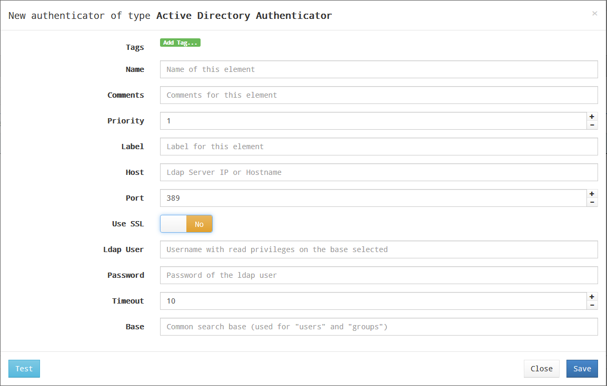

# Active Directory

Этот внешний аутентификатор обеспечивает доступ пользователям и группам пользователей, принадлежащим Active Directory, к виртуальным рабочим столам или приложениям.

Минимальные параметры для настройки в аутентификаторе Active Directory:

* имя (Name) – имя аутентификатора;
* приоритет (Priority) – приоритет аутентификатора. Чем ниже значение параметра, тем выше аутентификатор будет отображаться в списке аутентификаторов, доступных в окне доступа пользователя. Допускаются отрицательные значения;
* метка (Label) – позволяет пользователям выполнять вход в систему используя этот аутентификатор, без необходимости выбора из перечня доступных. Доступ к форме входа в таком случае осуществляется по прямой ссылке вида HOSTVM-VDI-Server/uds/page/login/label, где label - значение данного поля. Например, если в поле задано значение AD, ссылка будет иметь вид https://HOSTVM-VDI-Server/uds/page/login/AD;
* хост (Host) – IP-адрес или имя сервера AD;
* порт (Port) – порт подключения к серверу AD (обычно 389, или 636 при использовании SSL);
* использовать SSL (Use SSL) – если установлено значение «Yes», используется SSL-соединение с сервером AD;
* пользователь (Ldap user) – пользователь с правами чтения AD в формате: user@domain;
* пароль (Password) – пароль пользователя;
* тайм-аут (Timeout) – тайм-аут соединения с аутентификатором;
* Base – базовая запись поиска в AD (например dc=example, dc=com).

Нажав кнопку «Test», можно проверить, правильно ли настроено соединение с AD.

###
