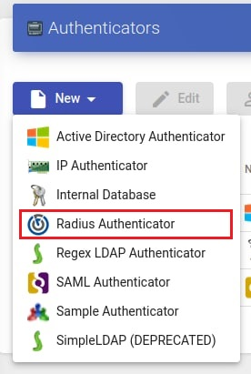
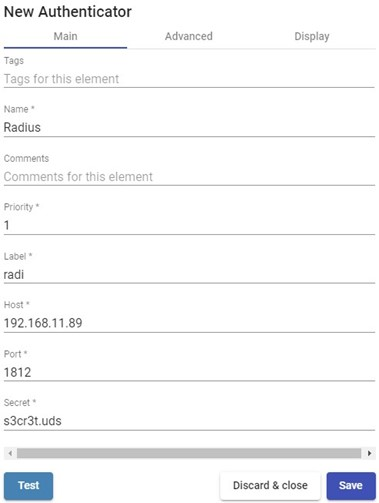
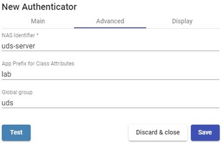
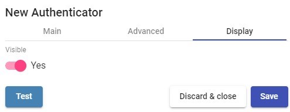

# Radius

Этот внешний аутентификатор позволяет предоставлять доступ к виртуальным рабочим столам и приложениям пользователям и группам пользователей, принадлежащим к аутентификатору протокола RADIUS.

<figure><figcaption></figcaption></figure>

Для работы требуется настройка следующих минимальных параметров «Radius Authenticator»:

* Main:

**Name:** Имя аутентификатора.

**Priority:** Приоритет который будет задан аутентификатору. Если аутентификаторов несколько, то чем ниже приоритет, тем выше в списке доступных аутентификаторов на HOSTVM VDI портале он будет расположен. Данное поле допускает отрицательные значения.

**Label:** Включает прямую валидацию для аутентификатора. Прямая валидация позволяет пользователю проходить валидацию с указанным аутентификатором, даже если в окружении HOSTVM VDI настроены несколько аутентификаторов. Чтобы выполнить прямую валидацию, вы должны получить доступ к порталу HOSTVM VDI используя следующий формат:

_**VDIServer/uds/page/login/label**_

(Например: https://VDIServer/uds/page/login/Radi).

**Host:** IP-адрес или имя сервера RADIUS.

**Port:** Порт, используемый для соединения с RADIUS сервером

**Secret:** Строка подлинности (валидации) соответствующего RADIUS сервера (определяется на самом RADIUS сервере).

<figure><figcaption></figcaption></figure>

* Advanced:

**NAS Identified:** Идентифицирует HOSTVM VDI внутри RADIUS сервера, позволяя использовать фильтрацию при необходимости.

**App Prefix for Class Attributes:** Позволяет фильтровать какие группы мы получаем из атрибута «class» RADIUS сервера.

**Global group:** Позволяет принудительно включить всех пользователей в какую-либо группу. Это позволяет RADIUS серверу (который является «простым» аутентификатором) который не имеет групп, иметь возможность включать ВСЕХ пользователей в группу (даже если он также содержит группы).

<figure><figcaption></figcaption></figure>

**Примечание:**

По умолчанию, HOSTVM VDI будет извлекать из атрибута «Class» Radius сервера элементы, которые имеют вид "group=..."

Например, если мы укажем в поле "App Prefix for Class Attributes" значение "lab", HOSTVM VDI будет искать только те атрибуты "class" которые имеют вид "labgroup=..."

* Display:

**Visible:** Если отключен, аутентификатор не будет отображён как доступный на портале HOSTVM VDI.

<figure><figcaption></figcaption></figure>

Нажав на кнопку **«Test»**, вы можете проверить успешность соединения.
