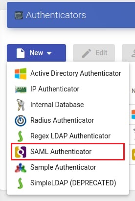
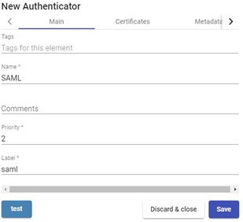
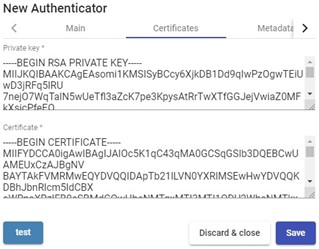
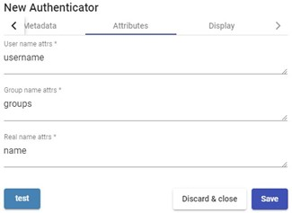
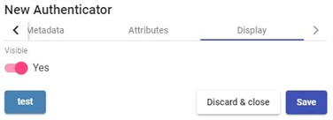

# SAML

Аутентификатор SAML позволяет пользователям и группам пользователей, принадлежащим к поставщику удостоверений с поддержкой SAML 2.0 получить доступ к виртуальным рабочим столам и приложениям.

SAML используется для обмена данными авторизации и аутентификации между доменами безопасности, то есть между провайдером идентификационных данных (создателем требований) и провайдером услуг (потребителем требований).

<figure><figcaption></figcaption></figure>

## Основные настройки 

**Name (Имя) -** имя аутентификатора (не должно содержать знак пробела).

**Priority (Приоритет) -** приоритет, который будет присвоен аутентификатору. Чем ниже значение приоритета, тем выше он будет отображен в листе аутентификаторов, доступных в окне авторизации пользователей. Данное поле допускает отрицательные значения.

**Label (Метка) -** включает прямую валидацию для аутентификатора. Прямая валидация позволяет пользователю проходить валидацию с указанным аутентификатором в окне авторизации, даже если в окружении HOSTVM VDI настроены несколько аутентификаторов. Чтобы выполнить прямую валидацию, вы должны получить доступ к порталу HOSTVM VDI используя следующий формат:

_**VDIServer/uds/page/login/label**_

(Например: https://VDIServer/uds/page/login/SAML).

<figure><figcaption></figcaption></figure>

## Сертификаты 

**Private key (Закрытый ключ) -** закрытый RSA ключ, который будет использоваться для подписей и шифрования.

**Certificate (Сертификат) -** открытый ключ, который будет использоваться в SSL сессиях.

<figure><figcaption></figcaption></figure>

## Метаданные 

**IDP Metadata (Метаданные IdP (поставщика идентификационных данных)) -** вы можете указать URL или файл в формате XML.

**Entity ID (Идентификатор объекта) -** данное поле изначально должно быть пустым. URL будет сгенерирован автоматически при сохранении аутентификатора. URL сгенерированный в данном поле обычно используется для регистрации брокера VDI в качестве SP (service provider – поставщика услуг) на сервере SAML.

<figure><figcaption></figcaption></figure>

## Атрибуты 

**User name attrs (Атрибут имени пользователя) -** атрибут, определяющий имя пользователя для выполнения входа на портал доступа VDI.

**Group name attrs (Атрибут имени группы) -** атрибут, определяющий принадлежность пользователя к группе. Могут быть указаны различные атрибуты для определения разных атрибутов группы (по одному в каждой строке), а также позволяется использование регулярных выражений для извлечения или составления специфичных значений.

**Real name attrs (Атрибут настоящего имени) -** атрибут, определяющий информацию об имени пользователя. Он не влияет на портал входа VDI.

<figure><figcaption></figcaption></figure>

## Экран / Дисплей 

**Visible (Видимость) -** если отключено, аутентификатор не будет отображен как доступный на странице входа в VDI.

<figure><figcaption></figcaption></figure>

## Примеры настройки 

В данном разделе приведены примеры интеграции аутентификатора SAML с внешними IdP провайдерами.

### Indeed Identity Provider

Руководство по настройке: [https://support.indeed-company.ru/Knowledgebase/Article/View/hostvm-vdi--plus--indeed-identity-provider-saml](https://support.indeed-company.ru/Knowledgebase/Article/View/hostvm-vdi--plus--indeed-identity-provider-saml)
