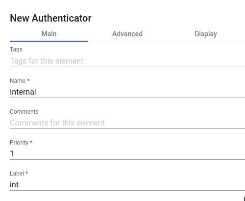

# Внутренняя база данных (Internal Database)

В средах, где нет внешнего аутентификатора, можно использовать аутентификатор «Internal Database». Этот аутентификатор позволяет вручную создавать пользователей и группы для доступа к различным службам рабочего стола и виртуальным приложениям, предоставляемым платформой HOSTVM VDI.

Все данные пользователей и групп хранятся в базе данных, к которой подключен сервер HOSTVM VDI.

<figure><figcaption></figcaption></figure>

В «Internal Database» должны быть настроены минимальные параметры.

**Минимальные параметры:**

* имя (Name) – имя аутентификатора;
* приоритет (Priority) – приоритет аутентификатора. Чем ниже значение этого параметра, тем выше аутентификатор будет отображаться в списке аутентификаторов, доступных в окне доступа пользователя. Допускаются отрицательные значения параметра;
* метка (Label) – позволяет пользователям выполнять вход в систему используя этот аутентификатор, без необходимости выбора из перечня доступных. Доступ к форме входа в таком случае осуществляется по прямой ссылке вида HOSTVM-VDI-Server/uds/page/login/label, где label - значение данного поля. Например, если в поле задано значение int, ссылка будет иметь вид https://HOSTVM-VDI-Server/uds/page/login/int;

<figure><figcaption></figcaption></figure>

**Дополнительные параметры:**

* Different user for each host – параметр позволяет подключаться к виртуальным рабочим столам с помощью одного и того же пользователя, добавляя приставку к имени существующего пользователя во время подключения к виртуальному рабочему столу. Приставка – это IP-адрес клиента подключения или его DNS-имя. Новое созданное имя пользователя имеет следующую структуру: IP клиента-пользователь подключения;
* Reverse DNS – аналогично предыдущему параметру, но корень, добавленный к пользователю, является DNS-именем клиента подключения. Требуется правильное разрешение DNS, в противном случае будет использоваться IP-адрес. Созданный пользователь имеет следующую структуру: пользователь-имя\_клиента\_подключения;
* Accept proxy – этот параметр должен быть включен, если есть компонент для доступа к серверу HOSTVM VDI, например, балансировщик нагрузки. По умолчанию HOSTVM VDI автоматически определяет IP-адрес клиента подключения. В средах, где настроены балансировщики нагрузки или другие подобные элементы, это обнаружение не выполняется правильно, поскольку обнаруженный IP-адрес соответствует этим балансировщикам. Включение данной опции обеспечит правильное определение IP. В средах, где используется опция «Different user for each host» и есть балансировщики нагрузки, необходимо включить эту опцию;
* Visible – если этот параметр отключен, аутентификатор не будет отображаться как доступный на странице входа в брокер.
