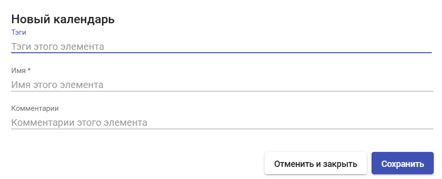
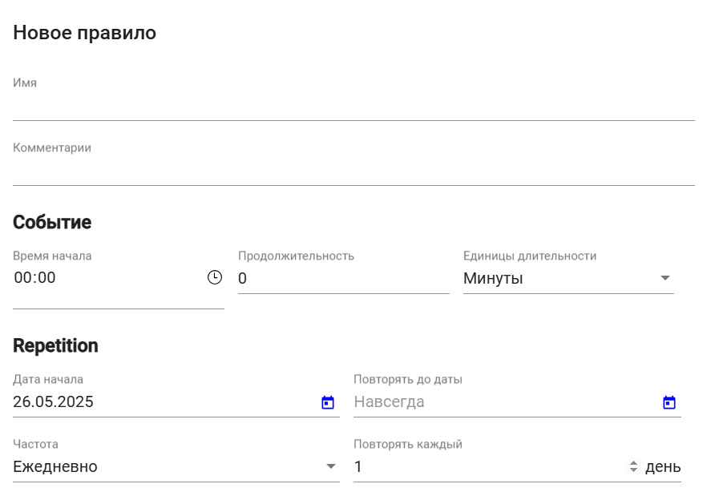
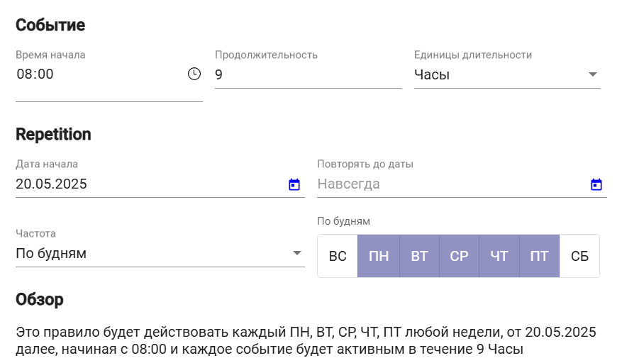

# Календари доступа и запланированные задачи

Брокер HOSTVM VDI, с помощью функционала календарей, позволяет предоставлять или ограничивать доступ пользователей к виртуальным рабочим столам и приложениям по дням недели, датам и временным интервалам.

Также  с помощью календарей вы можете настроить автоматическое выполнение по расписанию определенных задач для сервис-пулов, таких как новые публикации, настройка количества доступных сервисов и размера кэша для пула, добавление и удаление групп доступа и транспортов пула.

## Создание календаря 

Для создания календаря выберите раздел "Пулы", пункт "Календари" и нажмите кнопку "Новый".

### Основные параметры 

**Имя** — наименование создаваемого календаря для отображения в системе.

<figure><figcaption></figcaption></figure>

Для сохранения календаря нажмите "Сохранить".

## Создание правил 

После сохранения календаря вы сможете создавать правила для него. Эти правила можно применять к сервис-пулам.

Для создания нового правила выберите календарь, откройте его параметры с помощью двойного щелчка и нажмите кнопку "Новый".

### Основные параметры 

**Имя** — наименование создаваемого правила для отображения в системе.

<figure><figcaption></figcaption></figure>

#### Событие 

**Время начала** — время, когда начнёт действовать данное правило (формат: `чч:мм`).

**Продолжительность** — продолжительность действия правила.

**Единица длительности** — единица измерения для поля "Продолжительность". Доступны следующие варианты:

* Минуты;
* Часы;
* Дни;
* Недели.

#### Повторение (Repetition) 

В этом блоке параметров задается частота повторения правила.

**Дата начала** — дата, с которой начнёт действовать правило. Формат `ДД.ММ.ГГГГ`.

**Повторять до даты** — дата окончания действия правила.

**Частота** — частота повторения правила. Доступны следующие варианты:

* Ежедневно;
* Еженедельно;
* Ежемесячно;
* Ежегодно;
* По будням (выбор может быть настроен по дням недели).

**Повторять каждый** — периодичность применения правила по дням/неделям/месяцам/годам, в зависимости от заданного значения в поле "Частота", начиная с даты начала.

После заполнения параметров график работы правила будет отображаться в нижней части окна.

<figure><figcaption></figcaption></figure>

### Применение 

Созданные правила можно использовать в следующих разделах сервис-пулов:

* Календари доступа;
* Запланированные действия.
