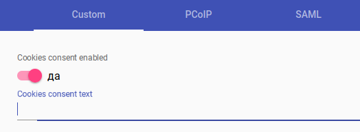

# Конфигурация

## Настройка уведомления об использовании cookies 

В `Панели управления` откройте раздел `Инструменты / Конфигурация`, перейдите на вкладку `Custom`.

Для настройки уведомления об использовании cookies на этой вкладке доступны следующие параметры:

`Cookies consent enabled` - если включено (по умолчанию), уведомление будет отображаться;

`Cookies consent text` - текст уведомления. Если пусто, будет использован текст по умолчанию.

<figure><figcaption></figcaption></figure>

