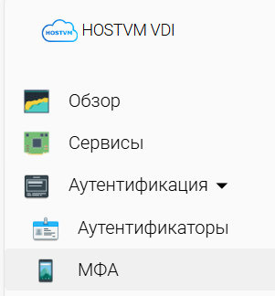

# Многофакторная аутентификация

Многофакторная аутентификация (далее МФА) добавляет дополнительный уровень защиты в процесс входа. При попытке входа в приложение или аккаунт, пользователь обязан пройти дополнительную проверку для подтверждения своей личности.

Для создания МФА перейдите в раздел "Аутентификация" > "МФА", нажмите "Новый" и выберите тип МФА.

<figure><figcaption></figcaption></figure>

Брокер HOSTVM VDI обеспечивает нативную поддержку двухфакторной аутентификации пользователей с помощью следующих методов:

* [Email](email.md)
* [Radius OTP](radius.md)
* [SMS через HTTP](sms-via-http.md)
* [TOTP](totp.md)

Кроме того, брокер поддерживает другие методы МФА, интегрированные непосредственно во внешнюю систему аутентификации. Это означает, что при подключении такого аутентификатора к HOSTVM VDI, МФА становится автоматически доступной для использования.


"**МФА**" не является необходимым к настройке компонентом для создания **сервис-пула.**

