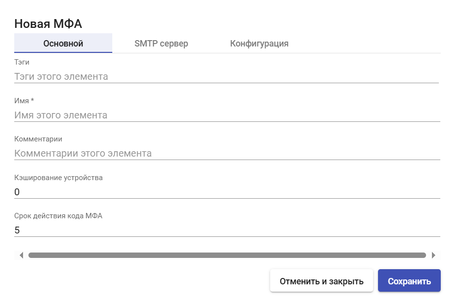
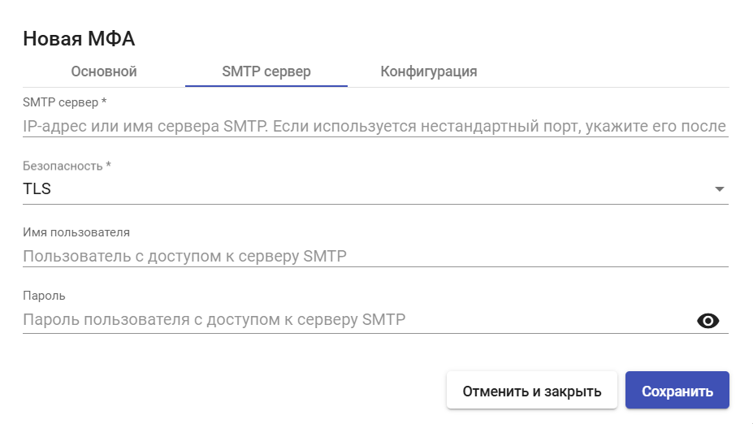
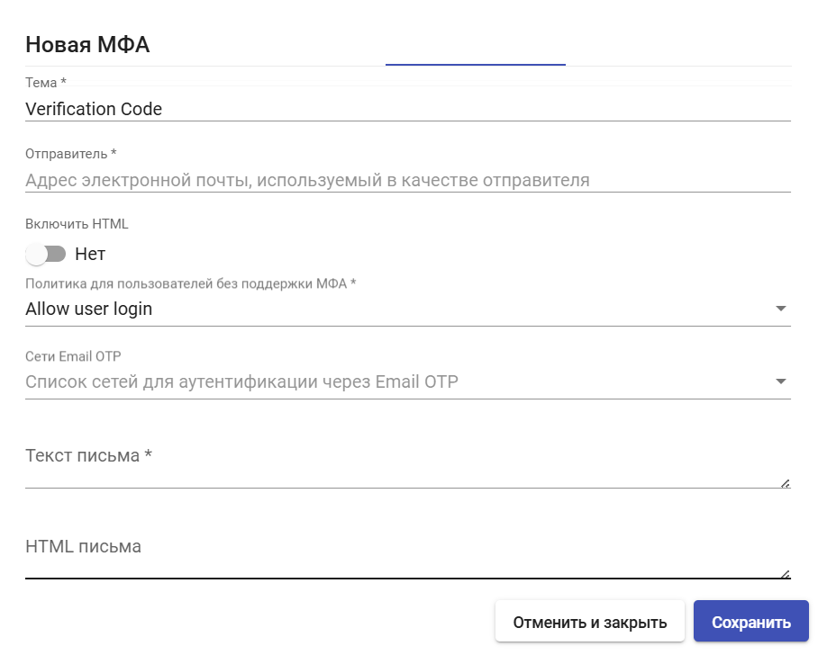

# Email

МФА Email - метод двухфакторной аутентификации с отправкой верификационного кода по электронной почте.

Для создания МФА Email перейдите в раздел "Аутентификация" > "МФА", нажмите "Новый" и выберите тип "Email МФА".

## Основные настройки 

<figure><figcaption></figcaption></figure>

**Имя** - наименование создаваемого МФА для отображения в системе.

**Кэширование устройства** - время кэширования устройства (в часах), в течение которого МФА повторно не требуется. Привязывается к пользователю.

**Срок действия кода МФА** - время в минутах, в течение которого можно использовать код МФА.

## SMTP сервер 

<figure><figcaption></figcaption></figure>

**SMTP сервер** - IP-адрес или FQDN сервера SMTP. Если используется нестандартный порт, укажите его после двоеточия, например, `smtp.example.ru:587` .

**Безопасность** - используемый протокол шифрования:

* TLS
* SSL
* None

**Имя пользователя** - имя пользователя с доступом к серверу SMTP.

**Пароль** - пароль пользователя.

## Конфигурация 

<figure><figcaption></figcaption></figure>

**Тема** - тема письма.

**Отправитель** - адрес электронной почты, используемый в качестве отправителя.

**Включить HTML** - если включено, будет использоваться HTML разметка писем.

**Политика для пользователей без МФА**:

* Allow user login — разрешить доступ пользователю;
* Deny user login — отказать в доступе пользователю;
* Allow user to login if their IP is in the network list — разрешить доступ пользователей, если их IP есть в списке сетей;
* Deny user to login if their IP is in the network list — запретить доступ пользователей, если их IP есть в списке сетей.

**Сети Email OTP** - список сетей для аутентификации через Email OTP.

**Текст письма** - текст письма с кодом верификации. Если пусто, будет использован текст по-умолчанию. Для использования в тексте доступны следующие переменные:

* {code}
* {username}
* {justUsername}
* {ip}

**HTML письма** - HTML письма с кодом верификации. Если пусто, будет использован HTML по-умолчанию. Для использования в HTML доступны следующие переменные:

* {code}
* {username}
* {justUsername}
* {ip}

После внесения необходимых настроек нажмите **"Сохранить"**.
