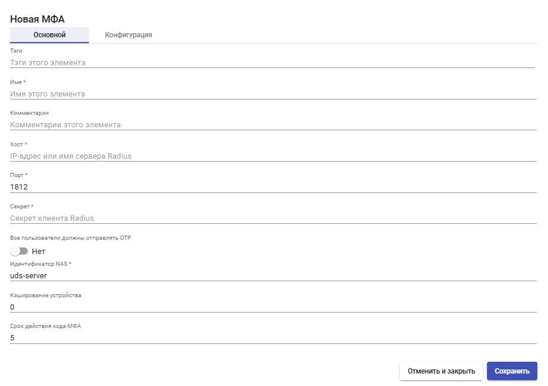
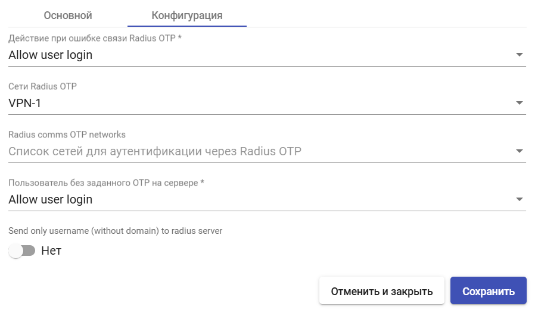

# Radius

МФА Radius - метод двухфакторной аутентификации, при котором пользователь получит верификационный код от сервера Radius.

Для создания МФА Radius перейдите в раздел "Аутентификация" > "МФА", нажмите "Новый" и выберите тип "Radius OTP".

## Основные настройки 

<figure><figcaption></figcaption></figure>

**Имя** - наименование создаваемого МФА для отображения в системе.

**Хост** - IP-адрес или FQDN сервера Radius.

**Порт** - порт аутентификации Radius (по умолчанию 1812).

**Секрет** -  секретный пароль клиента Radius, который используется для аутентификации.

**Все пользователи должны отправлять OTP** - если отключено, добавляется этап проверки необходимости OTP для конкретного пользователя.

**Идентификатор NAS** - идентификатор NAS для Radius Server.

**Кэширование устройства** - время кэширования устройства (в часах), в течение которого МФА повторно не требуется. Привязывается к пользователю.

**Срок действия МФА** - время в минутах, в течение которого можно использовать код МФА.

## Конфигурация 

<figure><figcaption></figcaption></figure>

**Действия при ошибке связи Radius OTP**:

* **Allow user login** - разрешить доступ пользователю;
* **Deny user login** - отказать в доступе пользователю;
* **Allow user to login if their IP is in the network list** - разрешить доступ пользователей, если их IP есть в списке сетей;
* **Deny user to login if their IP is in the network list** - запретить доступ пользователей, если их IP есть в списке сетей.

**Radius comms OTP networks** - список сетей для аутентификации через Radius OTP.

**Сети Radius OTP** - у пользователей из данных сетей не будет запрашиваться одноразовый пароль.

**Действия для пользователя без заданного OTP на сервере**:

* **Allow user login** - разрешить доступ пользователю;
* **Deny user login** - отказать в доступе пользователю;
* **Allow user to login if their IP is in the network list** - разрешить доступ пользователей, если их IP есть в списке сетей;
* **Deny user to login if their IP is in the network list** - запретить доступ пользователей, если их IP есть в списке сетей.

**Send only username (without domain) to radius server** - если включено, доменная часть в имени пользователя будет удалена перед отправкой Radius серверу.

После внесения необходимых настроек нажмите **"Сохранить"**.
