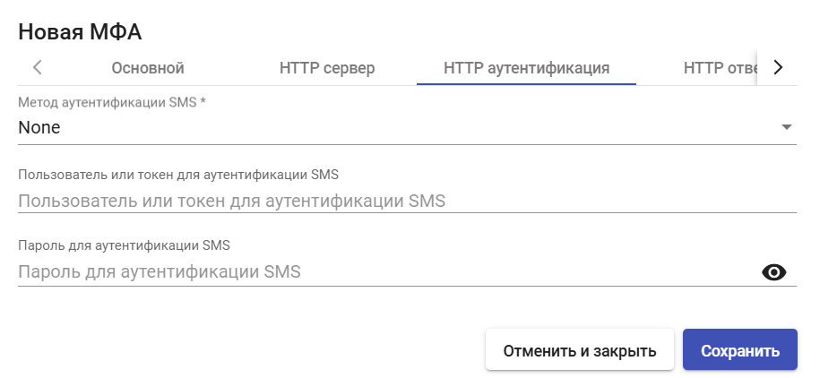

# SMS через HTTP

SMS через HTTP - метод двухфакторной аутентификации, при котором верификационный код приходит по SMS, с использованием HTTP-шлюза.


Для работы данного метода аутентификации требуется настроенный HTTP шлюз с возможностью отправки sms.


Для создания МФА "SMS через HTTP" перейдите в раздел "Аутентификация" > "МФА", нажмите "Новый" и выберите тип "SMS через HTTP".

## Основные настройки 

<figure><figcaption></figcaption></figure>

**Имя** - наименование создаваемого МФА для отображения в системе.

**Кэширование устройства** - время кэширования устройства (в часах), в течение которого МФА повторно не требуется. Привязывается к пользователю.

**Срок действия кода МФА** - время в минутах, в течение которого можно использовать код МФА.

## HTTP сервер 

<figure><figcaption></figcaption></figure>

**Шаблон URL для отправки SMS** - шаблон URL адреса. Может содержать следующие переменные:

* **{code}** - код для отправки;
* **{phone/+phone}** - номер телефона;
* **{username}** - имя пользователя;
* **{justUsername}** - имя пользователя без @.

**Игнорировать ошибки сертификата** - если включено, игнорирует сертификат сервера. Полезно, если сервер использует самоподписанный сертификат.

**Способ отправки SMS** - метод, который будет использоваться для отправки SMS. Доступны:

* GET
* POST
* PUT

**Параметры для POST/PUT отправки SMS** - при выборе данных методов можно дополнительно выставить следующие параметры:

* **{code}** - код для отправки;
* **{phone/+phone}** - номер телефона;
* **{username}** - имя пользователя;
* **{justUsername}** - имя пользователя без @.

**Заголовки для SMS запросов** - могут содержать следующие параметры:

* **{code}** - код для отправки;
* **{phone/+phone}** - номер телефона;
* **{username}** - имя пользователя;
* **{justUsername}** - имя пользователя без @.

**Кодировка SMS** - метод кодировки отправляемых SMS. Доступны:

* utf-8
* utf-16
* iso-8859-1

## HTTP аутентификация 

<figure><figcaption></figcaption></figure>

**Метод аутентификации SMS** - выбор метода аутентификации, доступны следующие варианты:

* **None** - без аутентификации;
* **HTTP Basic auth** - стандартный метод аутентификации в протоколе HTTP, при котором логин и пароль передаются в заголовке запроса в base64;
* **HTTP Digest auth -** метод аутентификации, при котором клиент отправляет не пароль напрямую, а его хеш (MD5/SHA), вычисленный с учётом одноразового кода.

**Пользователь или токен для аутентификации SMS -** поле для ввода пользователя или токена для аутентификации SMS.

**Пароль для аутентификации SMS** - поле для ввода пароля пользователя для аутентификации SMS.

## HTTP ответ 

<figure><figcaption></figcaption></figure>

**Регулярное выражение для SMS ответа OK** - если пусто, ответ считается OK, когда код состояния равен 200.

## Конфигурация 

<figure><figcaption></figcaption></figure>

**Действия при ошибке ответа SMS** - выбор сценария действий при ошибке ответа SMS. Доступные варианты:

* **Allow user login** - разрешить доступ пользователю;
* **Deny user login** - отказать в доступе пользователю;
* **Allow user to login if their IP is in the network list** - разрешить доступ пользователей, если их IP есть в списке сетей;
* **Deny user to login if their IP is in the network list** - запретить доступ пользователей, если их IP есть в списке сетей.

**Сети SMS** - поле для выбора сетей, в которых будет использоваться данный метод МФА;

**Пользователь без политики МФА** - выбор сценария действий при отсутствии у пользователя политики МФА. Доступные варианты:

* **Allow user login** - разрешить доступ пользователю;
* **Deny user login** - отказать в доступе пользователю;
* **Allow user to login if their IP is in the network list** - разрешить доступ пользователей, если их IP есть в списке сетей;
* **Deny user to login if their IP is in the network list** - запретить доступ пользователей, если их IP есть в списке сетей.

После внесения необходимых настроек нажмите **"Сохранить"**.
