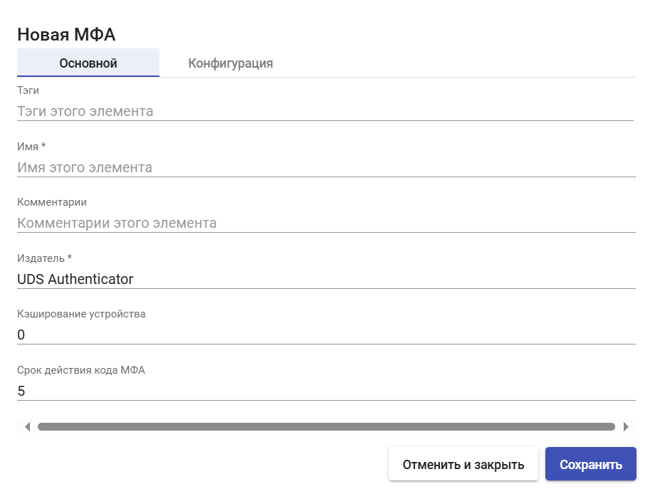
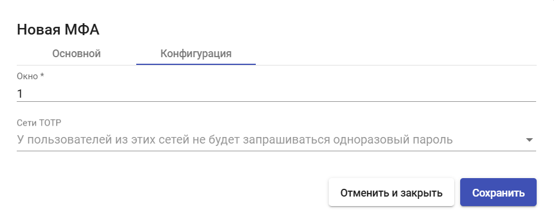

# TOTP

TOTP - метод двухфакторной аутентификации, при котором верификационный код генерируется в приложении (FreeOTP, GoogleAuthenticator и т.п.) на основе секретного ключа и текущего времени.&#x20;

Функции:

* Верификация пользователя;
* Динамические коды (недействительны после истечения времени);
* Офлайн-работа (не требует подключение к сети интернет или sms-аутентификации).

## Создание TOTP МФА 

Для создания МФА TOTP перейдите в раздел "Аутентификация" > "МФА", нажмите "Новый" и выберите тип "TOTP МФА".

## Основные настройки 

<figure><figcaption></figcaption></figure>

**Имя** - наименование создаваемого МФА для отображения в системе.

**Издатель** - издатель OTP. После создания МФА данный параметр изменить нельзя.

**Кэширование устройства** - время кэширования устройства (в часах), в течение которого МФА повторно не требуется. Привязывается к пользователю.

**Срок действия кода МФА** - время в минутах, в течение которого можно использовать код МФА.

## Конфигурация 

<figure><figcaption></figcaption></figure>

**Окно** - количество действительных кодов до и после текущего.

**Сети TOTP** - у пользователей из этих сетей не будет запрашиваться одноразовый пароль.

После внесения необходимых настроек нажмите **"Сохранить"**.
