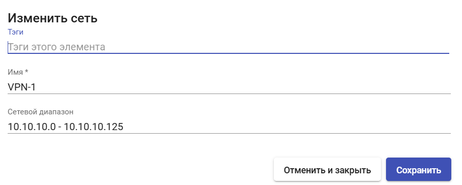
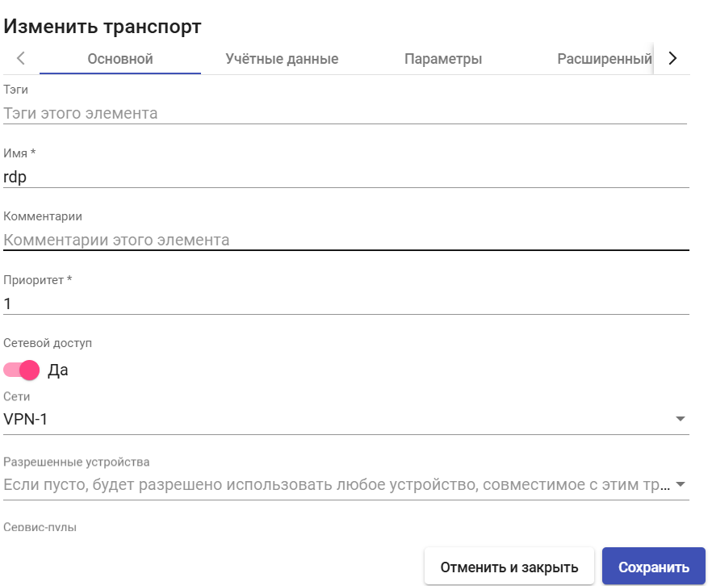

# Настройка сетей доступа

Брокер HOSTVM VDI позволяет задавать сети для управления доступом пользователей к виртуальным рабочим столам или приложениям.

Эти сети, совместно с настройками [транспорта подключения](transports/), определяют, какие типы подключений будут доступны пользователям, на основании определяемого при подключении к брокеру IP-адреса клиента и заданных для него правил.

Для создания сети выберите раздел «Подключение» («Connectivity»), пункт «Сети» («Networks») и нажмите кнопку «Новый» («New»).

## Основные параметры 

**Имя** — наименование создаваемой сети для отображения в системе.

**Сетевой диапазон** — IP адрес, подсеть или диапазон адресов создаваемой сети. Используйте один из нижеперечисленных форматов данных (комбинирование форматов в рамках одной сети не поддерживается):

* Одиночный IP-адрес `xxx.xxx.xxx.xxx` (например, `10.10.10.1`);
* Подсеть `xxx.xxx.xxx.xxx/x` (например, `10.10.10.0/24`);
* Диапазон IP-адресов `xxx.xxx.xxx.xxx-xxx.xxx.xxx.xxx` (например, `10.10.10.0-10.10.10.125`).

<figure><figcaption></figcaption></figure>

Созданные сети будут доступны в настройках транспортов, позволяя задать их видимость в зависимости от адреса клиента подключения.


Если для транспорта не заданы ограничения по сетям, подключение будет доступно из любой сети.


В следующем примере настройки транспорт «RDP» будет доступен только пользователям, подключающимся из сети VPN-1, заданной ранее (диапазон `10.10.10.0`— `10.10.10.125`).

<figure><figcaption></figcaption></figure>
