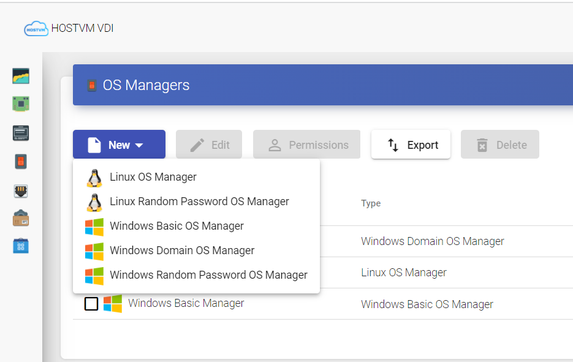
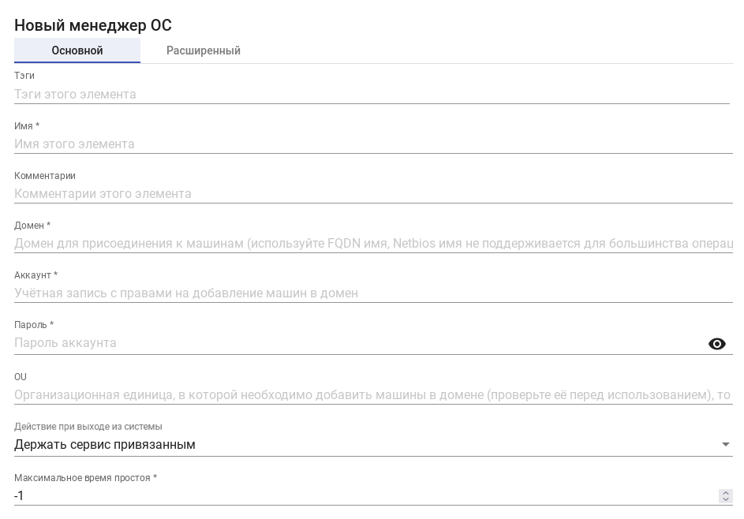
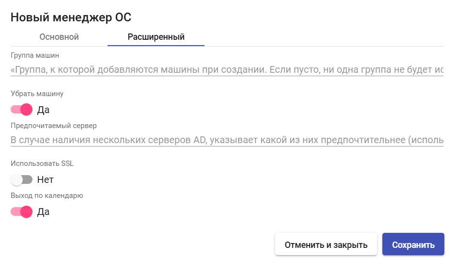

# Настройка менеджеров ОС

Менеджеры ОС обеспечивают управление ранее созданными сервисами Linked Clone.

Тип и настройки менеджера ОС определяют взаимодействие между ОС тонкого клона и брокером подключений HOSTVM VDI через приложение VDI Actor.

Для создания менеджера ОС перейдите в раздел "Менеджеры ОС", нажмите "Новый" и выберите тип менеджера ОС.

Доступные типы менеджеров ОС:

## Linux OS Manager

ОС менеджер Linux предназначен для управления виртуальными рабочими столами на базе Linux-систем.

### Основные параметры 

**Имя (Name)** — имя менеджера ОС.

**Действие при выходе из системы (Logout action)** — выполняемое при завершении сеанса пользователя действие. Доступные варианты:

* Держать сервис привязанным (Keep service assigned) - виртуальный рабочий стол остается зарезервированным за пользователем, и при следующем обращении предоставляется ему же. Если для сервис-пула создана новая публикация, при выходе из системы виртуальный рабочий стол будет удален, а при следующем обращении будет создан новый рабочий стол из актуальной версии базового образа (новой публикации);
* Удалить сервис (Remove service) - виртуальный рабочий стол удаляется, при следующем обращении назначается новый.

**Максимальное время простоя (Max. Idle time)** — максимальное время неактивности пользователя, по достижении которого выполняется автоматический выход из системы. Применяется только при выборе опции Logout action: Remove service.

## Linux Domain OS Manager

ОС менеджер Linux Domain предназначен для управления виртуальными рабочими столами на базе Linux-систем, являющихся членами домена Active Directory или FreeIPA. Он осуществляет переименование, ввод в домен и контроль сеансов виртуальных рабочих столов.

### Основные параметры 

**Имя** — имя менеджера ОС.

**Домен** — имя домена Active Directory или FreeIPA, к которому будут присоединены виртуальные рабочие столы. Необходимо использовать имя в формате FQDN, работа с именем в формате NetBIOS не поддерживается.

**Аккаунт** — имя пользователя с правами на добавление машин в домен.

**Пароль** — пароль пользователя из поля "Аккаунт".

**OU** — организационная единица, в которую будут добавляться виртуальные машины. Необходимо использовать Distinguished Name (DN) группы, например: OU=Machines,DC=domain,DC=local.

**Действие при выходе из системы** - выполняемое при завершении сеанса пользователя действие.&#x20;


Данный параметр задается при создании менеджера ОС, после нажатия кнопки "Сохранить" редактирование его значения будет недоступно.


Доступные варианты:

* Держать сервис привязанным - виртуальный рабочий стол остается зарезервированным за пользователем, и при следующем обращении предоставляется ему же. Если для сервис-пула создана новая публикация, при выходе из системы виртуальный рабочий стол будет удален, а при следующем обращении будет создан новый рабочий стол из актуальной версии базового образа (новой публикации);
* Удалить сервис - виртуальный рабочий стол удаляется, при следующем обращении назначается новый;
* Держать сервис привязанным даже в новой публикации - виртуальный рабочий стол остается зарезервированным за пользователем, и при следующем обращении предоставляется ему же. Если для сервис-пула создана новая публикация, при выходе из системы виртуальный рабочий стол остается зарезервированным за пользователем, и может быть удален только администратором системы.

**Максимальное время простоя** — максимальное время неактивности пользователя (в секундах), по достижении которого выполняется автоматический выход из системы. Отрицательное значение или 0 означают отсутствие лимита.

<figure><figcaption></figcaption></figure>

### Расширенные параметры 

**ПО клиента** — какое программное обеспечение используется на стороне клиента: _Автоматический выбор_, _SSSD_ или _Winbind_.

**ПО членства в группах** — какое программное обеспечение используется для членства в группах: _Автоматический выбор_, _Samba_ или _adcli_.

**ПО сервера** — какое программное обеспечение используется на стороне сервера: _Active Directory_ или _FreeIPA_.

**Убрать машину** — если включено, при удалении виртуального рабочего стола брокер также удалит его запись в указанной OU домена. Требуются соответствующие права у пользователя, указанного в поле "Аккаунт".

**Использовать SSL** — если включено, брокер будет использовать SSL-соединение при подключении к Active Directory.

**Автоматическое сопоставление идентификаторов** — если включено, то уникальные идентификаторы пользователей и групп (UID/GID) из Active Directory автоматически будут сопоставляться с локальными ID в Linux-системе, позволяя обеспечить корректный доступ к ресурсам без ручной настройки соответствий.

**Выход по календарю** — если включено, брокер попытается выполнить выход пользователей из сеанса виртуального рабочего стола по истечении срока действия календаря для текущего доступа.

<figure><figcaption></figcaption></figure>

## Windows Basic OS Manager

ОС менеджер Windows Basic предназначен для управления виртуальными рабочими столами на базе Windows-систем, не являющихся членами домена.

### Основные параметры 

**Имя (Name)** — имя менеджера ОС.

**Действие при выходе из системы (Logout action)** — выполняемое при завершении сеанса пользователя действие. Доступные варианты:

* Держать сервис привязанным (Keep service assigned) - виртуальный рабочий стол остается зарезервированным за пользователем, и при следующем обращении предоставляется ему же. Если для сервис-пула создана новая публикация, при выходе из системы виртуальный рабочий стол будет удален, а при следующем обращении будет создан новый рабочий стол из актуальной версии базового образа (новой публикации);
* Удалить сервис (Remove service) - виртуальный рабочий стол удаляется, при следующем обращении назначается новый.

**Максимальное время простоя (Max. Idle time)** — максимальное время неактивности пользователя, по достижении которого выполняется автоматический выход из системы. Применяется только при выборе опции Logout action: Remove service.

## Windows Domain OS Manager

ОС менеджер Windows Domain предназначен для управления виртуальными рабочими столами на базе Windows-систем, являющихся членами домена Active Directory. Он осуществляет переименование, ввод в домен и контроль сеансов виртуальных рабочих столов.

### Основные параметры 

**Имя** — имя менеджера ОС.

**Домен** — имя домена Active Directory, к которому будут присоединены виртуальные рабочие столы. Необходимо использовать имя в формате FQDN, работа с именем в формате NetBIOS не поддерживается.

**Аккаунт** — имя пользователя с правами на добавление машин в домен.

**Пароль** — пароль пользователя из поля "Аккаунт".

**OU** — организационная единица, в которую будут добавляться виртуальные машины. Необходимо использовать Distinguished Name (DN) группы, например: OU=Machines,DC=domain,DC=local.

**Действие при выходе из системы** - выполняемое при завершении сеанса пользователя действие.&#x20;


Данный параметр задается при создании менеджера ОС, после нажатия кнопки "Сохранить" редактирование его значения будет недоступно.


Доступные варианты:

* Держать сервис привязанным - виртуальный рабочий стол остается зарезервированным за пользователем, и при следующем обращении предоставляется ему же. Если для сервис-пула создана новая публикация, при выходе из системы виртуальный рабочий стол будет удален, а при следующем обращении будет создан новый рабочий стол из актуальной версии базового образа (новой публикации);
* Удалить сервис - виртуальный рабочий стол удаляется, при следующем обращении назначается новый;
* Держать сервис привязанным даже в новой публикации - виртуальный рабочий стол остается зарезервированным за пользователем, и при следующем обращении предоставляется ему же. Если для сервис-пула создана новая публикация, при выходе из системы виртуальный рабочий стол остается зарезервированным за пользователем, и может быть удален только администратором системы.

**Максимальное время простоя** — максимальное время неактивности пользователя (в секундах), по достижении которого выполняется автоматический выход из системы. Отрицательное значение или 0 означают отсутствие лимита.

<figure><figcaption></figcaption></figure>

### Расширенные параметры 

**Группа машин** — имя группы, в которую будут добавляться виртуальные рабочие столы. Если пусто, добавление в группу при присоединении машины к домену не производится.

**Убрать машину** — если включено, при удалении виртуального рабочего стола брокер также удалит его запись в указанной OU домена. Требуются соответствующие права у пользователя, указанного в поле "Аккаунт".

**Предпочитаемый сервер** — в случае наличия нескольких контроллеров домена, в данном поле указывается предпочтительный.

**Использовать SSL** — если включено, брокер будет использовать SSL-соединение при подключении к Active Directory.

**Выход по календарю** — если включено, брокер попытается выполнить выход пользователей из сеанса виртуального рабочего стола по истечении срока действия календаря для текущего доступа.

<figure><figcaption></figcaption></figure>
