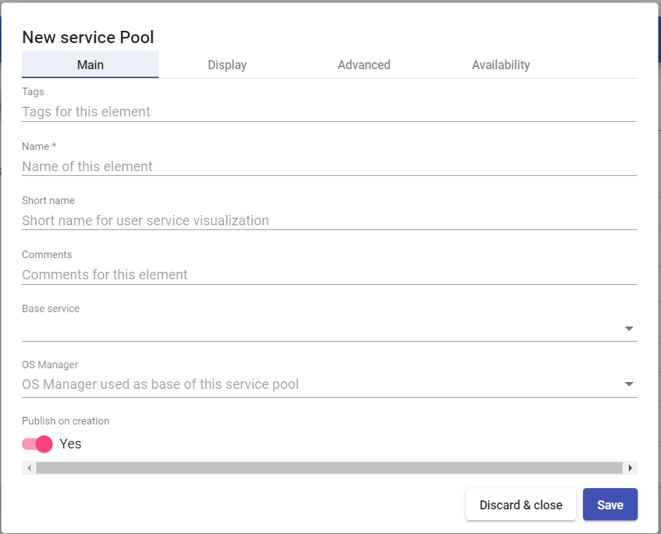

# Настройка пула сервисов

Сервис-пулы позволяют управлять развертыванием виртуальных рабочих столов и приложений, и предоставлением доступа к ним для различных групп пользователей.

Для создания пула сервисов требуются следующие ранее настроенные компоненты: сервис-провайдер и его базовый сервис, менеджер ОС (для некоторых типов базовых сервисов), транспорт подключения, и группа пользователей, для которой планируется предоставить доступ к сервису.

## Создание сервис-пула 

Для создания нового пула сервисов нажмите «New» в разделе «Service Pools».

### Основные настройки 

`Имя (Name)` – наименование создаваемого пула для отображения в системе.

`Короткое имя (Short name)` – имя сервиса, отображаемое пользователям.

`Базовый сервис (Base service)` – настроенный ранее базовый сервис сервис-провайдера.

`Менеджер ОС (OS Manager)` – настроенный ранее менеджер ОС.

`Публикация при создании (Publish on creation)` – если опция включена, то после завершения настройки пула сервисов и нажатия кнопки «Save» сразу начнется публикация нового сервиса. Если опция выключена, публикация осуществляется вручную на вкладке «Publications» созданного сервиса.

### Доступность 

`Первоначально доступные сервисы` – минимальное количество виртуальных рабочих столов для этого сервис-пула (доступных, назначенных и кэшированных, без учета L2). Создаются автоматически при отсутствии необходимого количества.

`Сервисы, хранящиеся в кэше` - количество предварительно настроенных и запущенных виртуальных рабочих столов, для ускоренной выдачи пользователям. При необходимости пополнения кэша, новые машины создаются автоматически до достижения лимита, заданного в параметре `Максимальное количество предоставляемых сервисов`.

`Сервисы, хранящиеся в L2 кэше` - количество предварительно настроенных виртуальных рабочих столов, хранящихся в выключенном состоянии. Используются для пополнения кэша доступных для подключения машин, в случае возникновения такой необходимости. Напрямую пользователям не назначаются.

`Максимальное количество предоставляемых сервисов` – максимально возможное количество виртуальных рабочих столов для этого сервис-пула (доступных, назначенных и кэшированных, без учета L2).

## Группы 

Для предоставления пользователям доступа к сервису необходимо добавить соответствующую группу пользователей в созданный пул сервисов.

Группы пользователей создаются в настройках аутентификатора. Для добавления группы нажмите «New» на вкладке «Groups» созданного пула сервисов.

Выберите аутентификатор и группу из списка доступных для выбранного аутентификатора.

## Транспорты 

Для добавления транспорта подключения нажмите «New» на вкладке «Transports» созданного пула сервисов. Выберите из списка ранее созданных транспортов нужный.

## Календари доступа 


Описание создания и настройки календаря можно найти в [этой](calendars.md) статье.


После создания календаря и его правил вы можете использовать их для управления доступом пользователей к ресурам пула (виртуальным рабочим столам или приложениям).

Для добавления нового правила перейдите на вкладку "Календари доступа" и нажмите "Новый". Укажите приоритет правила, используемый календарь и применяемое действие:

* ALLOW - разрешить доступ в указанное время;
* DENY - запретить доступ в указанное время.

Встроенное правило FallBack действует для всех пулов и применяется для всех диапазонов дат и времени, не подпадающих под другие правила. По умолчанию правило имеет значение ALLOW (разрешать доступ).

Если вы хотите разрешить доступ только в заданное календарем время, после добавления соответствующего правила измените значение FallBack на DENY.

## Запланированные действия 

После создания календаря и его правил вы можете использовать их для выполнения действий с сервис-пулом по расписанию.

Для добавления нового действия перейдите на вкладку "Запланированные действия" и нажмите "Новый". Укажите:

* используемый календарь;
* смещение срабатывания события;
* признак срабатывания в начале интервала времени (для срабатывания в конце интервала переключите в "Нет");
* выполняемое действие;
* дополнительные параметры, в зависимости от выбранного действия.


Помимо запуска по расписанию вы можете запустить любое действие немедленно. Для этого выберите его в списке и нажмите "**Запустить сейчас**", затем подтвердите запуск во всплывающем окне.


### Доступные действия 


В зависимости от типа сервис-пула могут быть доступны не все действия.


`Установить начальные сервисы` - переопределить количество первоначально доступных сервисов пула.

`Установить размер кэша` - переопределить количество сервисов, хранящихся в кэше.

`Установить максимальное количество сервисов` - переопределить максимальное количество предоставляемых сервисов.

`Установить размер L2 кэша` - переопределить количество сервисов, хранящихся в L2 кэше.

`Публикация` - запустить новую публикацию пула.

`Добавить транспорт` - добавить существующий транспорт в пул. Дополнительно укажите:

* Транспорт - транспорт для добавления.

`Удалить транспорт` - удалить транспорт из пула. Дополнительно укажите:

* _Транспорт_ - транспорт для удаления.

`Удалить все транспорты` - удалить все транспорты из пула.

`Добавить группу` - добавить существующую группу в пул. Дополнительно укажите:

* _Аутентификатор_ - аутентификатор, в котором содержится группа для добавления в пул;
* _Группа_ - группа для добавления в пул.

`Удалить группу` - удалить существующую группу из пула. Дополнительно укажите:

* _Аутентификатор_ - аутентификатор, в котором содержится группа для удаления из пула;
* _Группа_ - группа для удаления из пула.

`Удалить все группы` - удалить все группы из пула.

`Устанавливает игнорирование неиспользуемых` - переопределить настройку пула "Игнорировать неиспользуемые". Дополнительно укажите:

* _Игнорировать назначенные и неиспользуемые_ - новое значение настройки пула.

`Удалить все назначенные сервисы` - удалить все назначенные пользователям сервисы пула.

`Удалить устаревшие сервисы, назначенные пользователям` - удалить назначенные пользователям сервисы пула, помеченные как устаревшие. Дополнительно укажите:

* _Время в часах, после которого сервис считается устаревшим_ -  если установлено значение, например, 48, это означает, что сервис, созданный более 48 часов назад, считается устаревшим и подлежит удалению.

