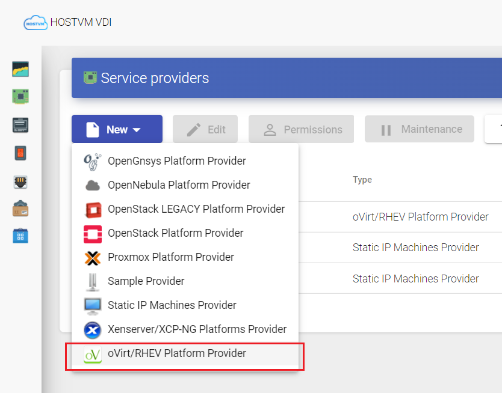
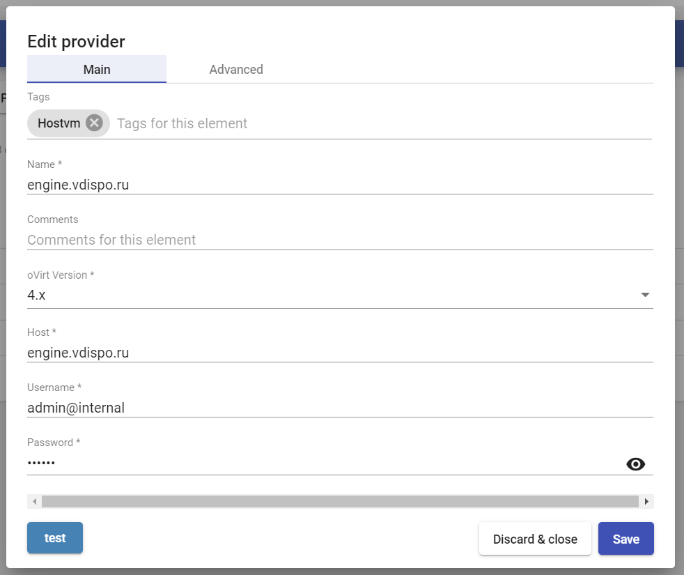
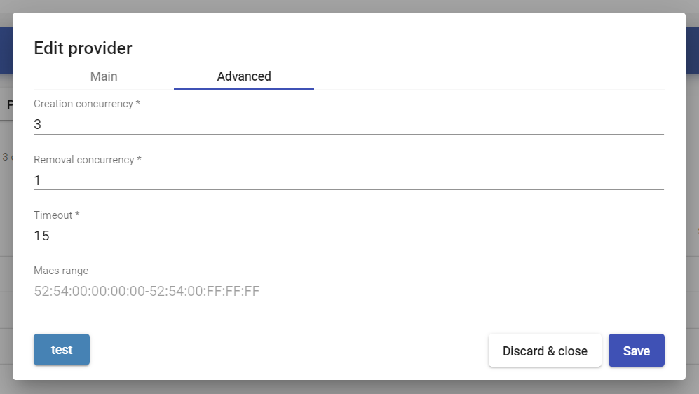
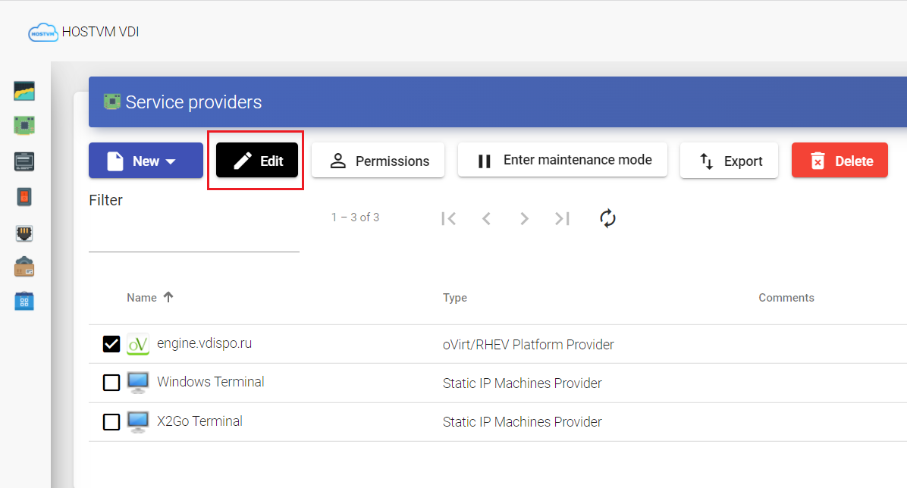
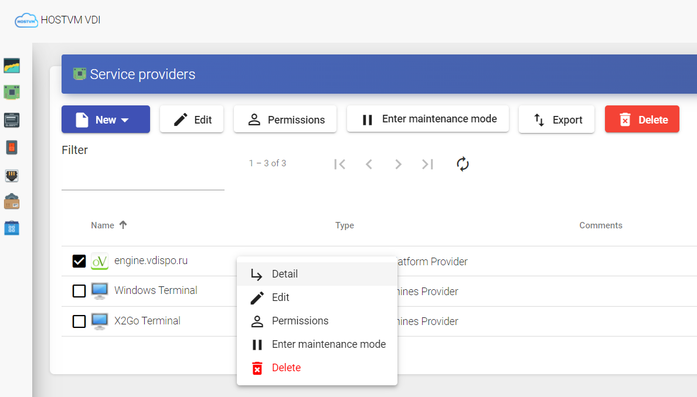
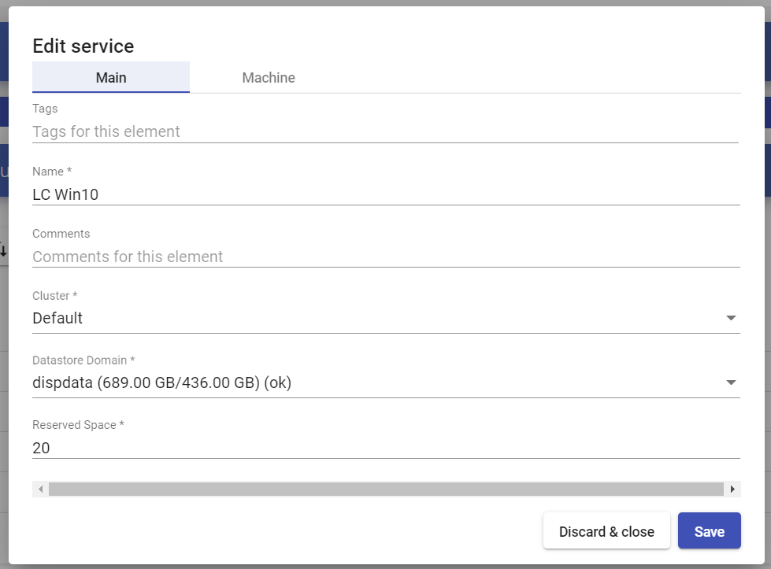
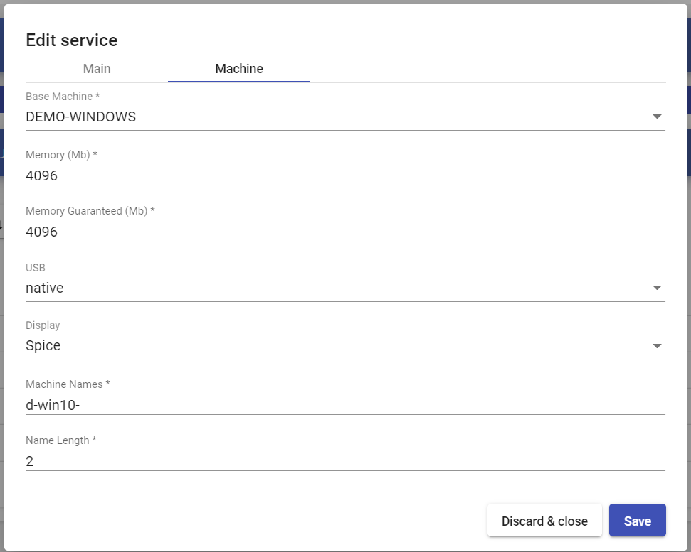
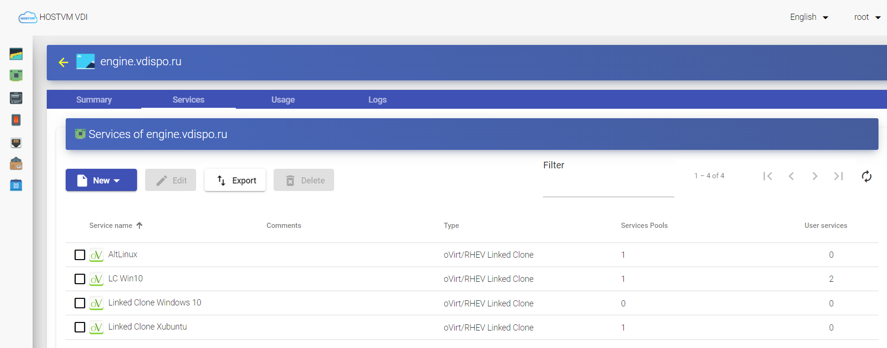
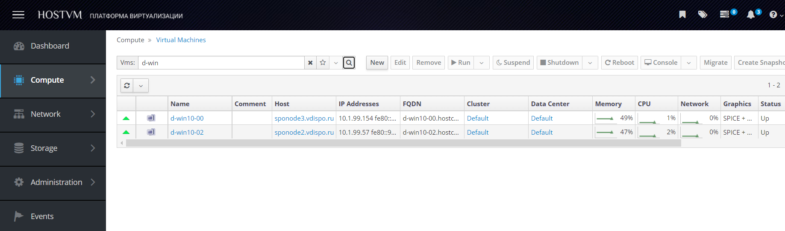

# Платформа виртуализации HOSTVM

В данном разделе описывается развертывание платформы VDI через виртуальную инфраструктуру HOSTVM.

## Регистрация сервис-провайдера HOSTVM 

Для регистрации сервис-провайдера HOSTVM необходимо зайти в раздел «Services», нажать «New» и выбрать тип провайдера «oVirt/RHEV Platform Provider».

При создании провайдера должны быть настроены следующие параметры:

**Основные:**

* имя (name) – имя сервисного провайдера;
* версия (oVirt Version) – версия подключаемой системы HOSTVM;
* хост (host) – имя или IP-адрес менеджера виртуализации;
* имя пользователя (username) – имя пользователя (в формате user@domain), имеющего доступ с правами администратора на менеджер виртуализации;
* пароль (password) – пароль пользователя;


**Если поставщиком единого входа является Keycloak, то имя пользователя, имеющего доступ с правами администратора на менеджер виртуализации, указывается в формате user@ovirt@domain.**


**Дополнительные:**

* количество одновременных задач создания рабочего стола (поле «Creation concurrency»);
* количество одновременных задач удаления рабочего стола (поле «Removal concurrency»);
* тайм-аут при установлении соединения с менеджером виртуализации;
* диапазон MAC-адресов для присвоения виртуальным рабочим столам.

С помощью кнопки «Test» можно проверить, что соединение выполнено успешно.

После сохранения настроенные сервис-провайдеры будут подтверждены и готовы для создания базовых сервисов в HOSTVM.

Количество сервис-провайдеров типа HOSTVM, регистрируемых в рамках платформы, не ограничено.

Чтобы изменить какой-либо параметр в уже существующих сервис-провайдерах, необходимо выбрать его и нажать «Edit».

С помощью кнопки «Enter Maintenance Mode» можно приостановить все операции, запущенные платформой для данного сервис-провайдера.

Рекомендуется поставить провайдер в режим обслуживания в случае потери связи или его остановки для обслуживания.

## Создание сервиса Linked Clone 

После регистрации провайдера HOSTVM, в котором будут созданы рабочие столы, необходимо создать базовые сервисы для генерации тонких клонов ВМ.

Для этого следует открыть сервис-провайдер, в котором будет создан тонкий клон, с помощью двойного щелчка, либо выбором пункта “Detail” в контекстном меню провайдера:

Нажать «New оVirt / RHEV Linked Clone» для создания нового базового сервиса. Минимальные параметры, которые необходимо настроить.

**Основные параметры:**

* имя (name) – имя сервиса;
* кластер (cluster) – кластер серверов HOSTVM, на котором будут размещены развернутые связанные клоны;
* домен хранилища (datastore domain) – хранилище, установленное для развертывания клонов ВМ;
* зарезервированное место (reserved space) – минимальный порог свободного места в хранилище, для возможности разворачивания клонов.

**Параметры ВМ:**

* базовая машина (base machine) – шаблон для развертывания виртуальных рабочих столов (golden image);
* память (memory) – объем памяти, который будет присвоен (в мегабайтах);
* гарантированная память (memory guaranteed) – объем памяти, который будет гарантированно доступен для тонких клонов;
* USB – если выбрано, то виртуальные рабочие столы будут поддерживать перенаправление USB-устройств;
* экран/дисплей (display) – протокол подключения административной консоли для виртуальных машин - тонких клонов;
* имена машин (machine names) – префикс имени для всех тонких клонов, которые будут развернуты в этой службе (например, имена машин = win-);
* длина имени (name length) – длина номера суффикса, прикрепленного к корневому имени (например, Name Length = 3, win-000 ... win-999).

После сохранения этой конфигурации будет готов действующий «HOSTVM / oVirt Linked Clone» на платформе HOSTVM.

Можно зарегистрировать необходимое количество «HOSTVM / oVirt Linked Clone» на платформе HOSTVM VDI.

После настройки всех компонентов среды HOSTVM VDI (сервис-провайдеры, аутентификаторы, менеджеры ОС и транспорты подключений) и создания пула сервисов на сервере HOSTVM Manager можно увидеть развернутые виртуальные рабочие столы на базе тонких клонов HOSTVM.

## Создание сервиса "Фиксированные машины" ("Fixed Machines") 

Этот тип базового сервиса позволяет подключать пользователей к существующим виртуальным машинам платформы виртуализации.

Для создания сервиса, в сервис-провайдере перейдите на вкладку `Сервисы`, нажмите `Новый`, выберите из списка тип сервиса `Фиксированные машины`.

**Основные параметры**

_Имя (Name)_: имя сервиса.

_Токен сервиса (Service token)_: если требуется отслеживание брокером "входа" и "выхода" пользователя, запрашивающего данный тип сервиса (чтобы при выходе брокер автоматически освобождал машину, делая ее доступной для подключения другого пользователя), необходимо заполнить поле, задав токен в виде произвольной последовательности букв и цифр. Если поле пустое, брокер будет закреплять машину за пользователем (до ручного сброса администратором системы).

> Если поле `Токен сервиса` заполнено, на машины, заданные в качестве используемых сервисом, необходимо установить соответствующий VDI актор типа `Unmanaged`, и при его настройке задать такое же значение поля `Service Token`, как и в настройках базового сервиса.

**Параметры ВМ**

_Кластер (Cluster)_: кластер платформы виртуализации, на котором размещаются виртуальные машины.

_Машины (Machines)_: виртуальные машины выбранного выше кластера, управление которыми и подключение к ним пользователей будет осуществляться брокером VDI. Отметьте нужные машины в списке.

Нажмите `Сохранить` для завершения настройки сервиса.
