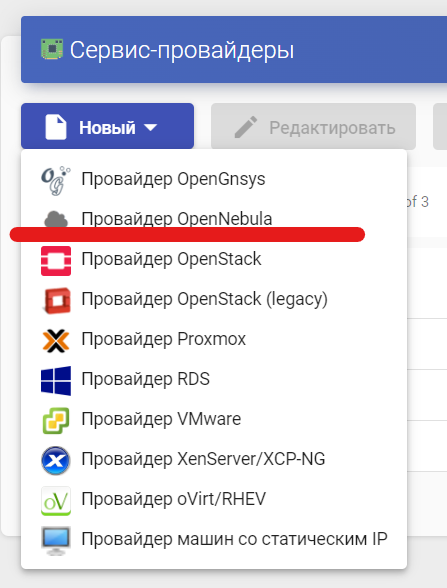

# Провайдер OpenNebula

## Регистрация сервис-провайдера OpenNebula

Для регистрации сервис-провайдера OpenNebula необходимо зайти в раздел "Сервисы", нажать "Новый" и выбрать тип провайдера OpenNebula

<figure><figcaption></figcaption></figure>

При создании сервис-провайдера необходимо настроить следующие параметры:

**Основные:**

Имя(name) - имя сервисного провайдера;

Хост(Host) - имя или IP-адрес хоста OpenNebula;

Порт(Port) - порт подключения к  хосту OpenNebula;

Использовать SSL - если включен данный параметр, то сервис-провайдер не будет работать без предоставления сервером ssl

Имя пользователя(username) - Имя пользователя, обладающего правами администратора в OpenNebula

Пароль(passwd) - пароль пользователя

<figure><figcaption></figcaption></figure>

**Дополнительные:**

Одновременное создание(Creation Concurrency) - максимальное количество одновременно создаваемых виртуальных машин

Одновременное удаление(Removal Concurrency) - максимальное количество одновременно удаляемых виртуальных машин

Таймаут(Timeout) - Время на повторное подключение к OpenNebula в секундах

<figure><figcaption></figcaption></figure>

С помощью кнопки "Проверить" можно проверить, что конфигурация провайдера OpenNebula выполнено успешно.

Чтобы изменить какой-либо параметр в уже существующих сервис-провайдерах, необходимо выбрать его и нажать «Редактировать».

С помощью кнопки «Обслуживание» можно приостановить все операции, запущенные платформой для данного сервис-провайдера.

Рекомендуется поставить провайдер в режим обслуживания в случае потери связи или его остановки для обслуживания.

## Создание сервиса OpenNebula

После регистрации провайдера необходимо создать базовый сервис OpenNebula.

Откройте настройки сервисов провайдера с помощью двойного щелчка или выбрав пункт "Подробно" в контекстном меню провайдера. Для добавления нового сервиса нажмите "Новый" и выберите "Действующие образы OpenNebula":

<figure><figcaption></figcaption></figure>

**Основные параметры:**

* Имя - имя этого сервиса
* Хранилище - хранилище виртуальных машин сервиса

<figure><figcaption></figcaption></figure>

**Параметры ВМ:**

* Базовый шаблон - шаблон для развертывания виртуальных рабочих столов
* Имена машин - шаблон имени, присваемого виртуальным машинам
* Длина имени - длина числового суффикса, добавляемого к именам машин

<figure><figcaption></figcaption></figure>

Для завершения настройки сервиса нажмите `Сохранить`

