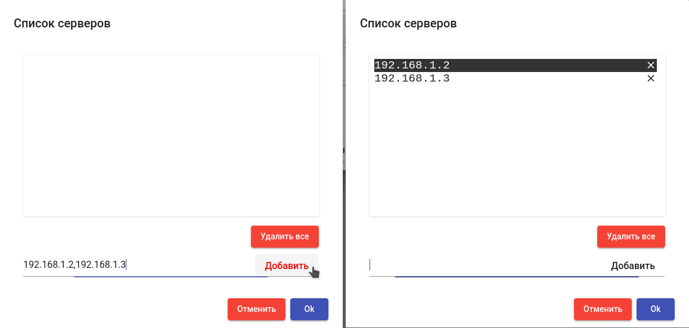

---
layout:
  title:
    visible: true
  description:
    visible: false
  tableOfContents:
    visible: true
  outline:
    visible: true
  pagination:
    visible: true
---

# Провайдер RDS / Linux terminal

Данный тип сервис-провайдера предоставляет возможность публикации сервисов терминальных сессий и виртуальных приложений, с помощью как серверов Microsoft Remote Desktop Services (RDS), так и терминальных серверов на основе Linux.

> Описываемый функционал доступен начиная с версии брокера 3.6 (номер сборки 20250314).

## Создание сервис-провайдера 

Для создания сервис-провайдера зайдите в раздел "Сервисы", нажмите "Новый" и выберите тип провайдера "RDS / Linux Terminal":

<figure><figcaption></figcaption></figure>

### Параметры 

**Имя:** - наименование создаваемого провайдера для отображения в системе;

**Список серверов:** список серверов, используемых для терминального доступа или публикации приложений. В случае указания нескольких серверов, пользователи будут распределяться между ними. Задайте IP адреса серверов, разделенные запятыми, и нажмите "Добавить":

<figure><figcaption></figcaption></figure>

**Проверка сервера:** проверка доступности сервера перед подключением пользователя. При непройденной проверке пользователь будет перенаправлен на следующий доступный сервер.

Используйте кнопку “Проверить” для проверки созданной конфигурации провайдера. Для сохранения созданной конфигурации нажмите "Сохранить".

## Создание сервисов 

После завершения настройки провайдера откройте его параметры с помощью двойного щелчка, перейдите на вкладку "Сервисы", нажмите "Новый" и выберите тип создаваемого сервиса:

* Linux приложение - для публикации виртуальных приложений с использованием серверов на основе Linux;
* Linux терминальная сессия - для публикации терминального доступа к серверам на основе Linux;
* RDS приложение - для публикации виртуальных приложений с использованием платформы Microsoft Remote Desktop Services (RDS);
* RDS терминальная сессия - для публикации терминального доступа к серверам под управлением Microsoft Windows.

### Linux приложение 

Этот тип базового сервиса позволяет публиковать виртуальные приложения с серверов на основе Linux.

> Для подключения и публикации приложений используется протокол X2Go.

> На машине пользователя и сервере приложений должны быть установлены компоненты, необходимые для работы протокола X2Go: X2Go client и X2Go server соответственно.

#### Параметры 

**Имя:** - наименование создаваемого сервиса для отображения в системе;

**Тип сервера:** - тип используемого сервера (на данный момент поддерживается только X2Go). При настройке сервис-пула на основе этого базового сервиса используйте тип транспорта, соответствующий данному параметру;

**Назначать другой IP при недоступности** - автоматическое переназначение ранее выданного адреса сервера, если при подключении он недоступен.

Параметры публикуемого приложения [задаются в настройках транспорта X2Go](../transports/x2go.md).

### Linux терминальная сессия 

Этот тип базового сервиса позволяет предоставлять терминальный доступ к серверам на основе Linux.

> Поддерживаемые протоколы для терминального доступа: X2Go, Loudplay, RDP.

> На машине пользователя и терминальном сервере должны быть установлены компоненты, необходимые для работы используемого протокола: клиент и сервер соответственно.

#### Параметры 

**Имя:** - наименование создаваемого сервиса для отображения в системе;

**Тип сервера:** - тип используемого сервера (поддерживаются: X2Go, Loudplay, Xrdp). При настройке сервис-пула на основе этого базового сервиса используйте тип транспорта, соответствующий данному параметру;

**Назначать другой IP при недоступности** - автоматическое переназначение ранее выданного адреса сервера, если при подключении он недоступен.

### RDS приложение 

Этот тип базового сервиса позволяет публиковать виртуальные приложения с использованием Microsoft Remote Desktop Services (RDS).

> Для работы сервиса требуется наличие одного или нескольких серверов Microsoft Windows Server 2012/2016/2019/2022 с ролью Remote Desktop Session Host, сконфигурированных для предоставления доступа к виртуальным приложениям.

> При настройке сервис-пула на основе этого базового сервиса используйте тип транспорта [RDS RemoteApp](../transports/rds-remoteapp.md) (прямой и туннельный) либо [HTML5 RDS](../transports/html5-rds.md).

#### Параметры 

**Имя:** - наименование создаваемого сервиса для отображения в системе;

**Алиас приложения:** - алиас опубликованного приложения RemoteApp;

<figure><figcaption></figcaption></figure>

**Назначать другой IP при недоступности** - автоматическое переназначение ранее выданного адреса сервера, если при подключении он недоступен.

### RDS терминальная сессия 

Этот тип базового сервиса позволяет предоставлять терминальный доступ к серверам под управлением Microsoft Windows.

> Поддерживаемые протоколы для терминального доступа: RDP.

#### Параметры 

**Имя:** - наименование создаваемого сервиса для отображения в системе;

**Назначать другой IP при недоступности** - автоматическое переназначение ранее выданного адреса сервера, если при подключении он недоступен.

## Управление сессиями пользователей 

Провайдер `RDS / Linux Terminal` предоставляет возможность [сброса сессий пользователей](../tools.md#service-management) администратором системы. Для этого потребуется установить RDS агент на серверы, указанные в настройках провайдера, и зарегистрировать его на брокере. Для регистрации понадобится создать токен RDS агента.

### Создание токена 

Управление токенами доступно в разделе `Инструменты` меню администратора системы.

[Инструкция по созданию токена](../tools.md#rds-actor)

### Установка агента 

> При настройке агента в качестве значения поля Service token используйте созданный на предыдущем шаге токен.

[Инструкция по установке и настройке агента](../../hostvm-vdi-installation-guide/actor/rds-actor.md)

