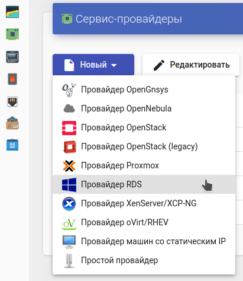
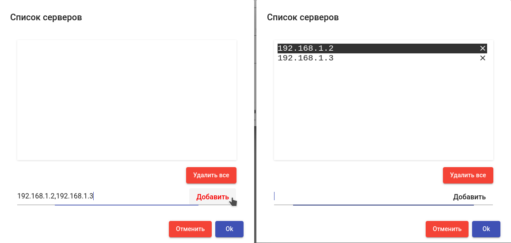
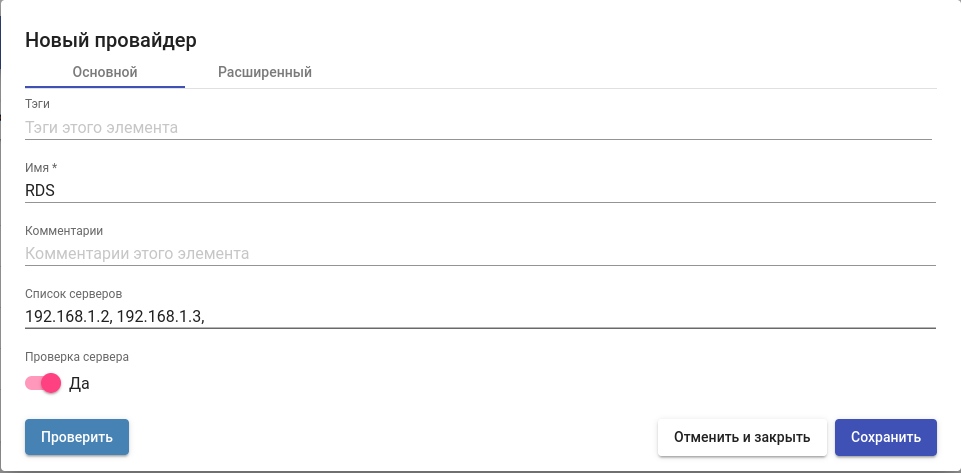
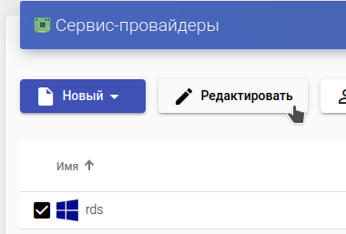
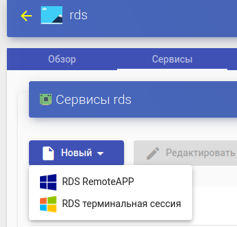
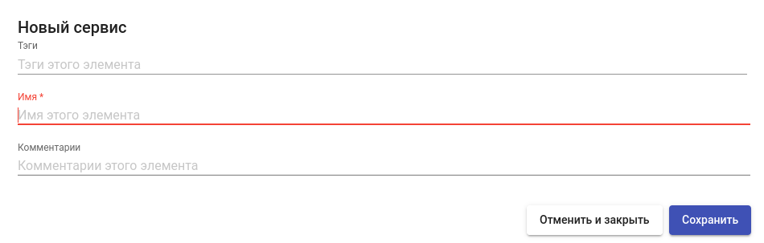

# Платформа RDS

Данный тип сервис-провайдера позволяет подключить платформу Microsoft Remote Desktop Services (RDS) и опубликовать сервисы терминальных сессий и виртуальных приложений.

_Примечание:_ для работы провайдера требуется наличие одного или нескольких внешних серверов Microsoft RDS с ролью Remote Desktop Session Host (Windows Server 2012/2016/2019/2022), сконфигурированных для предоставления терминального доступа и/или виртуальных приложений.

_Примечание:_ данный провайдер доступен начиная с версии брокера 3.5.

## Создание сервис-провайдера 

Для создания сервис-провайдера зайдите в раздел "Сервисы", нажмите "Новый" и выберите тип провайдера "RDS":

<figure><figcaption></figcaption></figure>

Выполните настройку нового провайдера, задав параметры:

**Имя:** - наименование создаваемого провайдера для отображения в системе;

**Список серверов:** список серверов Microsoft RDS, используемых для терминального доступа или публикации приложений (роль RDSH). В случае указания нескольких серверов, пользователи будут распределяться между ними. Задайте IP адреса серверов, разделенные запятыми, и нажмите "Добавить":

<figure><figcaption></figcaption></figure>

**Проверка сервера:** проверка доступности RDS сервера перед подключением пользователя. При непройденной проверке пользователь будет перенаправлен на следующий доступный сервер.

Используйте кнопку “Проверить” для проверки созданной конфигурации провайдера. Для сохранения созданной конфигурации нажмите "Сохранить".

<figure><figcaption></figcaption></figure>

Для внесения изменений в конфигурацию провайдера отметьте его и нажмите "Редактировать".

<figure><figcaption></figcaption></figure>

Чтобы приостановить все операции, выполняемые брокером для сервис-провайдера, используйте кнопку "Обслуживание". Рекомендуется переводить провайдер в режим обслуживания в случае потери доступа к нему, запланированного или аварийного.

После завершения настройки добавьте соответствующие сервисы, предоставляемые провайдером. Для этого откройте его параметры с помощью двойного щелчка, перейдите на вкладку "Сервисы", нажмите "Новый" и выберите тип создаваемого сервиса:

* RDS RemoteApp - для публикации виртуальных приложений;
* RDS терминальная сессия - для публикации терминального доступа к серверу.

<figure><figcaption></figcaption></figure>

Выполните настройку нового сервиса, задав параметры:

**Имя:** - наименование создаваемого сервиса для отображения в системе.

Сохраните конфигурацию сервиса нажав "Сохранить".

<figure><figcaption></figcaption></figure>
