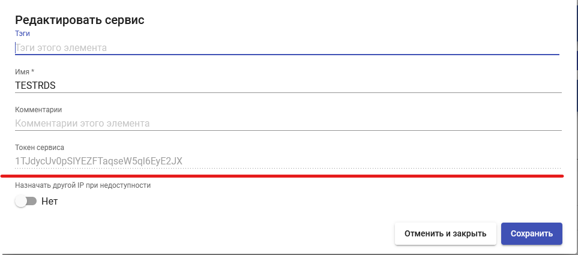

# Платформа RDS

Данный тип сервис-провайдера позволяет подключить платформу Microsoft Remote Desktop Services (RDS) и опубликовать сервисы терминальных сессий и виртуальных приложений.

_Примечание:_ данный провайдер доступен начиная с версии брокера 3.5.

## Требования к конфигурации RDS 

* Для работы провайдера требуется наличие одного или нескольких внешних серверов Microsoft RDS с ролью Remote Desktop Session Host (Windows Server 2012/2016/2019/2022), сконфигурированных для предоставления терминального доступа и/или виртуальных приложений.
* В случае использования брокера подключений (RD Connection Broker) должна быть отключена балансировка подключений. В частности, на терминальных серверах должно быть отключено правило "Use RD Connection Broker load balancing" раздела "Windows Components/Remote Desktop Services/Remote Desktop Session Host/RD Connection Broker".
* В случае использования брокера подключений (RD Connection Broker) рекомендуется установка этой роли на отдельную машину. Использование серверов с ролью RDCB при подключении через провайдер RDS не поддерживается.

## Создание сервис-провайдера 

Для создания сервис-провайдера зайдите в раздел "Сервисы", нажмите "Новый" и выберите тип провайдера "RDS":

<figure><figcaption></figcaption></figure>

Выполните настройку нового провайдера, задав параметры:

**Имя:** - наименование создаваемого провайдера для отображения в системе;

**Список серверов:** список серверов Microsoft RDS, используемых для терминального доступа или публикации приложений (роль RDSH). В случае указания нескольких серверов, пользователи будут распределяться между ними. Задайте IP адреса серверов, разделенные запятыми, и нажмите "Добавить":

<figure><figcaption></figcaption></figure>


В списке серверов не должны указываться машины с ролью брокера подключений (RDCB), добавляйте только адреса машин с ролью RDSH.


**Проверка сервера:** проверка доступности RDS сервера перед подключением пользователя. При непройденной проверке пользователь будет перенаправлен на следующий доступный сервер.

Используйте кнопку “Проверить” для проверки созданной конфигурации провайдера. Для сохранения созданной конфигурации нажмите "Сохранить".

<figure><figcaption></figcaption></figure>

Для внесения изменений в конфигурацию провайдера отметьте его и нажмите "Редактировать".

<figure><figcaption></figcaption></figure>

Чтобы приостановить все операции, выполняемые брокером для сервис-провайдера, используйте кнопку "Обслуживание". Рекомендуется переводить провайдер в режим обслуживания в случае потери доступа к нему, запланированного или аварийного.

После завершения настройки добавьте соответствующие сервисы, предоставляемые провайдером. Для этого откройте его параметры с помощью двойного щелчка, перейдите на вкладку "Сервисы", нажмите "Новый" и выберите тип создаваемого сервиса:

* RDS RemoteApp - для публикации виртуальных приложений;
* RDS терминальная сессия - для публикации терминального доступа к серверу.

<figure><figcaption></figcaption></figure>

Выполните настройку нового сервиса, задав параметры:

**Имя:** - наименование создаваемого сервиса для отображения в системе.

Сохраните конфигурацию сервиса нажав "Сохранить".

<figure><figcaption></figcaption></figure>

## Изменения в версии 3.6 

Добавлены параметры:

* Токен сервиса - сервисный токен, используемый при [настройке агента RDS](../../hostvm-vdi-installation-guide/actor/rds-actor.md). Генерируется автоматически при сохранении сервиса;

<figure><figcaption></figcaption></figure>

* Назначать другой IP при недоступности - автоматическое переназначение ранее выданного адреса сервера, если при подключении он недоступен.

