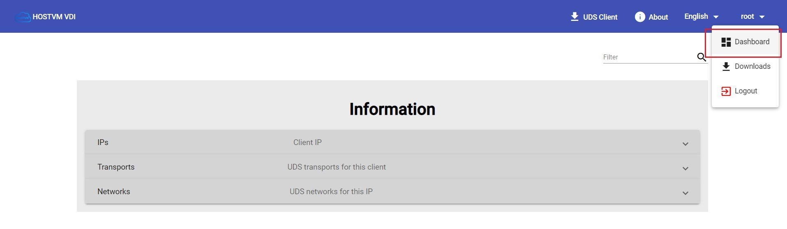
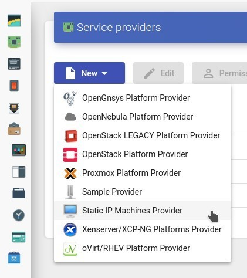
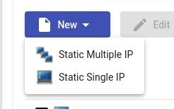
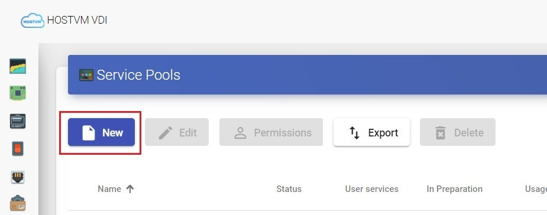
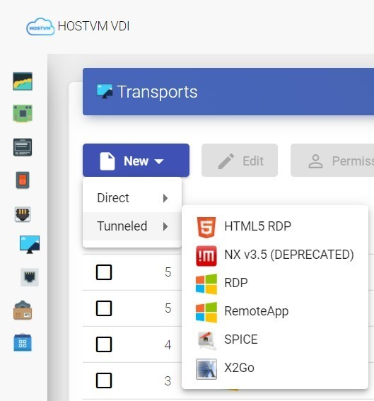

# Настройка подключений по протоколу x2Go

Настройки производятся в панели управления администратора на брокере VDI.

#### **Регистрация сервис-провайдера Static IP machines provider**

Для регистрации сервис-провайдера необходимо зайти в раздел «Services», нажать «New» и выбрать тип провайдера Static IP machines provider.

Указать произвольное имя и сохранить провайдера.

#### **Настройка сервиса на основе провайдера Static IP machines provider**

Для создания сервисов открыть созданный провайдер двойным щелчком. Выбрать New>Static single IP

Указать имя (произвольное) и IP адрес терминального сервера Linux. Повторить процедуру при наличии нескольких серверов.

#### **Настройка транспорта (протокола) для прямого подключения к сервисам**

Для создания транспорта перейдите в соответствующий раздел панели администрирования VDI, затем New>Direct>выберите транспорт из списка.

#### **Транспорт «X2Go»**

Транспорт «X2Go» (прямое подключение) позволяет пользователям получать доступ к виртуальным рабочим столам и приложениям Linux с помощью программного обеспечения  «X2Go». «X2Go» должен быть установлен и включен как на клиенте подключения так и на виртуальном рабочем столе (сервере).

После создания необходимо задать параметры транспорта.

Вкладка Основные:

* имя (Name) – произвольное имя транспорта;
* приоритет (Priority) – приоритет, который будет иметь транспорт. Чем ниже значение параметра, тем выше транспорт будет отображаться в списке доступных транспортов для сервиса. Транспорт с самым низким приоритетом будет использоваться по умолчанию при нажатии на иконку сервиса;

Вкладка Учетные данные:

* имя пользователя (Username) – имя пользователя, которое будет использоваться для входа на виртуальный рабочий стол

Вкладка Параметры:

* рабочий стол (Desktop) – выбор менеджера рабочего стола, для терминальной сессии выбрать соответствующую оболочку (например xfce) для виртуализации приложений Linux - UDS vAPP
* vAPP – абсолютный путь до виртуализируемого приложения (применяется когда для параметра «Рабочий стол» («Desktop») выбран  «UDS vAPP»), например: /usr/bin/firefox

#### **Настройка сервис-пула для подключения к терминальным серверам и приложениям**

После настройки основных компонентов можно приступить к созданию пула сервисов.

Для создания пула сервисов потребуются ранее настроенные компоненты: базовый сервис сервис-провайдера, транспорты подключения, и группа пользователей, которым планируется предоставить доступ к сервису.

Для создания нового пула перейдите в раздел Pools>Service pools и нажмите «New»**.**

Указать необходимые параметры при настройке:

Основные параметры:

* имя (Name) – произвольное имя пула сервисов
* базовый сервис (Base service) – настроенный ранее базовый сервис терминального сервера Static IP;

После сохранения настроек сервис пула открыть его двойным щелчком и добавить следующие элементы:

* группа пользователей, имеющих доступ к пулу: для добавления группы нажмите «New» на вкладке «Groups», выберите ранее созданные аутентификатор и группу.
* протоколы подключения для пула: для добавления транспорта нажмите «New» на вкладке  Transports созданного пула сервисов. Добавьте протокол из списка ранее созданных: RemoteApp для Windows пула или X2GO для Linux пула.

После завершения настройки приложения будут доступны на портале брокера VDI для пользователей, которым был выдан доступ.

#### **Настройка транспорта (протокола) для туннельного подключения к сервисам**

Для создания транспорта перейдите в соответствующий раздели панели администрирования VDI, затем New>Tunneled>выберите транспорт из списка.

#### **Транспорт Tunneled X2Go**

Транспорт Tunneled X2Go позволяет пользователям получать доступ к виртуальным рабочим столам и приложениям Linux с помощью программного обеспечения X2Go, как из внутренней, так и внешней сети. После создания транспорта задайте параметры:

Вкладка Основные:

* имя (Name) – произвольное имя транспорта;
* приоритет (Priority) – приоритет, который будет иметь транспорт. Чем ниже значения параметра, тем выше транспорт будет отображаться в списке доступных транспортов для сервиса. Транспорт с самым низким приоритетом будет использоваться по умолчанию при нажатии на иконку сервиса;

Вкладка Учетные данные:

* имя пользователя (Username) – имя пользователя, которое будет использоваться для входа на виртуальный рабочий стол.

Вкладка Параметры:

* рабочий стол (Desktop) – выбор менеджера рабочего стола, для терминальной сессии выбрать соответствующую оболочку (например xfce) для виртуализации приложений Linux - UDS vAPP
* vAPP – абсолютный путь до виртуализируемого приложения (применяется когда для параметра «Рабочий стол» («Desktop») выбран «UDS vAPP»), например: /usr/bin/firefoxus

Вкладка Tunnel:

* параметр tunnel server: укажите адрес ВМ Tunneler, в формате \<ip>:\<port> (порт по умолчанию: 443)

**На стороне терминального сервера (и сервера приложений):**\
 
