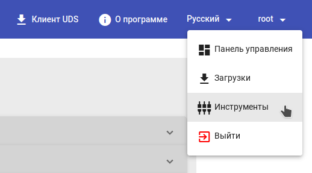
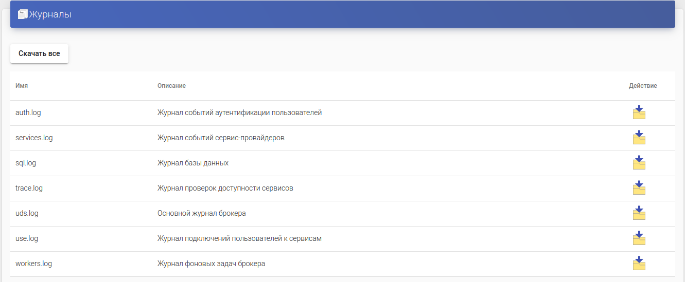
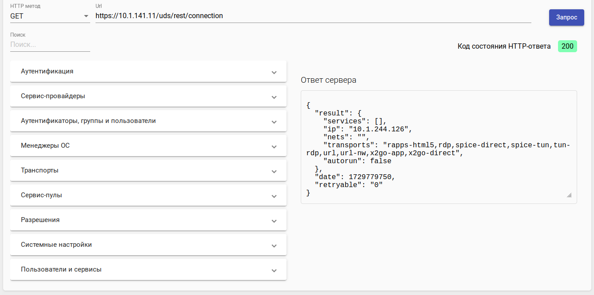
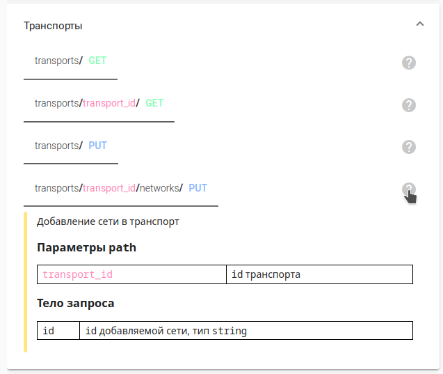
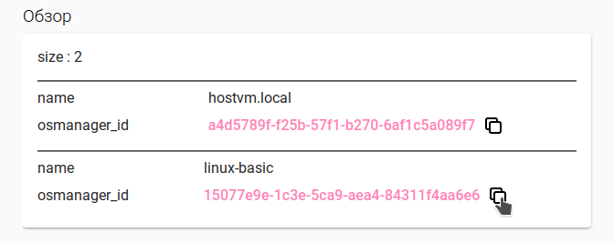
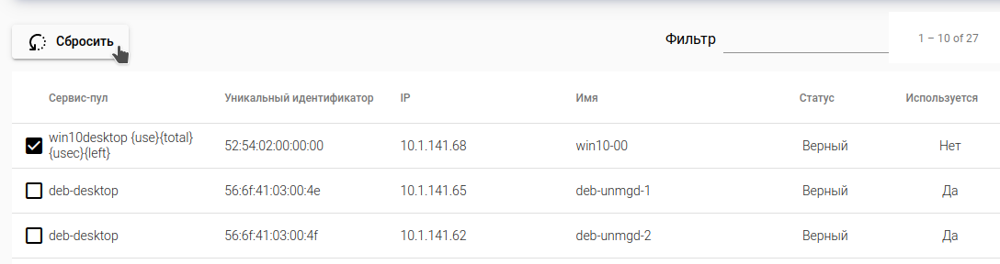

# Инструменты

> Данный функционал доступен начиная с версии брокера 3.6.

Раздел "Инструменты" доступен в меню пользователя (только для учетных записей с ролью _Администратор_):

<figure><figcaption></figcaption></figure>

## Журналы 

Здесь отображается перечень доступных для загрузки журналов брокера.

Вы можете скачать их по отдельности, нажав на иконку загрузки рядом с нужным файлом, либо архив всех журналов целиком, нажав на кнопку "Скачать все".

<figure><figcaption></figcaption></figure>

## REST API Обозреватель 

Обозреватель позволяет выполнять запросы к REST API брокера прямо из браузера.

> Дополнительную информацию вы можете узнать в [Руководстве по REST API](../rest-api-guide/)

Вы можете создать запрос как полностью вручную, так и используя готовые шаблоны.

Чтобы создать запрос вручную:

* выберите HTTP метод;
* задайте Url;
* при выборе PUT или POST метода запроса укажите параметры тела запроса в появившейся форме;
* нажмите кнопку "Запрос".

После выполнения запроса вы увидите код состояния HTTP-ответа и сам ответ сервера.

<figure><figcaption></figcaption></figure>

Шаблоны запросов разделены на тематические блоки. Раскройте нужный блок и выберите запрос из появившегося списка.

При нажатии на знак вопроса появится дополнительная информация с описанием запроса, а также параметров path и тела запроса (при наличии).

<figure><figcaption></figcaption></figure>

Чтобы создать запрос из шаблона:

* нажмите на нужный шаблон, данные из него подставятся в форму запроса;
* задайте нужные значения для параметров path и тела запроса (при наличии);
* нажмите кнопку "Запрос".

Для некоторых запросов, помимо кода состояния HTTP-ответа и полного ответ сервера будет доступно поле "Обзор" с перечнем найденных элементов в сокращенном формате (имя и id). Id элемента можно скопировать, нажав на иконку рядом, и использовать для дальнейших запросов.

<figure><figcaption></figcaption></figure>

## Управление сервисами 

Здесь отображается перечень всех назначенных пользователям сервисов.

> Кнопка "Сбросить" активна только для типов сервисов, поддерживающих сброс.

> Для управления сеансами пользователей на терминальных серверах сервис-провайдера RDS требуется [установка и настройка агента RDS](../hostvm-vdi-installation-guide/actor/rds-actor.md).

Вы можете перезапустить виртуальную машину или сбросить сессию пользователя, для этого выберите один или несколько (с помощью Shift или Ctrl) элементов из списка и нажмите кнопку "Сбросить":

<figure><figcaption></figcaption></figure>

## RDS агент 

Здесь отображается перечень зарегистрированных в системе токенов RDS агентов:

`Провайдер` - сервис-провайдер RDS \ Linux Terminal, для которого зарегистрирован токен;

`Токен` - токен агента;

`Дата` - дата создания токена.

> Создание токенов доступно только для [сервис-провайдеров RDS \ Linux Terminal](service-providers/rds-linux-terminal.md).

Чтобы создать токен для провайдера, нажмите `Новый`, выберите провайдер из списка доступных, нажмите `Сохранить`.

> Для каждого экземпляра провайдера, созданного в системе, можно зарегистрировать только один токен.

Если токен уже существует, при попытке сохранения новый токен создан не будет. Если вам необходимо пересоздать токен для провайдера, выберите уже существующий из списка, нажмите `Удалить` и подтвердите удаление. Затем создайте новый токен.

Чтобы скопировать значение токена в буфер обмена, нажмите на нем правой кнопкой мыши для открытия контекстного меню, и выберите пункт `Копировать`.

