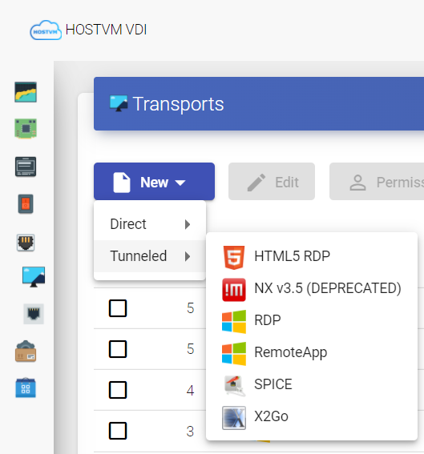

# Настройка транспорта подключения

Для подключения к виртуальным рабочим столам и приложениям необходимо создать транспорт подключения.

Транспорт – это небольшое приложение, отвечающее за предоставление доступа к развернутому сервису, которое запускается на клиенте.

В зависимости от типа настроенного виртуального рабочего стола, места расположения и способа подключения, могут использоваться различные типы транспортов.

На клиенте и ВМ должны быть установлены необходимые компоненты ПО для протокола соединения, используемого в качестве транспорта.

Прямое подключение (транспорт) используется для доступа пользователей к виртуальным рабочим столам и приложениям из внутренней локальной сети, VPN, LAN Extension и т. д.

Туннелированное подключение (транспорт) используется для доступа пользователей к виртуальным рабочим столам и приложениям из глобальной сети. Транспорты этого типа используют HOSTVM VDI туннелер для установления соединения.

Транспорт HTML5 может использоваться для доступа пользователей к виртуальным рабочим столам с помощью всех типов доступа (LAN, WAN и т.д.). Этот транспорт использует HOSTVM VDI туннелер для соединения с виртуальными рабочими столами.

Для создания нового транспорта нажмите «New» в разделе «Connectivity» -> «Transports».

Примечания:

* если вам нужен доступ из сети, которая не является вашей локальной сетью, используйте туннелированные транспорты. Для их настройки потребуется общедоступный IP-адрес сервера HOSTVM VDI Tunneler;
* HOSTVM VDI Tunneler использует один из двух портов в зависимости от типа транспорта. По умолчанию, при соединении через HTML5 используется порт 10443, для остальных туннелированных соединений (RDP, RDS, X2Go и т.д.) - порт 443.

## Функциональные возможности протоколов подключения 

| Возможность                                                            | RDP             | HTML5                                               | Loudplay                                                                                            |
| ---------------------------------------------------------------------- | --------------- | --------------------------------------------------- | --------------------------------------------------------------------------------------------------- |
| Поддержка нескольких мониторов                                         | Да              | Нет                                                 | Нет (планируется в Q1 202&#x36;**\***)                                                              |
| Автоматическое изменение разрешения                                    | Да              | Да                                                  | Да                                                                                                  |
| Передача текста через буфер обмена                                     | Двунаправленная | Двунаправленная                                     | Двунаправленная                                                                                     |
| Передача изображений через буфер обмена                                | Двунаправленная | Нет                                                 | 
Однонаправленная, с клиента на ВРМ

(доработка планируется в Q1 2026<strong>*</strong>)
 |
| Передача файлов через буфер обмена                                     | Да              | Нет                                                 | 
Однонаправленная, с клиента на ВРМ

(доработка планируется в Q1 2026<strong>*</strong>)
 |
| Ограничение размера и формата данных буфера обмена при перенаправлении | Нет             | Нет                                                 | Нет                                                                                                 |
| Воспроизведение звука                                                  | Да              | Да                                                  | Да                                                                                                  |
| Перенаправление микрофона                                              | Да              | Да                                                  | Да                                                                                                  |
| Перенаправление веб-камер                                              | Да              | Нет                                                 | Да                                                                                                  |
| Перенаправление USB                                                    | Да              | Нет                                                 | Да                                                                                                  |
| Перенаправление принтеров                                              | Да              | Нет (печать будет перенаправлена в удалённый сеанс) | Да                                                                                                  |
| Перенаправление сканеров                                               | Нет             | Нет                                                 | Да                                                                                                  |
| Перенаправление локальных дисков и каталогов                           | Да              | Нет                                                 | Нет (планируется в Q2 202&#x36;**\***)                                                              |
| Передача файлов в РМ                                                   | Да              | Да                                                  | Да                                                                                                  |
| Получение файлов из РМ                                                 | Да              | Да                                                  | Нет (планируется в Q1 202&#x36;**\***)                                                              |
| Перенаправление смарт-карт                                             | Да              | Нет                                                 | Нет (планируется в Q1 202&#x36;**\***)                                                              |
| Аутентификация с использованием смарт-карт                             | Да              | Нет                                                 | Нет (планируется в Q1 202&#x36;**\***)                                                              |
| Поддержка единого входа                                                | Да              | Да                                                  | Да                                                                                                  |
| Гибкие настройки передачи изображения                                  | Нет             | Нет                                                 | Да                                                                                                  |

**\*** - по информации от компании-разработчика.
