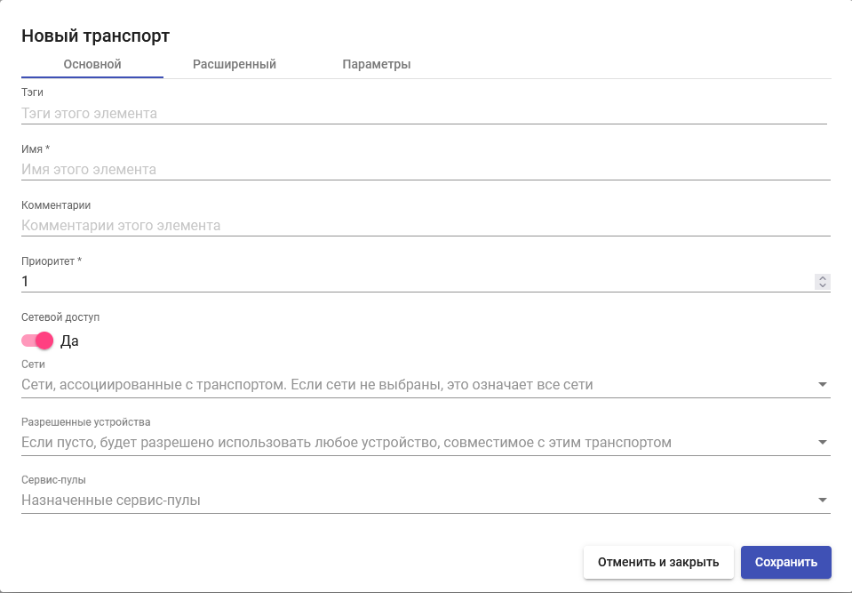

# Loudplay

Транспорт "Loudplay" позволяет пользователям получать доступ к виртуальным рабочим столам Windows с использованием протокола Loudplay.

_Примечание:_ на клиенте и виртуальном рабочем столе должны быть установлены и настроены компоненты, необходимые для работы протокола Loudplay.

## Настройка прямого подключения 

Для создания транспорта перейдите в раздел "Подключение" > "Транспорты", нажмите "Новый", в выпадающем списке выберите тип "Прямой" и транспорт "Loudplay".

**Основные настройки:**

_Имя:_ наименование создаваемого транспорта для отображения в системе;

_Приоритет:_ приоритет транспорта. Чем ниже значение параметра, тем выше транспорт будет отображаться в списке доступных для сервиса. Транспорт с наименьшим значением параметра будет использоваться по умолчанию при нажатии на иконку сервиса пользователем;

_Сетевой доступ:_ разрешает или запрещает пользователю доступ к сервису в зависимости от сети, из которой он получает доступ, и сети, указанной в поле «Сети» («Networks»);

_Сети:_ сетевые диапазоны, подсети или IP-адреса, заданные в разделе "Подключение" - "Сети". Используется совместно с параметром «Сетевой доступ» для разрешения или запрета пользователю доступа к сервису в зависимости от его местоположения в сети;

_Разрешенные устройства:_ разрешает доступ к сервису только с выбранных устройств. Если ничего не выбрано, фильтрация не выполняется;

_Сервис-пулы:_ перечень сервис-пулов, в которых используется транспорт.

<figure><figcaption></figcaption></figure>

**Параметры:**

_Энкодер_: параметр, отвечающий за выбор энкодера на стороне сервера. По умолчанию параметр имеет значение ffmpeg-dda. Проверить используемый метод энкодирования можно в логах на сервере logs/server\_date.log.

<figure><figcaption></figcaption></figure>

, где «encoder-dda» указывает, что запущен аппаратный энкодер, «encoder-ffmpeg-dda», указывает, что запущен софтверный энкодер.

<figure><figcaption></figcaption></figure>

**Расширенный:**

_Протокол_: параметр, определяющий, какой протокол будет использоваться для передачи видео между сервером и клиентом. По умолчанию параметр имеет значение tcp.

_Максимальное значение фпс_: параметр, отвечающий за максимальное значение fps, которое получает пользователь с сервера. По умолчанию значение 30.

_Максимальное значение битрейта_: параметр, отвечающий за максимальное значение битрейта, которое получает пользователь с сервера, при условии отключенного автобитрейта. По умолчанию параметр имеет значение 5000.

_Автобитрейт_: параметр, отвечающий за то, включен ли режим автобитрейта на старте трансляции. По умолчанию имеет он выключен.

_Начальное значение битрейта_: параметр, задающий начальное значение битрейта при включенном режиме автобитрейта. По умолчанию параметр имеет значение 1000.

_Минимальный порог битрейта_: параметр, задающий минимальный порог битрейта при включенном режиме автобитрейта. По умолчанию параметр имеет значение 50.

_Максимальный порог битрейта_: параметр, задающий максимальный порог битрейта при включенном режиме автобитрейта. По умолчанию параметр имеет значение 12000.

_Время между циклами_: параметр, отвечающий за время между прохождением двух циклов работы автобитрейта. По умолчанию имеет значение 8000.

_Время между пингами_: параметр, отвечающий за время между двумя пингами до сервера с целью узнать RTT(round-trip time) внутри работы одного цикла работы автобитрейта. По умолчанию имеет значение 50.

_Множитель автобитрейта без очереди_: параметр, отвечающий за множитель на старте работы цикла автобитрейта без наличия очереди из видео-пакетов и неувеличенным RTT в сравнении с предыдущим циклом работы автобитрейта. По умолчанию параметр имеет значение 2.

_Множитель автобитрейта в ожидании_: параметр, отвечающий за множитель работы автобитрейта, находящийся в состоянии ожидания и, при этом, очередь из виде-пакетов не была обнаружена. По умолчанию параметр имеет значение 1.

_Множитель автобитрейта в ожидании с проверкой дополнительной полосы_: параметр, отвечающий за множитель работы автобитрейта, находящийся в режиме ожидания и, при котором, система проверяет наличие дополнительной полосы пропускания для видео пакетов. По умолчанию параметр имеет значение 1.15.

_Множитель автобитрейта в ожидании с очередью_: параметр, отвечающий за множитель работы автобитрейта, находящийся в состоянии ожидания и, при этом, была обнаружена очередь из видео пакетов и разница между соседними значениями RTT была выше порогового значения. По умолчанию параметр имеет значение 0.75.

_Множитель автобитрейта на старте с очередью_: параметр, отвечающий за множитель на старте работы цикла автобитрейта при наличии очереди из видео пакетов и увеличенным RTT в сравнении с предыдущим циклом работы автобитрейта. По умолчанию параметр имеет значение 0.5.

_Порт обмена RPC-сообщениями_: параметр, отвечающий за номер порта, по которому сервер и клиент обмениваются RPC-сообщениями. Параметр задается в виде х556, где х - номер префикса (**Префикс по-умолчанию необходимо указывать 8)**.

_Аппаратное ускорение_: параметр, отвечающий за включение/отключение режима аппаратного ускорения. Включение аппаратного ускорения снижает нагрузку на CPU ПК пользователя. Повышает производительность протокола на клиентской части. По умолчанию параметр включен.

_Включение работы клавиатуры и мыши_: параметр, отвечающий за то, будет ли включена работа клавиатуры и мыши при запуске трансляции. По умолчанию параметр включен.

_Порт для обмена сообщениями, связанными с клавиатурой и мышью_: параметр, отвечающий за номер порта, по которому сервер и клиент обмениваются сообщениями, связанными с клавиатурой и мышью. Параметр задается в виде х555, где х - номер префикса (**Префикс по-умолчанию необходимо указывать 8**).

_Протокол передачи клавиатуры и мыши_: параметр, отвечающий за выбор протокола для передачи клавиатуры и мыши с клиента на сервер. По умолчанию параметр имеет значение udp.

_Порт для обмена видео-пакетами_: параметр, отвечающий за номер порта, по которому сервер и клиент обмениваются видео-пакетами при использовании протокола udp. Параметр задается в виде х970, где х - номер префикса (**Префикс по-умолчанию необходимо указывать 6**).

_Порт для обмена аудио-пакетами_: параметр, отвечающий за номер порта, по которому сервер и клиент обмениваются аудио-пакетами при использовании протокола udp. Параметр задается в виде х972, где х - номер префикса (**Префикс по-умолчанию необходимо указывать 6**).

_Начало таймера неактивности_: один из параметров, отвечающий за таймер неактивности. По истечении указанного времени появляется уведомление о том, что пользователь неактивен. По- умолчанию параметр имеет значение 0. Параметр задается в секундах. При установке значения 0 таймер неактивности отключается.

_Продолжительность таймера неактивности_: один из параметров, отвечающий за таймер неактивности. По истечении таймера X1 запускается таймер X2. По истечении X2 приложение Loudplay закрывается. По умолчанию параметр имеет значение 0. Параметр задается в секундах. При установке значения 0 приложение Loudplay не выключается.

_Автоизбыточность_: параметр, отвечающий за то, включен ли режим автоизбыточности. По умолчанию параметр включен.

_Избыточность_: параметр, отвечающий за значение избыточности, при условии, что режим автоизбыточности отключен. По умолчанию параметр имеет значение 20.

_Ретрансмиты_: параметр, отвечающий за включение/отключение ретрансмитов при использовании протокола udp. По умолчанию включен.

_Абсолютные координаты курсора_: параметр, отвечающий за режим работы мыши (абсолютные или относительные координаты). По умолчанию параметр включен.

_Уведомления при проблемах с сетью_: параметр управляет отображением уведомления при проблемах с сетью. По умолчанию параметр выключен.

_Уведомление при превышении разрешения_: параметр управляет отображением уведомления при превышении разрешения виртуальной машины над локальным разрешением. Если будет выбрано разрешение на виртуальной машине выше, чем на ПК, с которого было запущено приложение, то уведомление появится. По умолчанию параметр выключен.

_Показывать меню_: параметр управляет отображением логотипа "Loudplay" на старте приложения. Если логотип отключен, то его можно вернуть сочетанием клавиш «Alt+L».

_Максимальное потребление CPU_: параметр управляет отображением уведомления о превышении потребления CPU на клиентской части. Происходит расчет реального потребления CPU (может отличаться от значения потребления CPU в диспетчере задач) ПК пользователя. При достижении указанного процента загруженности отображается уведомление на клиенте Loudplay с советом снизить потребление CPU для нормального продолжения работы с приложением. Для отключения данного параметра необходимо выставить значение 0.

_Язык_: параметр определяет язык, на котором будут отображаться уведомления, подсказки (сочетание клавиш «Alt+1»), быстрое меню приложения.

_Включить микрофон_: параметра, определяющий, будет ли включен микрофон на старте трансляции. Для включения микрофона во время работы необходимо нажать сочетание клавиш «Alt+r»

_Монитор_: параметр, используемый в мультимониторной конфигурации на сервере. Отвечает за выбор монитора на сервере, к которому необходимо подключиться. Если монитор на сервере доступен только один, то подключение при любом значении будет производиться к нему.

<figure><figcaption></figcaption></figure>

<figure><figcaption></figcaption></figure>

<figure><figcaption></figcaption></figure>

<figure><figcaption></figcaption></figure>

## Установка и настройка клиента Loudplay 

Для корректной работы транспорта Loudplay необходимо установить и настроить клиент Loudplay.

1. Разархивировать клиент Loudplay.
2. Открыть папку клиента Loudplay, зайти в папку bin, скопировать полный путь. Проследить, что запускаемый файл (.exe) имеет имя streaming.exe. Если имя не совпадает, то файл необходимо переименовать в streaming.exe.

<figure><figcaption></figcaption></figure>

3. Нажимаем на "Этот компьютер" правой кнопкой мыши, выбираем "Свойства"

<figure><figcaption></figcaption></figure>

4. В открывшемся окне выбираем справа в Сопутствующих параметрах "Дополнительные параметры системы"

<figure><figcaption></figcaption></figure>

5. В открывшемся окне выбираем "Переменные среды"

<figure><figcaption></figcaption></figure>

6. В открывшемся окне делаем двойной щелчок левой кнопкой мыши по переменной Path.

<figure><figcaption></figcaption></figure>

7. В открывшемся окне нажимаем кнопку "Создать". Вставляем полный путь к папке bin, скопированный ранее.

<figure><figcaption></figcaption></figure>

8. На всех окнах нажимаем "Ок".

## Установка нового UDS Client 

Для работы транспорта Loudplay необходим новый UDS Client с поддержкой Loudplay. Для его установки необходимо:

1. Зайти в брокер HOSTVM VDI, нажать кнопку для скачивания Клиента UDS.

<figure><figcaption></figcaption></figure>

2. Выбрать "Клиент Windows с поддержкой Loudplay".

<figure><figcaption></figcaption></figure>

3. Запустить скачанный установщик.
4. Нажать "Далее", "Принимаю", выбрать папку установки, нажать "Установить".
