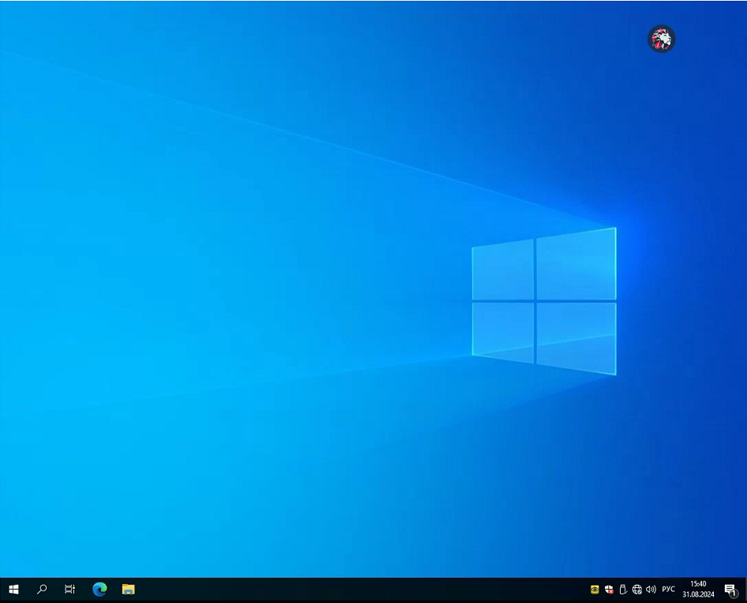

# Использование vGPU

Для использования возможностей vGPU при подключении через транспорт Loudplay вам потребуется подготовить соответствующую конфигурацию.

## Системные требования

**Платформа виртуализации:**

1. Хост с установленной видеокартой, поддерживающей vGPU;
2. Установленный драйвер с поддержкой vGPU:\
   \* - Для HOSTVM Node версии 4.4 – NVIDIA-GRID-RHEL-8.5-510.47.03-511.65\
   \* - Для HOSTVM Node версии 4.5 – NVIDIA-GRID-RHEL-8.9-535.154.02-535.154.05-538.15
3. Развернутый сервер FastAPI-DLS

**Виртуальное рабочее место (далее - ВМ):**

1. Установленный сервер Loudplay версии 0.17 (имя дистрибутива: Loudplay\_server\_0.17.0).

**Рабочее место пользователя (далее - Клиент):**

1. Установленный клиент HOSTVM VDI с поддержкой Loudplay (скачивается из раздела "Клиент UDS" в веб-интерфейсе брокера);
2. Установленный клиент LoudPlay-streaming-1.14.0-Windows-x64 (настройка данного клиента описана в [статье](https://kb.pvhostvm.ru/hostvm-vdi/hostvm-vdi-admin-guide/transports/loudplay) базы знаний HOSTVM).

В зависимости от выбора типа лицензирования также может потребоваться развернутый сервер лицензирования Loudplay, в случае тестирования одного рабочего места лицензия указывается в конфигурации ВМ, подробные инструкции по настройке лицензирования можно найти в документации, поставляемой вместе с дистрибутивами Loudplay.

## Настройка ВМ

1\.     Прикрепите к виртуальной машине профиль vGPU графического ускорителя, для этого нужно выключить ВМ (либо выключить и включить ВМ после применения изменений) и перейти в меню параметров ВМ на вкладку Host Devices -> Manage vGPU), в открывшемся окне выбрать необходимый профиль.

2\.     Установите драйвер видеокарты.

3\.     Получите токен клиента с сервера FastAPI-DLS.

### Получение токенов

#### Linux

Скачайте client-token и поместить по следующему пути _/etc/nvidia/ClientConfigToken_:

```
curl --insecure -L -X GET https://<dls-hostname-or-ip>/-/client-token -o /etc/nvidia/ClientConfigToken/client_configuration_token_$(date '+%d-%m-%Y-%H-%M-%S').tok
# или
wget --no-check-certificate -O /etc/nvidia/ClientConfigToken/client_configuration_token_$(date '+%d-%m-%Y-%H-%M-%S').tok https://<dls-hostname-or-ip>/-/client-token
```

Перезапустите службу nvidia-gridd:

```
service nvidia-gridd restart
```

Проверьте статус лицензии:

```
nvidia-smi -q | grep "License"
```

Вывод должен быть примерно таким:

```
vGPU Software Licensed Product
    License Status                    : Licensed (Expiry: YYYY-M-DD hh:mm:ss GMT)
```

#### Windows

Запустите Powershell от имени администратора

Скачайте client-token и поместите его по пути _C:\Program Files\NVIDIA Corporation\vGPU Licensing\ClientConfigToken:_

```
curl.exe --insecure -L -X GET https://<dls-hostname-or-ip>/-/client-token -o "C:\Program Files\NVIDIA Corporation\vGPU Licensing\ClientConfigToken\client_configuration_token_$($(Get-Date).tostring('dd-MM-yy-hh-mm-ss')).tok"
```

Перезапустите сервис _NvContainerLocalSystem:_

```
Restart-Service NVDisplay.ContainerLocalSystem
```

Проверьте статус лицензии:

```
& 'nvidia-smi' -q  | Select-String "License"
```

Вывод должен быть примерно таким:

```
vGPU Software Licensed Product
    License Status                    : Licensed (Expiry: YYYY-M-DD hh:mm:ss GMT)
```

## Подключение к сервису брокера

С машины-Клиента выполните подключение к развернутому сервис-пулу ВМ (при подключении пользователю будет доступно меню Loudplay в верхнем правом углу экрана):

<figure><figcaption></figcaption></figure>

## Примечание

### Аппаратное ускорение

При включенном в настройках транспорта Loudplay параметре 'Аппаратное ускорение' используются ресурсы графического ускорителя машины-Клиента. При такой конфигурации профиль vGPU должен быть откреплён от ВМ для корректной работы транспорта.


**Предупреждение:** сессия с включенным аппаратным ускорением не поддерживает работу с приложениями, требующими наличие графического ускорителя на стороне ВМ.


### Консоль ВМ

При использовании административной консоли гипервизора на портале платформы виртуализации для подключения к ВМ с прикреплённым профилем графического ускорителя рекомендуется использовать протокол VNC. При использовании протокола SPICE для подключения консоли ВМ с активированным профилем vGPU и установленным драйвером NVIDIA возможны проблемы с отображением курсора указателя.

### Полезные ссылки

1\.     [Список](https://docs.nvidia.com/vgpu/index.html) версий ПО NVIDIA;

2\.     [Перечень](https://docs.nvidia.com/vgpu/latest/grid-vgpu-release-notes-red-hat-el-kvm/index.html#hypervisor-software-versions) поддерживаемых систем для версии драйвера;

3\.     [Инструкция](https://docs.nvidia.com/vgpu/14.0/grid-vgpu-user-guide/index.html#install-update-vgpu-red-hat-el-kvm) по установке пакета Virtual GPU Manager;

4\.     [Инструкция](https://docs.nvidia.com/vgpu/14.0/grid-vgpu-user-guide/index.html#installing-grid-vgpu-display-drivers) по установке драйвера vGPU в клиентскую машину;
