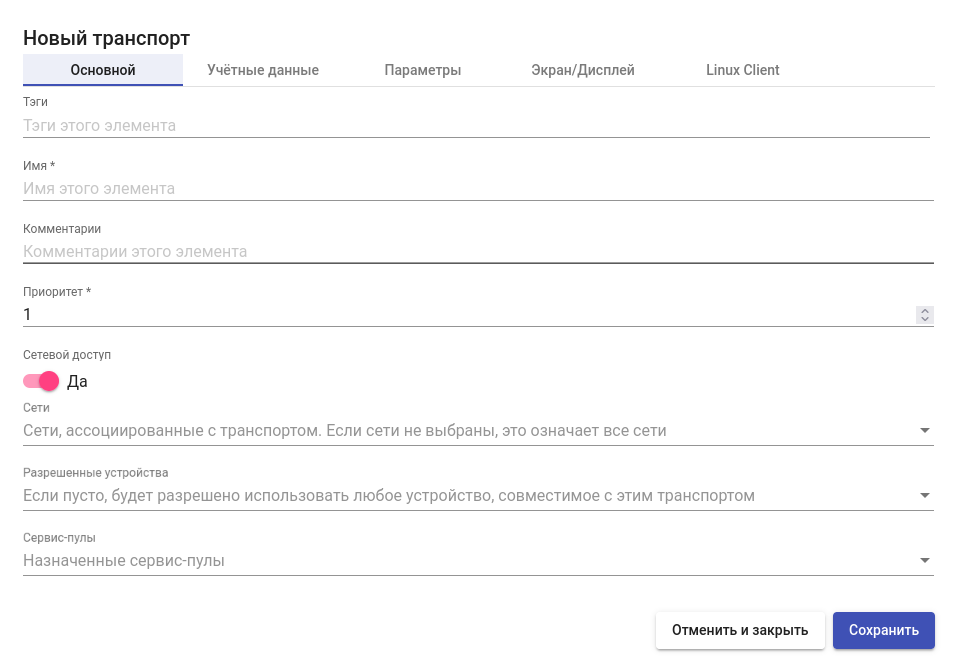
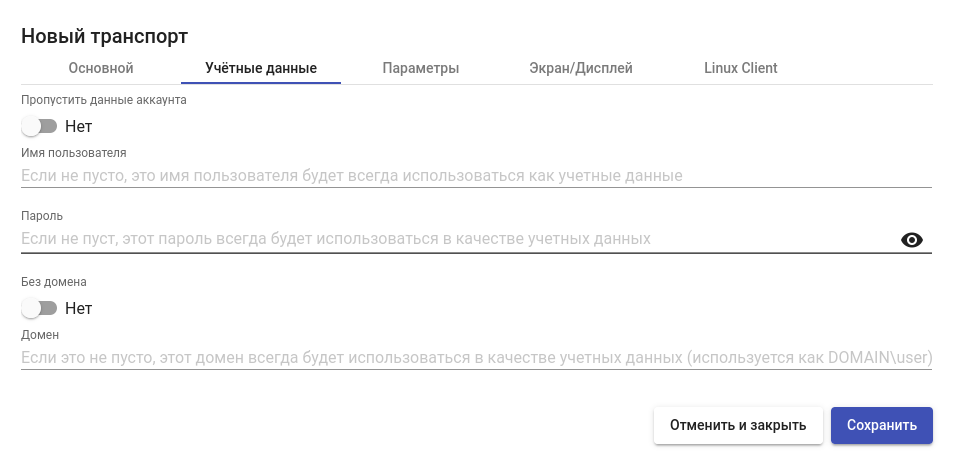
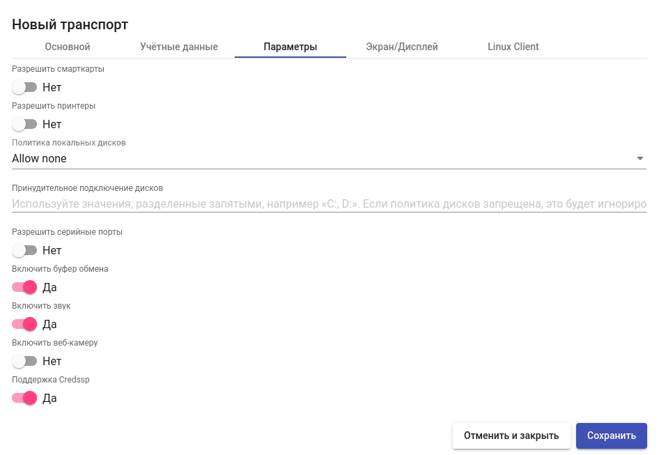
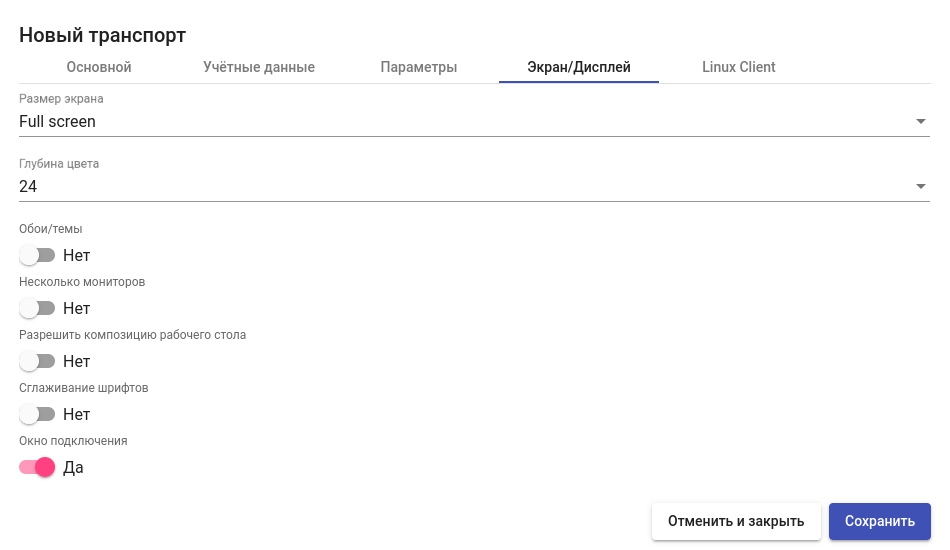
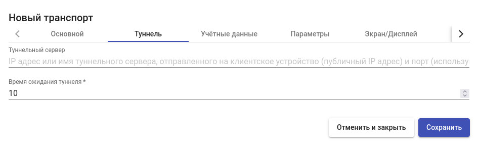

# RDP

Транспорт "RDP" позволяет пользователям получать доступ к виртуальным рабочим столам Windows/Linux с использованием протокола RDP.

_Примечание:_ на клиенте и виртуальном рабочем столе/терминальном или сервере приложений должны быть установлены и активированы компоненты, необходимые для работы протокола RDP. Для среды Windows используются встроенные средства RDP, для Linux – freerdp2 и xrdp (клиентская и серверная часть соответственно).


Важно: при низкой скорости отдачи возможно длительное открытие локальных дисков пользователя. Требования к пропускной способности и ограничения протокола RDP необходимо уточнять на сайте производителя.


## Настройка прямого подключения 

Для создания транспорта перейдите в раздел "Подключение" > "Транспорты", нажмите "Новый", в выпадающем списке выберите тип "Прямой" и транспорт "RDP".

**Основные настройки:**

_Имя:_ наименование создаваемого транспорта для отображения в системе;

_Приоритет:_ приоритет транспорта. Чем ниже значение параметра, тем выше транспорт будет отображаться в списке доступных для сервиса. Транспорт с наименьшим значением параметра будет использоваться по умолчанию при нажатии на иконку сервиса пользователем;

_Сетевой доступ:_ разрешает или запрещает пользователю доступ к сервису в зависимости от сети, из которой он получает доступ, и сети, указанной в поле «Сети» («Networks»);

_Сети:_ сетевые диапазоны, подсети или IP-адреса, заданные в разделе "Подключение" - "Сети". Используется совместно с параметром «Сетевой доступ» для разрешения или запрета пользователю доступа к сервису в зависимости от его местоположения в сети;

_Разрешенные устройства:_ разрешает доступ к сервису только с выбранных устройств. Если ничего не выбрано, фильтрация не выполняется;

_Сервис-пулы:_ перечень сервис-пулов, в которых используется транспорт.

<figure><figcaption></figcaption></figure>

**Учетные данные:**

_Пропустить данные аккаунта:_ если установлено «Да» («Yes»), то при подключении к сервису запрашиваются учетные данные для доступа к виртуальному приложению; если установлено «Нет» («No»), то будут перенаправлены учетные данные, введенные в поля "Имя пользователя" и "Пароль" ниже, а если они пусты, то данные пользователя, введенные при входе в HOSTVM VDI;

_Имя пользователя:_ имя пользователя для подключения к виртуальному рабочему столу (такой пользователь должен существовать), используется в связке с предыдущим параметром в значении "Нет";

_Пароль:_ пароль пользователя;

_Без домена:_ указывает, перенаправляется ли имя домена вместе с пользователем;

_Домен:_ имя домена, которое отправляется с учетными данными пользователя;

<figure><figcaption></figcaption></figure>

**Параметры:**

_Разрешить смарткарты:_ разрешает перенаправление смарт-карт;

_Разрешить принтеры:_ включает перенаправление принтера;

_Политика локальных дисков:_ позволяет управлять политикой проброса дисков в сессию;

_Принудительное подключение дисков:_ принудительное перенаправление указанных дисков. Можно ввести несколько через запятую (пример: F:, G:);

_Разрешить серийные порты:_ включает перенаправление последовательного порта;

_Включить буфер обмена:_ разрешает общий буфер обмена между клиентом подключения и виртуальным рабочим столом;

_Включить звук:_ позволяет перенаправить звук от виртуального рабочего стола к клиенту подключения;

_Включить веб-камеру:_ перенаправление веб-камеры;

_Поддержка Credssp:_ при включении данного параметра будет использоваться «Credential Security Support Provider».

<figure><figcaption></figcaption></figure>

**Экран/Дисплей:**

_Размер экрана:_ управление размером экрана при подключении к рабочему столу;

_Глубина цвета:_ управление глубиной цвета;

_Обои/темы:_ управление отображением обоев/тем рабочего стола на клиенте;

_Несколько мониторов:_ управление возможностью использования нескольких мониторов;

_Разрешить композицию рабочего стола:_ активирует композицию рабочего стола;

_Сглаживание шрифтов:_ активирует сглаживание шрифтов;

<figure><figcaption></figcaption></figure>

## Настройка туннелированного подключения 

Для создания транспорта перейдите в раздел "Подключение" > "Транспорты", нажмите "Новый", в выпадающем списке выберите тип "Туннельный" и транспорт "RDP".

**Вкладка Туннель:**

Туннельный сервер: IP-адрес или FQDN сервера HOSTVM VDI Tunneler и порт подключения, в формате `<адрес>:<порт>` (порт по умолчанию - 443). Если доступ к рабочему столу осуществляется из глобальной сети, необходимо ввести общедоступный адрес HOSTVM VDI Tunneler.

Время ожидания туннеля – время действия тикета для подключения к HOSTVM VDI Tunneler;

<figure><figcaption></figcaption></figure>
