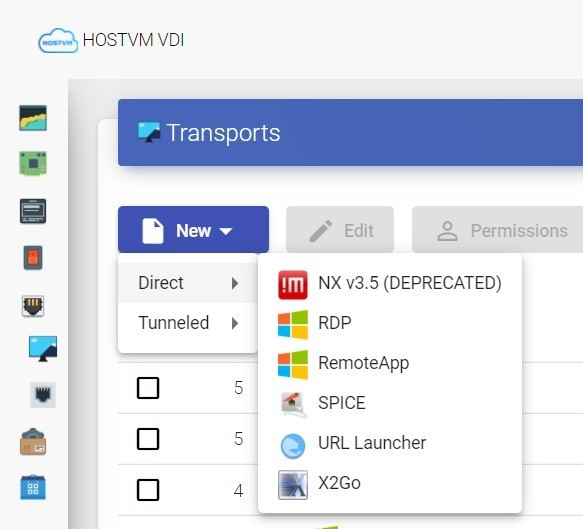
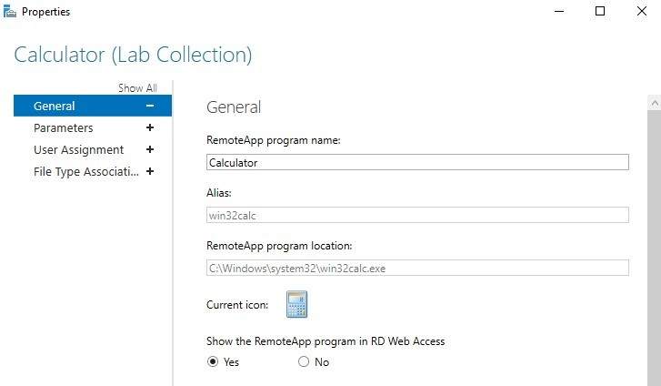
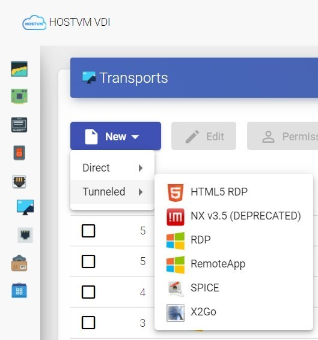

---
layout:
  title:
    visible: true
  description:
    visible: false
  tableOfContents:
    visible: true
  outline:
    visible: true
  pagination:
    visible: true
---

# RemoteApp

Транспорт «RemoteApp» позволяет пользователям получать доступ к виртуальным приложениям Windows.

Для доступа из внешней сети используйте туннелированное подключение.


Важно: при низкой скорости отдачи возможно длительное открытие локальных дисков пользователя. Требования к пропускной способности и ограничения протокола RDP необходимо уточнять на сайте производителя.


## **Настройка прямого подключения** 

Для создания транспорта перейдите в раздел "Connectivity" > "Transports", нажмите "New", в выпадающем списке выберите тип "Direct" и транспорт "RemoteApp".

### Основные настройки 

`Имя (Name)` – наименование создаваемого транспорта для отображения в системе;

`Приоритет (Priority)` – приоритет транспорта. Чем ниже значение параметра, тем выше транспорт будет отображаться в списке доступных для сервиса. Транспорт с наименьшим значением параметра будет использоваться по умолчанию при нажатии на иконку сервиса пользователем;

### Параметры 

`Имя приложения (App Name)` – параметр Alias (псевдоним) свойств опубликованного приложения:

### Linux Client 

`Версия клиента FreeRDP` - используемая для подключения версия FreeRDP. В зависимости от выбранного значения будет использоваться совместимый с указанной версией набор параметров для подключения;

`Оптимизация видеопотока` - если включено, используется параметр video клиента FreeRDP;

`Использовать Alsa` - если включено, используется ALSA, иначе Pulse;

`Строка принтера` - параметры принтера, передаваемые клиенту FreeRDP;

`Строка Smartcard` - параметры смарт-карты, передаваемые клиенту FreeRDP;

`Дополнительные параметры (Custom parameters)` – дополнительные параметры, передаваемые клиенту FreeRDP.


В версиях брокера до `3.6 номер сборки 20250314`, для корректной работы транспорта при использовании rdp-клиента xfreerdp, в данном поле необходимо указывать параметр Alias (псевдоним) опубликованного приложения в формате: /app:"||алиас приложения".


<figure><figcaption></figcaption></figure>

## **Настройка туннелированного подключения** 

Для создания транспорта перейдите в раздел "Connectivity" > "Transports", нажмите "New", в выпадающем списке выберите тип "Tunneled" и транспорт "RemoteApp".

### Туннель 

`Туннельный сервер` - IP-адрес или FQDN машины HOSTVM VDI Tunneler и порт подключения, в формате `<адрес>:<порт>` (порт по умолчанию - 443). Если доступ осуществляется из глобальной сети, введите общедоступный адрес HOSTVM VDI Tunneler.

`Время ожидания туннеля` – время действия тикета для подключения к HOSTVM VDI Tunneler;

`Принудительная проверка SSL-сертификата` - включает проверку сертификата HOSTVM VDI Tunneler при подключении (требуется наличие действительного сертификата на машине HOSTVM VDI Tunneler).

> Остальные параметры идентичны прямому подключению.

