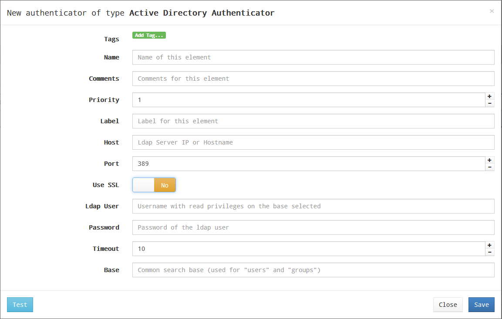

# Управление методами аутентификации

Аутентификатор является основным компонентом платформы доставки рабочих столов, так как позволяет пользователям и группам пользователей, которым предоставлены учетные данные, подключаться к различным сервисам на рабочих столах.

Если в пуле сервисов не назначен хотя бы один аутентификатор, не будет возможности для подключения пользователей к сервисам рабочих столов платформы.

В зависимости от деятельности и платформы можно выбирать внешние аутентификаторы (Active Directory, OpenLDAP и т.д.) или внутренние (внутренняя база данных и аутентификация по IP).

### Аутентификатор Active Directory

Этот внешний аутентификатор обеспечивает доступ пользователям и группам пользователей, принадлежащим Active Directory, к виртуальным рабочим столам или приложениям.

Минимальные параметры для настройки в аутентификаторе Active Directory:

* имя (Name) – имя аутентификатора;
* приоритет (Priority) – приоритет аутентификатора. Чем ниже значение параметра, тем выше аутентификатор будет отображаться в списке аутентификаторов, доступных в окне доступа пользователя. Допускаются отрицательные значения;
* метка (Label) – позволяет пользователям выполнять вход в систему используя этот аутентификатор, без необходимости выбора из перечня доступных. Доступ к форме входа в таком случае осуществляется по прямой ссылке вида HOSTVM-VDI-Server/uds/page/login/label, где label - значение данного поля. Например, если в поле задано значение AD, ссылка будет иметь вид https://HOSTVM-VDI-Server/uds/page/login/AD;
* хост (Host) – IP-адрес или имя сервера AD;
* порт (Port) – порт подключения к серверу AD (обычно 389, или 636 при использовании SSL);
* использовать SSL (Use SSL) – если установлено значение «Yes», используется SSL-соединение с сервером AD;
* пользователь (Ldap user) – пользователь с правами чтения AD в формате: user@domain;
* пароль (Password) – пароль пользователя;
* тайм-аут (Timeout) – тайм-аут соединения с аутентификатором;
* Base – базовая запись поиска в AD (например dc=example, dc=com).

Нажав кнопку «Test», можно проверить, правильно ли настроено соединение с AD.

### Внутренняя база данных (Internal Database)

В средах, где нет внешнего аутентификатора, можно использовать аутентификатор «Internal Database». Этот аутентификатор позволяет вручную создавать пользователей и группы для доступа к различным службам рабочего стола и виртуальным приложениям, предоставляемым платформой HOSTVM VDI.

Все данные пользователей и групп хранятся в базе данных, к которой подключен сервер HOSTVM VDI.

<figure><figcaption></figcaption></figure>

В «Internal Database» должны быть настроены минимальные параметры.

**Минимальные параметры:**

* имя (Name) – имя аутентификатора;
* приоритет (Priority) – приоритет аутентификатора. Чем ниже значение этого параметра, тем выше аутентификатор будет отображаться в списке аутентификаторов, доступных в окне доступа пользователя. Допускаются отрицательные значения параметра;
* метка (Label) – позволяет пользователям выполнять вход в систему используя этот аутентификатор, без необходимости выбора из перечня доступных. Доступ к форме входа в таком случае осуществляется по прямой ссылке вида HOSTVM-VDI-Server/uds/page/login/label, где label - значение данного поля. Например, если в поле задано значение int, ссылка будет иметь вид https://HOSTVM-VDI-Server/uds/page/login/int;

<figure><figcaption></figcaption></figure>

**Дополнительные параметры:**

* Different user for each host – параметр позволяет подключаться к виртуальным рабочим столам с помощью одного и того же пользователя, добавляя приставку к имени существующего пользователя во время подключения к виртуальному рабочему столу. Приставка – это IP-адрес клиента подключения или его DNS-имя. Новое созданное имя пользователя имеет следующую структуру: IP клиента-пользователь подключения;
* Reverse DNS – аналогично предыдущему параметру, но корень, добавленный к пользователю, является DNS-именем клиента подключения. Требуется правильное разрешение DNS, в противном случае будет использоваться IP-адрес. Созданный пользователь имеет следующую структуру: пользователь-имя\_клиента\_подключения;
* Accept proxy – этот параметр должен быть включен, если есть компонент для доступа к серверу HOSTVM VDI, например, балансировщик нагрузки. По умолчанию HOSTVM VDI автоматически определяет IP-адрес клиента подключения. В средах, где настроены балансировщики нагрузки или другие подобные элементы, это обнаружение не выполняется правильно, поскольку обнаруженный IP-адрес соответствует этим балансировщикам. Включение данной опции обеспечит правильное определение IP. В средах, где используется опция «Different user for each host» и есть балансировщики нагрузки, необходимо включить эту опцию;
* Visible – если этот параметр отключен, аутентификатор не будет отображаться как доступный на странице входа в брокер.

### Управление пользователями и группами

После настройки аутентификатора необходимо указать группы пользователей, участникам которых будет предоставлен доступ к сервисам виртуальных рабочих столов.

Для добавления группы выберите нужный аутентификатор в списке, перейдите на вкладку «Groups» и нажмите «New».

Для поиска укажите имя группы или его часть.

Выберите нужную группу в результатах поиска и нажмите «OK».

Пользователи, состоящие в добавленных в аутентификатор группах, будут автоматически добавлены в систему при первом входе.

Исключение составляют аутентификаторы «Internal Database» и «IP Authenticator», для которых пользователи добавляются только вручную.

Для добавления пользователя выберите нужный аутентификатор в списке, перейдите на вкладку «Users» и нажмите «New».

Для поиска укажите имя пользователя или его часть. Выберите нужного пользователя в результатах поиска и нажмите «OK».

При необходимости можно назначить пользователю специальные права доступа:

* Staff member – права администратора HOSTVM VDI и доступ к разделу «Downloads» (возможность скачивания приложения Actor);
* Admin – права Staff Member, а также доступ к расширенным настройкам HOSTVM VDI (раздел «Tools» –> «Configuration»).
