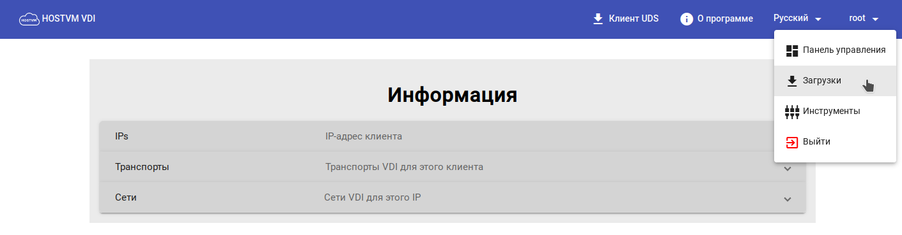
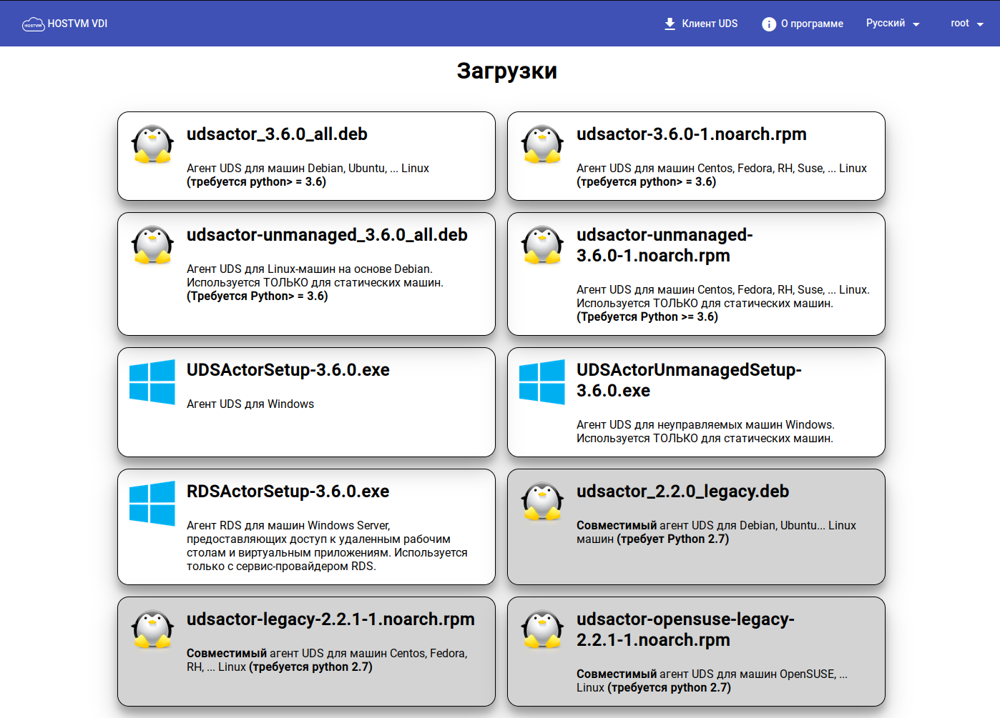

---
layout:
  title:
    visible: true
  description:
    visible: false
  tableOfContents:
    visible: true
  outline:
    visible: true
  pagination:
    visible: true
---

# Агент HOSTVM VDI

Агент HOSTVM VDI устанавливается:

* в шаблоны операционных систем Windows или Linux (базовый (“золотой”) образ) для управления публикацией виртуальных рабочих столов;
* на терминальные серверы RDS и Static IP машины для управления сессиями пользователей.

Дистрибутивы агента HOSTVM VDI доступны для загрузки в веб-интерфейсе брокера HOSTVM VDI из-под учетной записи с правами администратора.

Выберите **«Загрузки»** в меню пользователя:

<figure><figcaption></figcaption></figure>

Выберите дистрибутив, соответствующий типу и версии операционной системы в базовом образе или на терминальном сервере, используемых для предоставления сервисов VDI:

* `udsactor_3.6.0_all.deb`: агент для базового образа машин Linux на основе Debian, а также Ubuntu, Xubuntu и т.д. (требует python версии не ниже 3.6);
* `udsactor-3.6.0-1.noarch.rpm`: агент для базового образа машин Linux на основе Red Hat, а также CentOS, Fedora, Suse и т.д. (требует python версии не ниже 3.6);
* `udsactor-unmanaged_3.6.0_all.deb`: агент для управления сеансами машин на основе Debian, а также Ubuntu, Xubuntu и т.д., подключенных через сервис-провайдер «Static IP Machines Provider» (требует python версии не ниже 3.6);
* `udsactor-unmanaged-3.6.0-1.noarch.rpm`: агент для управления сеансами машин на основе на основе Red Hat, а также CentOS, Fedora, Suse и т.д. (требует python версии не ниже 3.6);
* `UDSActorSetup-3.6.0.exe`: агент для базового образа машин Windows;
* `UDSActorUnmanagedSetup-3.6.0.exe`: агент для управления сеансами машин Windows, подключенных через сервис-провайдер «Static IP Machines Provider»;
* `RDSActorSetup-3.6.0.exe`: агент для машин Windows Server, предоставляющих доступ к удаленным рабочим столам и приложениям. Используется только с сервис-провайдером RDS;
* `udsactor-2.2.0_legacy.deb`: legacy версия агента для базового образа машин Linux на основе Debian, а также Ubuntu, Xubuntu и т.д., где невозможно использовать Python версии 3 (требует python версии 2.7);
* `udsactor-legacy-2.2.1-1.noarch.rpm`: legacy версия агента для базового образа машин Linux на основе Red Hat, а также CentOS, Fedora и т.д., где невозможно использовать Python версии 3 (требует python версии 2.7);
* `udsactor-opensuse-legacy-2.2.1-1.noarch.rpm`: legacy версия агента для базового образа машин Linux на основе OpenSuse, где невозможно использовать Python версии 3 (требует python версии 2.7);

<figure><figcaption></figcaption></figure>

