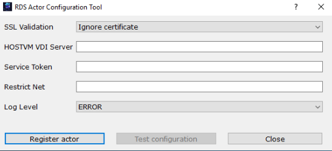
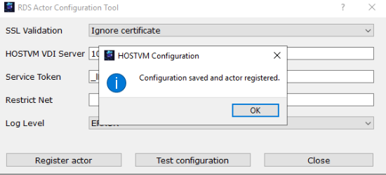
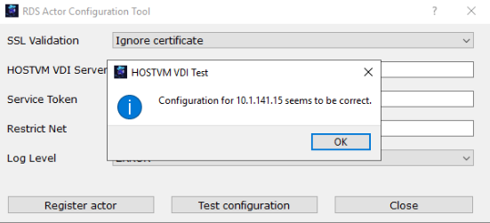

---
layout:
  title:
    visible: true
  description:
    visible: false
  tableOfContents:
    visible: true
  outline:
    visible: true
  pagination:
    visible: true
---

# Установка и настройка агента RDS

Для управления сеансами пользователей на машинах Windows Server, предоставляющих доступ к удаленным рабочим столам и приложениям, под управлением сервис-провайдера RDS, необходимо установить агент HOSTVM VDI из дистрибутива `RDSActorSetup-3.*.*.exe`.

Дистрибутивы агента HOSTVM VDI [доступны для загрузки в веб-интерфейсе брокера HOSTVM VDI](./) из-под учетной записи с правами администратора.

> При установке потребуются IP-адрес или FQDN брокера HOSTVM VDI, учетные данные пользователя с правами администратора для брокера HOSTVM VDI и для машины Windows Server.

Для корректной работы агента RDS на машине Windows Server, значение политики запуска скриптов PowerShell для локальной машины должно быть установлено в RemoteSigned.

Для проверки настройки политики, выполните в консоли PowerShell команду `Get-ExecutionPolicy -Scope LocalMachine`, результатом выполнения должно быть значение `RemoteSigned`:

```powershell
PS C:\Users\Administrator> Get-ExecutionPolicy -Scope LocalMachine
RemoteSigned
```

При необходимости, измените значение политики, выполнив команду:

```powershell
Set-ExecutionPolicy -ExecutionPolicy RemoteSigned -Scope LocalMachine
```

После загрузки дистрибутива агента RDS на терминальный сервер, запустите его для начала процесса установки, затем:

1. укажите путь установки RDS Actor;
2. нажмите «Установить» («Install»), чтобы продолжить установку;
3. после завершения установки перейдите к настройке RDS Actor.

<figure><figcaption></figcaption></figure>

При настройке необходимо зарегистрировать агент в брокере HOSTVM VDI, указав следующие параметры:

* проверка SSL (SSL Validation) – тип проверки безопасности при соединении с брокером HOSTVM VDI;
* сервер HOSTVM VDI (HOSTVM VDI Server) – имя или IP-адрес брокера HOSTVM VDI;
* токен сервиса (Service Token) — сервисный токен, который, в зависимости от используемого провайдера, был сгенерирован:\
  \- на странице [Инструменты / RDS агент](../../hostvm-vdi-admin-guide/tools.md#rds-actor) (для провайдера RDS / Linux Terminal);\
  \- при [создании сервиса RDS](../../hostvm-vdi-admin-guide/service-providers/rds.md#rds-3.6-changes) в поле `Токен сервиса` (для провайдера RDS);
* ограничение сети (Restrict Net) — сеть для соединения с брокером HOSTVM VDI. Используется в случаях, когда у машины более одной сетевой карты, в противном случае следует оставить поле пустым;
* Log Level – уровень логирования для отображения в файлах журнала агента. Эти файлы журналов (udsactor.log) расположены в следующих местах: `%temp%` (путь к временным файлам пользователя) и `C:\Windows\Temp` (путь к временным файлам ОС).

После указания всех параметров нажмиие кнопку «Зарегистрировать агент» («Register actor»):

<figure><figcaption></figcaption></figure>

Для проверки подключения к серверу HOSTVM VDI, нажмите кнопку «Проверить конфигурацию» («Test configuration»):

<figure><figcaption></figcaption></figure>

> Для сброса сессии имя пользователя в брокере HOSTVM VDI и имя пользователя на конечной машине должны совпадать.

