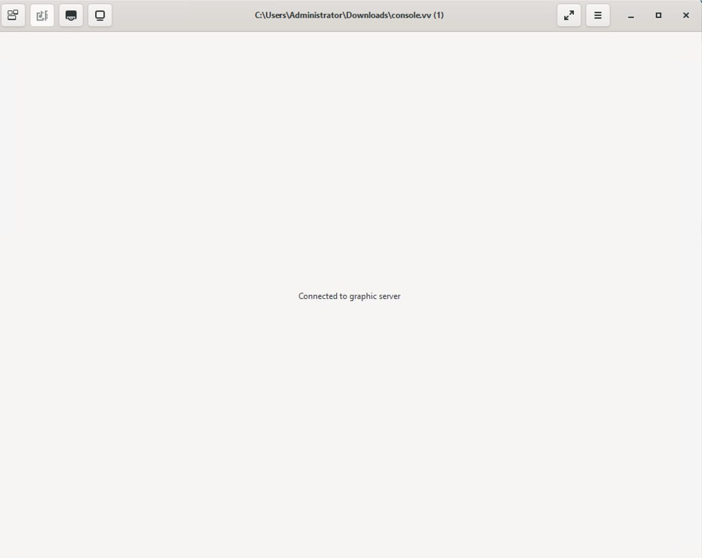

# Часто задаваемые вопросы

### **Известные ошибки при импорте**

Если при попытке подключения консолью появляется сообщение "Connected to graphic server":

<figure><figcaption><p>Ошибка "Connected to graphic server"</p></figcaption></figure>

в качестве решения необходимо проверить значение свойства Chipset/Firmware Type.\
(Compute -> Virtual Machines -> Выбрать нужную ВМ -> Edit -> System).\
Если значение отлично от "Q35 Chipset with BIOS", необходимо привести его к этому состоянию:

<figure><figcaption><p>Q35 Chipset with BIOS</p></figcaption></figure>

### Импорт апплаенса в VMware

Формат апплаенсов HOSTVM VDI не поддерживается со стороны VMware.

Возможна конвертация дисков в формат vmdk с помощью утилиты qemu-img (есть в составе Linux-подобных операционных систем), и импорт их в VMWare. Для этого распакуйте .ova файл брокера:&#x20;

```
tar xvf hostvm-vdi.ova
```

На выходе будет 2 файла: vm.ovf и диск ВМ (например c9bfb5c7-edc0-4596-adca-f63cca42b4c9)

Конвертируйте диск командой:&#x20;

```
qemu-img convert -f qcow2 c9bfb5c7-edc0-4596-adca-f63cca42b4c9 -O vmdk hostvm-vdi.vmdk
```

После выполнения команды вы получите файл vmdk для VMware Workstation. Получившийся vmdk необходимо еще раз конвертировать на хосте esxi:&#x20;

```
vmkfstools -i source.vmdk -d zeroedthick converted_source.vmdk  
```

Поскольку xml-файл с настройками машины не импортируется, необходимо выставить их вручную в настройках ВМ после импорта.


**Для конвертации vmdk имеются следующие ограничения:**&#x20;

VMDK disks converted through qemu-img are always monolithic sparse VMDK disks with an IDE adapter type.

