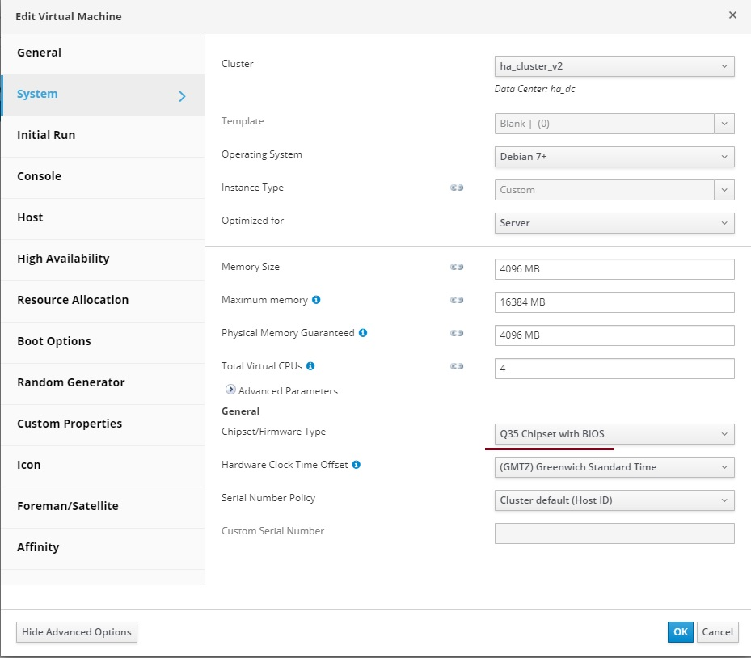

# Установка и настройка балансировщика HAProxy

Для настройки понадобится 3 IP адреса, по одному на каждый сервер (Master и Slave) и общий виртуальный IP для балансировки.

Для SSL соединений требуется действительный сертификат в формате PEM. Сервер предварительно настроен на использование самоподписанного сертификата. Рекомендуется указать другой используемый сертификат или сгенерировать новый.

### Импорт виртуальных машин

* Скачайте файл `haproxy.tar.bz2` из каталога загрузок HOSTVM.
* Загрузите данный файл на один из хостов виртуализации HOSTVM с помощью scp или других средств.
* Распакуйте командой: `tar xjvf haproxy.tar.bz2`
* Откройте портал администрирования платформы виртуализации HOSTVM, перейдите в раздел **Compute - Virtual Machines**.
* Нажмите на иконку из трех вертикальных точек в правом верхнем углу интерфейса и выберите пункт **Import**.
* Выберите в качестве источника импорта **Source** файл OVA: **"Virtual Appliance(OVA)"**. Укажите хост, на котором расположен файл ВМ и абсолютный путь директории с файлом, нажмите кнопку Load для поиска образа.
* Выберите нужный образ в результатах поиска, переместите его с помощью стрелки в список ВМ для импорта (справа) и нажмите кнопку **Next**.
* В появившемся окне задайте домен хранения и кластер для ВМ. Выделите ВМ в списке, перейдите на вкладку **Network Interfaces** и задайте логическую сеть для данной ВМ.
* После этого с помощью кнопки **OK** запустите импорт OVA и дождитесь его окончания.
* Для получения второй виртуальной машины, после завершения импорта, выделите полученную ВМ в интерфейсе, нажмите на иконку из трех вертикальных точек в правом верхнем углу интерфейса и выберите пункт **Clone VM**.
* Задайте имя для новой ВМ, дождитесь завершения процесса клонирования.
* Запустите полученные ВМ, подключитесь к ним с помощью консоли. Авторизуйтесь с логином/паролем _root/engine_.
* Задайте новый пароль для учетной записи root с помощью команды `passwd`.

### Настройка сети

В случае получения IP адреса по DHCP данный раздел настройки можно пропустить.

Если требуется настройка статического адреса, подключитесь к ВМ через консоль: `Compute > Virtual machines > выбрать машину > нажать кнопку Console`

После подключения внесите изменения в файл `/etc/network/interfaces`, задав параметры IP адреса, маски сети, и шлюза по умолчанию.

Пример настройки:

```
allow-hotplug eth0
iface eth0 inet static
    address 10.1.1.2
    netmask 24
    gateway 10.1.1.1
```

Укажите адреса DNS в `/etc/resolv.conf`

При необходимости, задайте новое имя ВМ командой `hostnamectl set-hostname <имя_машины>`.

Перезапустите виртуальную машину для применения настроек:

```bash
reboot
```

### Действия, выполняемые на главном сервере

В этом документе описана базовая настройка сервиса. Рекомендуется просмотреть остальные предварительно настроенные параметры и изменить их в зависимости от потребностей инфраструктуры.

#### Настройка HAProxy

Для настройки сервиса внесите изменения в файл конфигурации `/etc/haproxy/haproxy.cfg`.

Правило внешнего доступа к серверу HOSTVM VDI Broker в режиме http. Порт 80:

```
frontend http-in
        bind *:80
        mode http
        http-request set-header X-Forwarded-Proto http
        default_backend broker-backend
```

Правило внешнего доступа к серверу HOSTVM VDI Broker в режиме https (следует указать путь ранее сгенерированного сертификата .pem). Порт 443. Сервер предварительно настроен на использование самоподписанного сертификата, расположенного в `/etc/ssl/private/haproxy.pem`:

```
frontend https-in
        bind *:443 ssl crt /etc/ssl/private/haproxy.pem
        mode http
        http-request set-header X-Forwarded-Proto https
        default_backend broker-backend
```

Правило внешнего доступа к HOSTVM VDI Tunneler в режиме TCP на порт 1443 (туннельные соединения). В случае использования другого порта правило необходимо изменить (этот порт указывается на вкладке «Tunnel» соответствующего туннельного транспорта в панели администрирования брокера).

```
frontend tunnel-in
        bind *:1443
        mode tcp
        option tcplog
        default_backend tunnel-backend-ssl
```

Правило внешнего доступа к HOSTVM VDI Tunneler в режиме TCP через порт 10443 (соединения HTML5). В случае использования другого порта правило необходимо изменить (этот порт указывается на вкладке «Tunnel» соответствующего HTML5 транспорта в панели администрирования брокера).

```
frontend tunnel-in-guacamole    # HTML5
        bind *:10443
        mode tcp
        option tcplog
        default_backend tunnel-backend-guacamole
```

Правило внутреннего доступа к HOSTVM VDI брокерам. Нужно указать их IP адреса (порты прослушивания 80 или 443).

```
backend broker-backend
        balance source
        option httpclose
        server broker1 10.1.2.1:80 check
        server broker2 10.1.2.2:80 check
```

Правило внутреннего доступа к HOSTVM VDI Tunneler для туннельных подключений. Необходимо указать IP-адреса машин HOSTVM VDI Tunneler (порт прослушивания туннельного сервера для туннельных соединений – 443).

```
backend tunnel-backend-ssl
        mode tcp
        balance source
        server tunserv1 10.1.2.3:443 check
        server tunserv2 10.1.2.4:443 check
```

Правило внутреннего доступа к HOSTVM VDI Tunneler для соединений HTML5. Необходимо указать IP-адреса наших машин HOSTVM VDI Tunneler (порт прослушивания туннельного сервера для соединений HTML5 – 10443).

```
backend tunnel-backend-guacamole
        mode tcp
        balance source
        server tunguac1 10.1.2.3:10443 check
        server tunguac2 10.1.2.4:10443 check
```

#### Настройка виртуального IP

Скопируйте шаблон настроек для главного сервера:

```bash
cp /etc/keepalived/keepalived.conf.master /etc/keepalived/keepalived.conf
```

Внесите изменения в полученный файл конфигурации `/etc/keepalived/keepalived.conf`.

Задайте виртуальный IP-адрес балансировки в параметре `virtual_ipaddress`.

Пример конфигурации:

```
...
vrrp_instance VI_01 {
state MASTER
interface eth0
...
# The virtual ip address shared between the two loadbalancers
virtual_ipaddress {
10.1.1.10
}
...
}
```

После внесения изменений перезапустите машину. После запуска убедитесь, что виртуальный IP-адрес балансировки активен.

```console
# ip a
2: eth0: <BROADCAST,MULTICAST,UP,LOWER_UP> mtu 1500 qdisc mq state UP group default qlen 1000
...
    inet 10.1.1.11/24 brd 10.1.1.255 scope global eth0
...
    inet 10.1.1.10/32 scope global eth0
...
```

Примечание: балансирующий виртуальный IP-адрес будет предоставлять доступ к среде HOSTVM VDI. Этот адрес всегда будет оставаться активным на главном сервере. Если сервер станет недоступным, адрес будет автоматически активирован на вторичном сервере.

### Действия, выполняемые на вторичном сервере

#### Настройка HAProxy

Внесите изменения в конфигурационный файл `/etc/haproxy/haproxy.cfg`, идентичные главному серверу.

#### Настройка виртуального IP

Скопируйте шаблон настроек для вторичного сервера:

```bash
cp /etc/keepalived/keepalived.conf.slave /etc/keepalived/keepalived.conf
```

Внесите изменения в полученный файл конфигурации `/etc/keepalived/keepalived.conf`.

Задайте виртуальный IP-адрес балансировки в параметре `virtual_ipaddress`, идентичный главному серверу.

Пример конфигурации:

```
...
vrrp_instance VI_01 {
state SLAVE
interface eth0
...
# The virtual ip address shared between the two loadbalancers
virtual_ipaddress {
10.1.1.10
}
...
}
```

После внесения изменений перезапустите машину. После запуска убедитесь, что виртуальный IP-адрес балансировки неактивен. Он будет активирован только в случае отказа главного сервера.

```console
# ip a
2: eth0: <BROADCAST,MULTICAST,UP,LOWER_UP> mtu 1500 qdisc mq state UP group default qlen 1000
...
inet 10.1.1.12/24 brd 10.1.1.255 scope global eth0
...
```

### Конфигурация машин HOSTVM VDI Tunneler

Процесс развертывания и настройки машин HOSTVM VDI Tunneler описан в [соответствующей статье](https://kb.pvhostvm.ru/hostvm-vdi/hostvm-vdi-installation-guide/tunneler-appliance-deploy).

Параметры в мастере установки идентичны стандартному развертыванию, за исключением адреса подключения к брокеру HOSTVM VDI. Здесь необходимо указать виртуальный IP-адрес балансировщика.

После завершения настройки, оба сервера будут работать в режиме active/active. Каждый пользователь, который устанавливает соединение через туннель, будет подключаться к одному из этих серверов. Если один из них выйдет из строя, соединения пользователей, которые используют этот сервер, будут прерваны, но при повторном подключении они получат доступ через активный сервер туннеля автоматически.

#### Конфигурация туннелируемых подключений (транспортов) для работы через балансировщик

После завершения настройки машин VDI Tunneler необходимо [изменить настройки туннелируемых подключений в панели управления HOSTVM VDI брокера](https://kb.pvhostvm.ru/hostvm-vdi/hostvm-vdi-installation-guide/tunneler-appliance-deploy#nastroika-transporta-v-paneli-upravleniya-hostvm-vdi).

В качестве шлюза вместо адреса конкретного сервера укажите виртуальный IP-адрес балансировщика, а также порт из правила frontend в настройках `haproxy.cfg`: 10443 для html5, 1443 для остальных транспортов).

### Конфигурация машин HOSTVM VDI Broker

Доступ к брокерам HOSTVM VDI (портал пользователя и администратора) осуществляется через виртуальный IP-адрес балансировщика. Пользователь будет перенаправлен на один из брокеров балансировщиком.

В случае использования выделенного сервера БД оба брокера будут работать в режиме active/active, и если один из них выйдет из строя, все запросы на вход будут выполняться автоматически на активном узле.

**Известные ошибки при импорте**

Если при попытке подключения консолью появляется сообщение "Connected to graphic server":

<figure><figcaption><p>Ошибка "Connected to graphic server"</p></figcaption></figure>

в качестве решения необходимо проверить значение свойства Chipset/Firmware Type.\
(Compute -> Virtual Machines -> Выбрать нужную ВМ -> Edit -> System). \
Если значение отлично от "Q35 Chipset with BIOS", необходимо привести его к этому состоянию:

<figure><figcaption><p>Q35 Chipset with BIOS</p></figcaption></figure>

