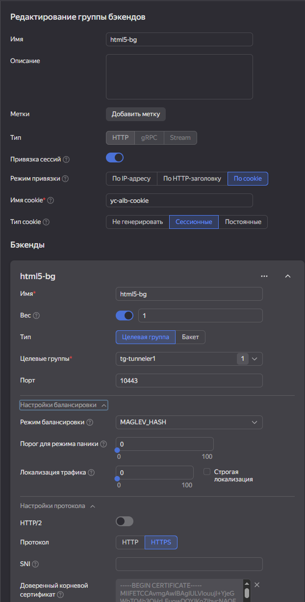
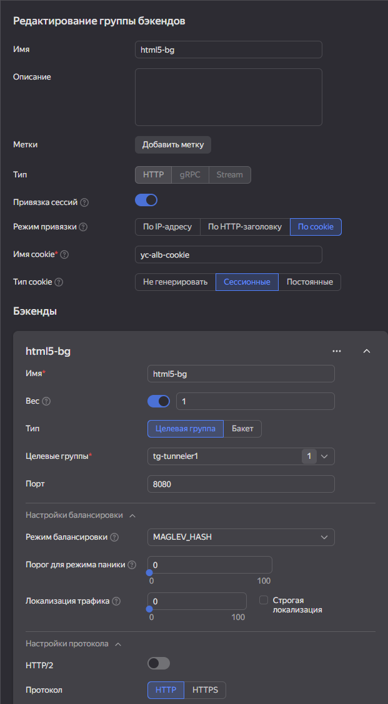

# HTTP режим балансировщика для HTML5 подключений

В конфигурации балансировщика по умолчанию для HTML5 подключений к HOSTVM VDI Tunneler используется режим TCP для сквозной передачи SSL трафика (Passthrough).

При наличии дополнительных средств фильтрации трафика перед балансировщиком нагрузки могут наблюдаться ошибки отрисовки изображения в HTML5 сессиях. В таких случаях может потребоваться настройка балансировки в режиме HTTP.

Ниже приведены примеры такой настройки в двух вариантах:

* SSL bridging - трафик от балансировщика до конечного сервера заново шифруется;
* SSL termination - трафик от балансировщика до конечного сервера не шифруется.

## SSL Bridging

Если необходима работа балансировщика в режиме HTTP, и шифрование обязательно на всех этапах подключения, используйте настройку SSL Bridging. В этом случае балансировщик будет расшифровывать входящий трафик и заново шифровать его для отправки на конечный сервер.

### Конфигурация HAProxy <a href="#bridging-haproxy" id="bridging-haproxy"></a>

Для настройки SSL Bridging необходимо внести изменения в конфигурационный файл  `/etc/haproxy/haproxy.cfg`.

Правило внешнего доступа к HOSTVM VDI Tunneler (соединения HTML5):

```
frontend tunnel-in-guacamole
bind *:10443 ssl crt /path/to/certificate
mode http
option httplog
option forwardfor except 127.0.0.1
http-request set-header X-Forwarded-Proto https
default_backend tunnel-backend-guacamole
```

Правило внутреннего доступа к HOSTVM VDI Tunneler для соединений HTML5:

```
backend tunnel-backend-guacamole
        mode http
        balance source
        option http-server-close
        timeout tunnel 3600s
        server tunguac1 10.1.1.3:10443 ssl verify none
        server tunguac2 10.1.2.4:10443 ssl verify none
```

Остальные настройки остаются идентичны статье [Установка и настройка балансировщика HAProxy](../haproxy.md#nastroika-haproxy-3.5)

### Конфигурация Yandex Application Load Balancer <a href="#bridging-yalb" id="bridging-yalb"></a>

Если в качестве балансировщика используется Yandex Application Load Balancer, необходимо в настройках группы бэкендов указать порт 10443, выбрать протокол HTTPS и включить привязку сессий, например по сессионным cookie. Режим балансировки при этом должен быть выбран MAGLEV\_HASH.&#x20;

<figure><figcaption></figcaption></figure>

Также в конфигурации маршрута роутера необходимо отметить чекбокс WebSocket.

<figure><figcaption></figcaption></figure>

## SSL Termination


В режиме SSL Termination трафик от балансировщика до конечного сервера не шифруется.


Если необходима работа балансировщика в режиме HTTP, и шифрование на этапе от балансировщика до конечного сервера не требуется, используйте настройку SSL Termination.

### Действия, выполняемые на HOSTVM VDI Tunneler <a href="#termination-tunneler" id="termination-tunneler"></a>

Отредактируйте конфигурационный файл `/etc/tomcat9/server.xml` и замените блок `<Connector>`:

```
<Connector port="10443" protocol="org.apache.coyote.http11.Http11AprProtocol" SSLEnabled="true"
               scheme="https" secure="true">
      <UpgradeProtocol className="org.apache.coyote.http2.Http2Protocol" />
      <SSLHostConfig
        ciphers="ECDHE-ECDSA-AES128-GCM-SHA256:ECDHE-RSA-AES128-GCM-SHA256:ECDHE-ECDSA-AES256-GCM-SHA384:ECDHE-RSA-AES256-GCM-SHA384:ECDHE-ECDSA-CHACHA20-POLY1305:ECDHE-RSA-CHACHA20-POLY1305:DHE-RSA-AES128>
        disableSessionTickets="true"
        honorCipherOrder="false"
        protocols="TLSv1.2, TLSv1.3">
          <Certificate
            certificateFile="/etc/certs/server.pem"
            certificateKeyFile="/etc/certs/key.pem" />
      </SSLHostConfig>
    </Connector>
```

На следующий:

```
    <Connector port="8080" protocol="HTTP/1.1" connectionTimeout="20000" redirectPort="10443" />
```

Перезапустите сервисы:

```
systemctl restart vditunnel tomcat9
```

Теперь для HTML5 трафика на туннелере будет использоваться порт 8080, а SSL возможно терминировать на балансировщике.

### Конфигурация HAProxy <a href="#termination-haproxy" id="termination-haproxy"></a>

Для того, чтобы HAProxy терминировал SSL, необходимо внести изменения в конфигурационный файл `/etc/haproxy/haproxy.cfg`.

Правило внешнего доступа к HOSTVM VDI Tunneler (соединения HTML5):

```
frontend tunnel-in-guacamole
bind *:10443 ssl crt /path/to/certificate
mode http
option httplog
option forwardfor except 127.0.0.1
http-request set-header X-Forwarded-Proto https
default_backend tunnel-backend-guacamole
```

Правило внутреннего доступа к HOSTVM VDI Tunneler для соединений HTML5:

```
backend tunnel-backend-guacamole
        mode http
        balance source
        option http-server-close
        timeout tunnel 3600s
        server tunguac1 10.1.1.3:8080 check
        server tunguac2 10.1.2.4:8080 check
```

Остальные настройки остаются идентичны статье [Установка и настройка балансировщика HAProxy](../haproxy.md#nastroika-haproxy-3.5)

### Конфигурация Yandex Application Load Balancer <a href="#termination-yalb" id="termination-yalb"></a>

Если в качестве балансировщика используется Yandex Application Load Balancer, необходимо в настройках группы бэкендов указать порт 8080, выбрать протокол HTTP и включить привязку сессий, например по сессионным cookie. Режим балансировки при этом должен быть выбран MAGLEV\_HASH.&#x20;

<figure><figcaption></figcaption></figure>

Также в конфигурации маршрута роутера необходимо отметить чекбокс WebSocket.

<figure><figcaption></figcaption></figure>

