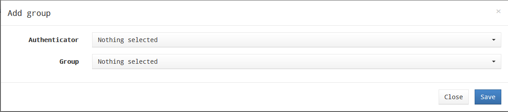

# Руководство администратора HOSTVM VDI

## Глоссарий

|                    Понятие                   |                                       Определение                                      |
| :------------------------------------------: | :------------------------------------------------------------------------------------: |
|        Аутентификатор (Authenticator)        | Ресурс, обеспечивающий управление правами доступа пользователей к виртуальным ресурсам |
|         Базовый образ (Base Machine)         |                            Базовый шаблон виртуальной машины                           |
| Менеджеры операционной системы (OS Managers) |       Управляющий компонент для операционной системы виртуального рабочего места       |
|               Сервис (Service)               |                Ресурс, обеспечивающий выделение виртуальных рабочих мест               |
|          Тонкий клон (Linked Clone)          |               Клонированный образ виртуальной машины минимального размера              |
|            Транспорты (Transports)           |     Приложения для подключения к виртуальным рабочим местам по требуемым протоколам    |

## Общие данные

Руководство описывает действия администратора при настройке основных компонентов программного комплекса и содержит список и описание наиболее часто встречающихся команд.

## Администрирование HOSTVM VDI

Для первоначальной настройки и администрирования программного комплекса необходимо ввести IP-адрес или имя сервера VDI брокера (развернутого из VDI Appliance) через http или https доступ.

При первом входе в панель администрирования VDI необходимо ввести имя и пароль администратора, как показано на Рис. 1.

После входа, в панели администрирования можно изменить пароль, создать или выбрать новых пользователей, которым будет разрешен доступ.

Если уже существует настроенная учетная запись пользователя с правами администратора для платформы VDI, необходимо ввести имя и пароль этого пользователя и выбрать тип аутентификации, который будет использоваться для входа.

Если настроено несколько аутентификаторов, и необходимо получить доступ к панели администрирования с помощью локальной учетной записи администратора, выбранный аутентификатор не будет использоваться, так как этот пользователь не будет сопоставлен с аутентификатором.

Для перехода к порталу администрирования необходимо выбрать **«Dashboard» ("Панель управления")** в меню пользователя.

После открытия панели управления необходимо выполнить первоначальную конфигурацию компонентов, составляющих пул сервисов, для развертывания и подключения виртуальных рабочих столов и сервисов, поддерживаемых HOSTVM VDI.

Конфигурация каждого пула сервисов составляется из различных элементов: подключение сервис-провайдера, настройка базовых образов виртуальных машин (для виртуальных рабочих столов), методов аутентификации пользователей, групп доступа, протоколов подключения. После настройки компонентов пула, можно приступать к его развертыванию.

## Настройка сервис-провайдеров

Сервис-провайдер отвечает за предоставление IP-сервисов.

Сервисы, предоставляемые платформой, могут быть виртуальными рабочими столами по требованию или приложениями, предоставляемыми платформой виртуализации или постоянными физическими/виртуальными рабочими столами, назначенными конкретным пользователям путем назначения IP-адресов.

Для создания пула сервисов должен быть создан хотя бы один сервис-провайдер.

Поддерживаемые типы сервис-провайдеров:

## Настройка платформы VDI на базе HOSTVM

В данном разделе описано развертывание платформы VDI через виртуальную инфраструктуру HOSTVM.

### Регистрация сервис-провайдера HOSTVM

Для регистрации сервис-провайдера HOSTVM необходимо зайти в раздел «Services», нажать «New» и выбрать тип провайдера «oVirt/RHEV Platform Provider».

При создании провайдера должны быть настроены следующие параметры:

**Основные:**

* имя (name) – имя сервисного провайдера;
* версия (oVirt Version) – версия подключаемой системы HOSTVM;
* хост (host) – имя или IP-адрес менеджера виртуализации;
* имя пользователя (username) – имя пользователя (в формате user@domain), имеющего доступ с правами администратора на менеджер виртуализации;
* пароль (password) – пароль пользователя;

**Дополнительные:**

* количество одновременных задач создания рабочего стола (поле «Creation concurrency»);
* количество одновременных задач удаления рабочего стола (поле «Removal concurrency»);
* тайм-аут при установлении соединения с менеджером виртуализации;
* диапазон MAC-адресов для присвоения виртуальным рабочим столам.

С помощью кнопки «Test» можно проверить, что соединение выполнено успешно.

После сохранения настроенные сервис-провайдеры будут подтверждены и готовы для создания базовых сервисов в HOSTVM.

Количество сервис-провайдеров типа HOSTVM, регистрируемых в рамках платформы, не ограничено.

Чтобы изменить какой-либо параметр в уже существующих сервис-провайдерах, необходимо выбрать его и нажать «Edit».

С помощью кнопки «Enter Maintenance Mode» можно приостановить все операции, запущенные платформой для данного сервис-провайдера.

Рекомендуется поставить провайдер в режим обслуживания в случае потери связи или его остановки для обслуживания.

## Настройка сервиса на основе провайдера HOSTVM

После регистрации провайдера HOSTVM, в котором будут созданы рабочие столы, необходимо создать базовые сервисы для генерации тонких клонов ВМ.

Для этого следует открыть сервис-провайдер, в котором будет создан тонкий клон, с помощью двойного щелчка, либо выбором пункта “Detail” в контекстном меню провайдера:

Нажать «New оVirt / RHEV Linked Clone» для создания нового базового сервиса. Минимальные параметры, которые необходимо настроить.

**Основные параметры:**

* имя (name) – имя сервиса;
* кластер (cluster) – кластер серверов HOSTVM, на котором будут размещены развернутые связанные клоны;
* домен хранилища данных (datastore domain) – хранилище, установленное для развертывания клонов ВМ;
* зарезервированное пространство (reserved space) – минимальное свободное пространство, которое может использоваться системой HOSTVM VDI.

**Параметры ВМ:**

* базовый образ (base machine) – шаблон для развертывания виртуальных рабочих столов (golden image);
* память (memory) – объем памяти, который будет присвоен (в мегабайтах);
* гарантированная память (memory guaranteed) – объем памяти, который будет гарантированно доступен для тонких клонов;
* USB – если выбрано, то виртуальные рабочие столы будут поддерживать перенаправление USB-устройств;
* отображение (display) – протокол подключения виртуальных рабочих столов, развернутых через тонкий клон;
* имена машин (machine names) – префикс имени для всех тонких клонов, которые будут развернуты в этой службе (например, имена машин = win-);
* длина имени (name length) – длина номера суффикса, прикрепленного к корневому имени (например, Name Length = 3, win-000 ... win-999).

После сохранения этой конфигурации будет готов действующий «HOSTVM / oVirt Linked Clone» на платформе HOSTVM.

Можно зарегистрировать необходимое количество «HOSTVM / oVirt Linked Clone» на платформе HOSTVM VDI.

После настройки всех компонентов среды HOSTVM VDI (сервисы, аутентификаторы, менеджеры ОС и транспорты подключений) и создания пула сервисов на сервере HOSTVM Manager можно увидеть развернутые виртуальные рабочие столы на базе тонких клонов HOSTVM.

## Управление методами аутентификации

Аутентификатор является основным компонентом платформы доставки рабочих столов, так как позволяет пользователям и группам пользователей, которым предоставлены учетные данные, подключаться к различным сервисам на рабочих столах.

Если в пуле сервисов не назначен хотя бы один аутентификатор, не будет возможности для подключения пользователей к сервисам рабочих столов платформы.

В зависимости от деятельности и платформы можно выбирать внешние аутентификаторы (Active Directory, OpenLDAP и т.д.) или внутренние (внутренняя база данных и аутентификация по IP).

### Аутентификатор Active Directory

Этот внешний аутентификатор обеспечивает доступ пользователям и группам пользователей, принадлежащим Active Directory, к виртуальным рабочим столам или приложениям.

Минимальные параметры для настройки в аутентификаторе Active Directory:

* имя (Name) – имя аутентификатора;
* приоритет (Priority) – приоритет аутентификатора. Чем ниже значение параметра, тем выше аутентификатор будет отображаться в списке аутентификаторов, доступных в окне доступа пользователя. Допускаются отрицательные значения;
* метка (Label) – метка, позволяет получать прямой доступ к странице входа с использованием данного аутентификатора без необходимости выбора, используя URL вида: VDI Server / login / label (например, https: // HOSTVM VDI Server / login / AD);
* хост (Host) – IP-адрес или имя сервера AD;
* порт (Port) – порт подключения к серверу AD (обычно 389, или 636 при использовании SSL);
* использовать SSL (Use SSL) – если установлено значение «Yes», используется SSL-соединение с сервером AD;
* пользователь (Ldap user) – пользователь с правами чтения AD в формате: user@domain;
* пароль (Password) – пароль пользователя;
* тайм-аут (Timeout) – тайм-аут соединения с аутентификатором;
* Base – базовая запись поиска в AD (например dc=example, dc=com).

Нажав кнопку «Test», можно проверить, правильно ли настроено соединение с AD.

### Внутренняя база данных (Internal Database)

В средах, где нет внешнего аутентификатора, можно использовать аутентификатор «Internal Database». Этот аутентификатор позволяет вручную создавать пользователей и группы для доступа к различным службам рабочего стола и виртуальным приложениям, предоставляемым платформой HOSTVM VDI.

Все данные пользователей и групп хранятся в базе данных, к которой подключен сервер HOSTVM VDI.

В «Internal Database» должны быть настроены минимальные параметры.

**Основные параметры:**

* имя (Name) – имя аутентификатора;
* приоритет (Priority) – приоритет аутентификатора. Чем ниже значение этого параметра, тем выше аутентификатор будет отображаться в списке аутентификаторов, доступных в окне доступа пользователя. Допускаются отрицательные значения параметра;
* метка (Label) – включает прямую проверку в этом аутентификаторе, это позволяет пользователю выполнять проверку с помощью указанного аутентификатора, хотя в среде UDS есть больше аутентификаторов. Для этого нужно получить доступ к экрану «входа в систему» HOSTVM VDI в следующем формате: HOSTVM VDI Server / uds / page / login / label (например: https: // VDIServer / uds / page / login / int1);

**Дополнительные параметры:**

* Different user for each host – параметр позволяет подключаться к виртуальным рабочим столам с помощью одного и того же пользователя, добавляя приставку к имени существующего пользователя во время подключения к виртуальному рабочему столу. Приставка – это IP-адрес клиента подключения или его DNS-имя. Новое созданное имя пользователя имеет следующую структуру: IP клиента-пользователь подключения;
* Reverse DNS – аналогично предыдущему параметру, но корень, добавленный к пользователю, является DNS-именем клиента подключения. Требуется правильное разрешение DNS, в противном случае будет использоваться IP-адрес. Созданный пользователь имеет следующую структуру: пользователь-имя\_клиента\_подключения;
* Accept proxy – этот параметр должен быть включен, если есть компонент для доступа к серверу HOSTVM VDI, например, балансировщик нагрузки. По умолчанию HOSTVM VDI автоматически определяет IP-адрес клиента подключения. В средах, где настроены балансировщики нагрузки или другие подобные элементы, это обнаружение не выполняется правильно, поскольку обнаруженный IP-адрес соответствует этим балансировщикам. Включение данной опции обеспечит правильное определение IP. В средах, где используется опция «Different user for each host» и есть балансировщики нагрузки, необходимо включить эту опцию;
* Visible – если этот параметр отключен, аутентификатор не будет отображаться как доступный на странице входа в брокер.

### Управление пользователями и группами

После настройки аутентификатора необходимо указать группы пользователей, участникам которых будет предоставлен доступ к сервисам виртуальных рабочих столов.

Для добавления группы выберите нужный аутентификатор в списке, перейдите на вкладку «Groups» и нажмите «New».

Для поиска укажите имя группы или его часть и нажмите «Search».

Выберите нужную группу в результатах поиска и нажмите «Accept».

Пользователи, состоящие в добавленных в аутентификатор группах, будут автоматически добавлены в систему при первом входе.

Исключение составляют аутентификаторы «Internal Database» и «IP Authenticator», для которых пользователи добавляются только вручную.

Для добавления пользователя выберите нужный аутентификатор в списке, перейдите на вкладку «Users» и нажмите «New».

Для поиска укажите имя пользователя или его часть и нажмите «Search». Выберите нужного пользователя в результатах поиска и нажмите «Accept».

При необходимости можно назначить пользователю специальные права доступа:

* Staff member – права администратора HOSTVM VDI и доступ к разделу «Downloads» (возможность скачивания приложения Actor);
* Admin – права Staff Member, а также доступ к расширенным настройкам HOSTVM VDI (раздел «Tools» –> «Configuration»).

## Настройка менеджеров ОС

Менеджеры ОС обеспечивают управление ранее созданными сервисами Linked Clone.

Тип и настройки менеджера ОС определяют взаимодействие между ОС тонкого клона и брокером подключений HOSTVM VDI через приложение VDI Actor.

Для создания менеджера ОС необходимо нажать “New” в разделе “OS Managers” – “Current OS Managers”.

Доступные типы менеджеров ОС:

### Настройка Linux OS Manager

Менеджер Linux OS предназначен для управления виртуальными рабочими столами на базе Linux-систем.

Минимально необходимые параметры настройки менеджера:

* Name: имя менеджера ОС;
* Logout action: выполняемое при завершении сеанса пользователя действие. Доступные варианты: Keep service assigned (виртуальный рабочий стол остается зарезервированным за пользователем, и при следующем обращении предоставляется ему же), Remove service (виртуальный рабочий стол удаляется, при следующем обращении назначается новый);
* Max. Idle time: максимальное время неактивности пользователя, по достижении которого выполняется автоматический выход из системы. Применяется только при выборе опции Logout action: Remove service.

### Настройка Windows Basic OS Manager

Менеджер Windows Basic OS предназначен для управления виртуальными рабочими столами на базе Windows-систем, не являющихся членами домена.

Минимально необходимые параметры настройки менеджера:

* Name: имя менеджера ОС;
* Logout action: выполняемое при завершении сеанса пользователя действие. Доступные варианты: Keep service assigned (виртуальный рабочий стол остается зарезервированным за пользователем, и при следующем обращении предоставляется ему же), Remove service (виртуальный рабочий стол удаляется, при следующем обращении назначается новый);
* Max. Idle time: максимальное время неактивности пользователя, по достижении которого выполняется автоматический выход из системы. Применяется только при выборе опции Logout action: Remove service.

## Настройка транспортов подключения

Для подключения к виртуальным рабочим столам и приложениям необходимо создать транспорт подключения.

Транспорт – это небольшие приложения, которые отвечают за предоставление доступа к развернутому сервису и запускаются на клиенте.

В зависимости от типа настроенного виртуального рабочего стола, места расположения и способа подключения к виртуальным рабочим столам, должны быть созданы различные типы транспортов.

На клиенте и ВМ должны быть установлены необходимые протоколы соединения, которые будут использоваться в разделе транспорта.

Прямое подключение (транспорт) используется для доступа пользователей к виртуальным рабочим столам и приложениям из внутренней локальной сети, VPN, LAN Extension и т. д.

Туннелированное подключение (транспорт) используется для доступа пользователей к виртуальным рабочим столам и приложениям из глобальной сети. Эти транспорты будут устанавливать соединение через HOSTVM VDI туннелер.

Транспорт HTML5 может использоваться для доступа пользователей к виртуальным рабочим столам с помощью всех типов доступа (LAN, WAN и т.д.). Этот транспорт использует сервер туннелирования для соединения с виртуальными рабочими столами.

Для создания транспортов необходимо нажать «New» в разделе «Connectivity» -> «Current Transports».

Примечания:

* если вам нужен доступ из сети, которая не является вашей локальной сетью, вам придется использовать туннелированные транспорты, которые должны иметь общедоступный IP-адрес сервера HOSTVM VDI Tunneler;
* HOSTVM VDI Tunneler будет использовать 2 порта в зависимости от предоставляемой услуги. При соединении через HTML5 будет использоваться порт 10443, при любом туннелированном соединении (RDP, RDS, X2Go и т. Д.) будет использоваться порт 443.

### Прямой транспорт SPICE

Прямой транспорт SPICE обеспечивает доступ к виртуальным рабочим столам пользователей Windows / Linux через протокол SPICE. Для этого клиентам необходимо установить SPICE-соединение (Virt-Manager).

Транспорт SPICE можно использовать только с сервис-провайдерами HOSTVM (oVirt) или Red Hat Enterprise Virtualization (RHEV) и OpenNebula.

Минимальные параметры, которые необходимо настроить для прямого транспорта SPICE:

**Основные параметры:**

* имя (Name) – имя транспорта;
* приоритет (Priority) – чем ниже значение параметра, тем выше транспорт будет отображаться в списке доступных сервисов. Транспорт с наименьшим значением параметра будет использоваться по умолчанию при нажатии на изображение сервиса;
* сертификат (Certificate) – сертификат, сгенерированный в HOSTVM Manager, необходим для подключения к виртуальным рабочим столам (обычно размещается в /etc/pki/ovirt-engine/certs/ca.der);
* доступ к сетям (Networks Access) – указывается, если в выбранной сети в параметре «Networks» предоставляется доступ пользователям с помощью этого транспорта (доступные сети будут настроены в параметре «Networks»);
* сети (Networks) – сетевые диапазоны, подсети или IP-адреса, перечисленные в разделе «Current Networks» -> «Connectivity». Этот параметр используется вместе с параметром «Network Access», чтобы включить или отключить доступ пользователя к сервису на основе сетевого местоположения;

**Дополнительные параметры:** показать полноэкранный режим (Show fullscreen) – включение/отключение полноэкранного режима для удаленного рабочего стола.

### Транспорт SPICE Tunnel

При настройке транспорта SPICE Tunnel в панели управления HOSTVM VDI в качестве tunnel server указывается \<tunneler\_hostname>:, где:

* \<tunneler\_hostname> - FQDN или IP адрес машины HOSTVM Tunneler;
* \<port> - порт подключения, по умолчанию - 443.

## Настройка пула сервисов.

После того, как будут настроены основные компоненты программного комплекса, можно приступить к созданию пула сервисов.

Для создания пула сервисов требуются следующие ранее настроенные компоненты: базовый сервис (тонкий клон) сервис-провайдера, менеджер ОС, транспорт подключения, и группа пользователей, которым планируется предоставить доступ к сервису.

Для создания нового пула сервисов нажмите «New» в разделе «Service Pools».

Минимально необходимые параметры для настройки нового пула сервисов:

**Основные параметры:**

* имя (Name) – имя пула сервисов;
* короткое имя (Short name) – имя сервиса, отображаемое пользователям;
* базовый сервис (Base service) – настроенный ранее базовый сервис (тонкий клон) сервис-провайдера;
* менеджер ОС (OS Manager) – настроенный ранее менеджер ОС;
* публикация при создании (Publish on creation) – если опция включена, то после завершения настройки пула сервисов и нажатия кнопки «Save» сразу начнется публикация нового сервиса. Если опция выключена, публикация осуществляется вручную на вкладке «Publications» созданного сервиса.

**Параметры доступности:**

* Initial available services – количество сервисов (виртуальных рабочих столов), которые будут развернуты и доступны для назначения пользователям сразу после создания пула;
* Maximum number of services to provide – максимально возможное количество предоставляемых пулом сервисов (виртуальных рабочих столов).

Для предоставления пользователям доступа к сервису необходимо добавить соответствующую группу пользователей в созданный пул сервисов.

Группы пользователей создаются в настройках аутентификатора. Для добавления группы нажмите «New» на вкладке «Groups» созданного пула сервисов.

Выберите аутентификатор и группу из списка доступных для выбранного аутентификатора.

Для добавления транспорта подключения нажмите «New» на вкладке «Transports» созданного пула сервисов. Выберите из списка ранее созданных транспортов нужный.

