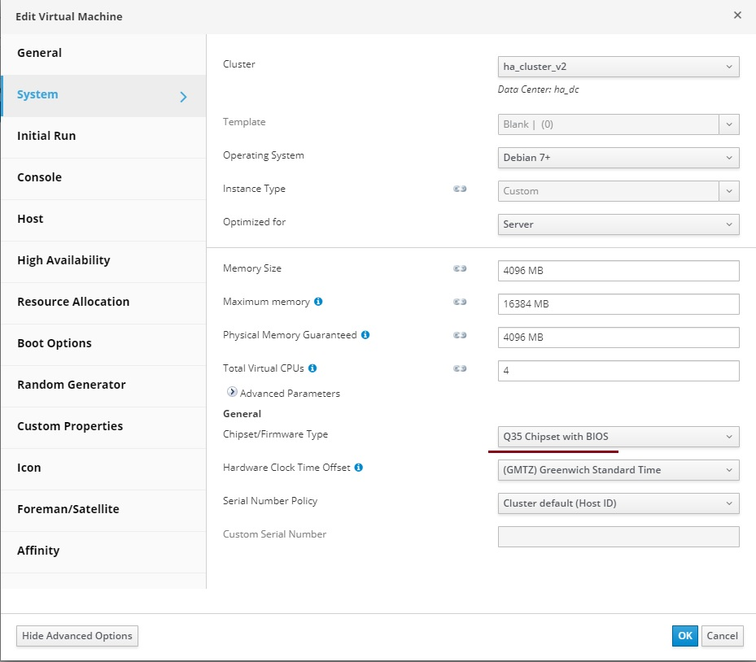

# Установка HOSTVM VDI Tunneler

### Версия 3.0 <a href="#3.0" id="3.0"></a>

#### Импорт виртуальной машины

* Скачайте образ машины `HOSTVM-VDI/Stable/3.0/hostvm-tunneler-<номер сборки>.tar.bz2` из каталога загрузок HOSTVM.
* Загрузите данный файл на один из хостов виртуализации HOSTVM с помощью scp или других средств.
* Распакуйте командой: `tar xjvf hostvm-tunneler-<номер сборки>.tar.bz2`
* Откройте портал администрирования платформы виртуализации HOSTVM, перейдите в раздел **Compute - Virtual Machines.**
* Нажмите на иконку из трех вертикальных точек в правом верхнем углу интерфейса и выберите пункт **Import.**
* Выберите в качестве источника импорта **Source** файл OVA: "**Virtual Appliance(OVA)**". Укажите хост, на котором расположен файл ВМ и абсолютный путь директории с файлом, нажмите кнопку Load для поиска образа.
* Выберите нужный образ в результатах поиска, переместите его с помощью стрелки в список ВМ для импорта (справа) и нажмите кнопку **Next.**
* В появившемся окне задайте домен хранения и кластер для ВМ. Выделите ВМ в списке, перейдите на вкладку **Network Interfaces** и задайте логическую сеть для данной ВМ.
* После этого с помощью кнопки **OK** запустите импорт OVA и дождитесь его окончания.
* Запустите полученную ВМ.

#### Настройка сети

В случае получения IP адрес по DHCP данный раздел настройки можно пропустить.

Если требуется настройка статического адреса, подключитесь к ВМ через консоль: `Compute > Virtual machines > выбрать машину > нажать кнопку Console`

После подключения внесите изменения в файл `/etc/network/interfaces`, задав параметры IP адреса, маски сети, и шлюза по умолчанию.

Пример настройки:

```
allow-hotplug eth0
iface eth0 inet static
    address 10.1.1.3
    netmask 24
    gateway 10.1.1.1
```

Укажите адреса DNS в `/etc/resolv.conf`

Перезапустите виртуальную машину для применения настроек:

```bash
reboot
```

#### Настройка сертификатов

Для подключения к брокеру HOSTVM VDI по протоколу HTTPS требуется наличие установленного действительного сертификата на ВМ брокера. При необходимости, добавьте CA сертификат на ВМ туннелера HOSTVM VDI, перед запуском графического мастера установки.

```bash
cp cert-bundle.crt /usr/local/share/ca-certificates/
update-ca-certificates
```

#### Мастер установки HOSTVM VDI Tunneler

После настройки параметров сети и перезапуска машины, мастер установки будет доступен через браузер по адресу: `http://<ip_адрес_ВМ_туннелера>:9900`

.png>)

После открытия веб-страницы конфигуратора выполните следующие действия:

* Выберите язык установки.
* Проверьте параметры: имя сервера, домен, настройки сети и dns.\
  Если параметры сети не требуют корректировки, выберите в выпадающем списке опцию “Skip network config (leave it as is)”.\
  Если корректировка требуется, оставьте в выпадающем списке опцию "Configure network" и внесите изменения. В случае смены ip адреса установщик автоматически перенаправит пользователя на новый, для продолжения установки.

.png>)

* Проверьте и подтвердите настройки, дождитесь их применения.
* Настройте раскладку клавиатуры для ОС, часовой пояс и ntp сервер (необязательно).

.png>)

* Задайте пароль локального пользователя root для ОС сервера туннелирования.

.png>)

* Задайте настройки подключения к vdi брокеру, указав его fqdn или ip. Использование подключения "HTTPS (Secure Connection)” возможно в случае наличия действительного сертификата на брокере, иначе используйте подключение “HTTP”.

.png>)

* Загрузите https сертификаты для сервера туннелирования (необязательно), либо пропустите шаг, нажав next.

.png>)

* Завершите настройку перезагрузкой сервера, и закройте страницу установщика. После перезагрузки сервер будет готов к работе.

.png>)

При необходимости запустить конфигуратор заново, авторизуйтесь на сервере под пользователем root и паролем, указанным в шаге 5, затем запустите команду:

```bash
uds setup
```

После выполнения команды конфигуратор будет доступен через браузер по адресу: `http://<ip_адрес_ВМ_туннелера>:9900`.

#### Настройка транспорта в панели управления HOSTVM VDI

При настройке туннелированных подключений (транспортов) в панели управления брокера HOSTVM VDI, в качестве параметра tunnel server на вкладке Tunnel настроек транспорта указывайте адрес настроенной ВМ туннелера в формате `адрес:порт`, где адрес - IP или FQDN туннелера, порт - порт подключения, по умолчанию 443.

.png>)

### Версия 3.5 <a href="#3.5" id="3.5"></a>

#### Импорт виртуальной машины

* Скачайте образ машины `HOSTVM-VDI/Stable/3.5/hostvm-gw35-<номер сборки>.tar.bz2` из каталога загрузок HOSTVM.
* Загрузите данный файл на один из хостов виртуализации HOSTVM с помощью scp или других средств.
* Распакуйте командой: `tar xjvf hostvm-gw35-<номер сборки>.tar.bz2`
* Откройте портал администрирования платформы виртуализации HOSTVM, перейдите в раздел **Compute - Virtual Machines.**
* Нажмите на иконку из трех вертикальных точек в правом верхнем углу интерфейса и выберите пункт **Import.**
* Выберите в качестве источника импорта **Source** файл OVA: "**Virtual Appliance(OVA)**". Укажите хост, на котором расположен файл ВМ и абсолютный путь директории с файлом, нажмите кнопку Load для поиска образа.
* Выберите нужный образ в результатах поиска, переместите его с помощью стрелки в список ВМ для импорта (справа) и нажмите кнопку **Next.**
* В появившемся окне задайте домен хранения и кластер для ВМ. Выделите ВМ в списке, перейдите на вкладку **Network Interfaces** и задайте логическую сеть для данной ВМ.
* После этого с помощью кнопки **OK** запустите импорт OVA и дождитесь его окончания.
* Запустите полученную ВМ, подключитесь к ней с помощью консоли. Авторизуйтесь с логином/паролем _root/engine._
* Задайте новый пароль для учетной записи root с помощью команды `passwd`

#### Настройка сети

В случае получения IP адрес по DHCP данный раздел настройки можно пропустить.

Если требуется настройка статического адреса, подключитесь к ВМ через консоль: `Compute > Virtual machines > выбрать машину > нажать кнопку Console`

После подключения внесите изменения в файл `/etc/network/interfaces`, задав параметры IP адреса, маски сети, и шлюза по умолчанию.

Пример настройки:

```
allow-hotplug eth0
iface eth0 inet static
    address 10.1.1.3
    netmask 24
    gateway 10.1.1.1
```

Укажите адреса DNS в `/etc/resolv.conf`

Перезапустите виртуальную машину для применения настроек:

```bash
reboot
```

При необходимости, задайте новое имя ВМ командой `hostnamectl set-hostname <имя_машины>`.

#### Мастер установки HOSTVM VDI Tunneler

Выполните команду `hostvm-setup` для запуски мастера установки.

Задайте запрашиваемые мастером параметры конфигурации:

* IP адрес развернутого брокера HOSTVM VDI
* Тип соединения с брокером (http или https)
* Учетная запись с правами администратора на брокере (аутентификатор, логин, пароль). Для использования встроенной учетной записи администратора оставьте значение аутентификатора пустым, нажав Enter (как в примере ниже).

**Важно:** для подключения к брокеру HOSTVM VDI по протоколу HTTPS требуется наличие установленного действительного сертификата на ВМ брокера. При необходимости, добавьте CA сертификат на ВМ туннелера HOSTVM VDI, перед запуском мастера установки.

```bash
cp cert-bundle.crt /usr/local/share/ca-certificates/
update-ca-certificates
```

**Пример конфигурации:**

```
root@hostvm-gw35:~# hostvm-setup 
Добро пожаловать в мастер установки HOSTVM VDI Tunneler.
Этот мастер шаг за шагом проведет вас через процесс установки.
Пожалуйста, заполните все поля корректными значениями.
IP адрес брокера: 10.1.1.2
Тип соединения с брокером (http или https): http
На брокере доступны следующие аутентификаторы:
int
Укажите аутентификатор из списка доступных, либо оставьте пустым, 
если используете встроенную учетную запись администратора: 
Имя пользователя: root
Пароль: 
Конфигурация системы...
Установка завершена.
root@hostvm-gw35:~# 
```

#### Настройка транспорта в панели управления HOSTVM VDI

При настройке туннелированных подключений (транспортов) в панели управления брокера HOSTVM VDI, в качестве параметра tunnel server на вкладке Tunnel настроек транспорта указывайте адрес настроенной ВМ туннелера в формате `адрес:порт`, где адрес - IP или FQDN туннелера, порт - порт подключения, по умолчанию 443.

.png>)

**Известные ошибки при импорте**

Если при попытке подключения консолью появляется сообщение "Connected to graphic server":

<figure><figcaption><p>Ошибка "Connected to graphic server"</p></figcaption></figure>

в качестве решения необходимо проверить значение свойства Chipset/Firmware Type.\
(Compute -> Virtual Machines -> Выбрать нужную ВМ -> Edit -> System). \
Если значение отлично от "Q35 Chipset with BIOS", необходимо привести его к этому состоянию:\


<figure><figcaption><p>Q35 Chipset with BIOS</p></figcaption></figure>
